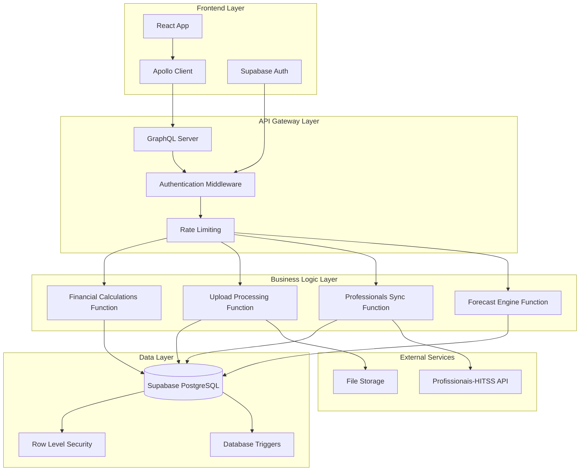

# 🏗️ Arquitetura Técnica Detalhada - App Financeiro Supabase

## 📐 Visão Geral da Arquitetura

### Diagrama de Arquitetura



## 🔧 Especificações Técnicas

### Stack Tecnológico

#### Frontend
- **React 18.2+** com TypeScript
- **Apollo Client 3.8+** para GraphQL
- **Supabase JS 2.38+** para autenticação
- **TailwindCSS 3.3+** para styling
- **Vite 4.4+** como bundler

#### Backend
- **Node.js 18+** com TypeScript
- **Apollo Server 4.9+** para GraphQL
- **Supabase Edge Functions** (Deno runtime)
- **PostgreSQL 15+** via Supabase

#### DevOps
- **Docker** para containerização
- **GitHub Actions** para CI/CD
- **Supabase CLI** para deployments
- **Jest** para testes

## 🚀 Implementação dos Microserviços

### 1. GraphQL Gateway Server

#### Estrutura do Projeto

```
backend/
├── src/
│   ├── schema/
│   │   ├── typeDefs/
│   │   │   ├── project.graphql
│   │   │   ├── financial.graphql
│   │   │   ├── professional.graphql
│   │   │   └── index.ts
│   │   └── resolvers/
│   │       ├── project.ts
│   │       ├── financial.ts
│   │       ├── professional.ts
│   │       └── index.ts
│   ├── middleware/
│   │   ├── auth.ts
│   │   ├── rateLimit.ts
│   │   └── errorHandler.ts
│   ├── services/
│   │   ├── supabaseClient.ts
│   │   ├── edgeFunctions.ts
│   │   └── cache.ts
│   ├── utils/
│   │   ├── validation.ts
│   │   ├── formatting.ts
│   │   └── logger.ts
│   └── index.ts
├── tests/
├── Dockerfile
├── package.json
└── tsconfig.json
```

#### Configuração do Apollo Server

**Arquivo:** `src/index.ts`

```typescript
import { ApolloServer } from '@apollo/server'
import { startStandaloneServer } from '@apollo/server/standalone'
import { buildSubgraphSchema } from '@apollo/subgraph'
import { typeDefs } from './schema/typeDefs'
import { resolvers } from './schema/resolvers'
import { authMiddleware } from './middleware/auth'
import { rateLimitMiddleware } from './middleware/rateLimit'
import { errorHandler } from './middleware/errorHandler'
import { createSupabaseClient } from './services/supabaseClient'
import { logger } from './utils/logger'

interface Context {
  user?: {
    id: string
    email: string
    role: string
  }
  supabase: ReturnType<typeof createSupabaseClient>
  dataSources: {
    edgeFunctions: any
  }
}

async function startServer() {
  const server = new ApolloServer<Context>({
    schema: buildSubgraphSchema({
      typeDefs,
      resolvers
    }),
    plugins: [
      {
        requestDidStart() {
          return {
            didResolveOperation(requestContext) {
              logger.info('GraphQL Operation', {
                operationName: requestContext.request.operationName,
                query: requestContext.request.query
              })
            },
            didEncounterErrors(requestContext) {
              logger.error('GraphQL Errors', {
                errors: requestContext.errors
              })
            }
          }
        }
      }
    ],
    formatError: errorHandler
  })

  const { url } = await startStandaloneServer(server, {
    listen: { port: parseInt(process.env.PORT || '4000') },
    context: async ({ req }) => {
      // Autenticação
      const user = await authMiddleware(req)
      
      // Rate limiting
      await rateLimitMiddleware(req, user)
      
      // Criar cliente Supabase com contexto do usuário
      const supabase = createSupabaseClient(user?.id)
      
      return {
        user,
        supabase,
        dataSources: {
          edgeFunctions: new EdgeFunctionsService(supabase)
        }
      }
    }
  })

  logger.info(`🚀 GraphQL Server ready at ${url}`)
}

startServer().catch(error => {
  logger.error('Failed to start server', error)
  process.exit(1)
})
```

#### Middleware de Autenticação

**Arquivo:** `src/middleware/auth.ts`

```typescript
import { Request } from 'express'
import { createClient } from '@supabase/supabase-js'
import { GraphQLError } from 'graphql'
import { logger } from '../utils/logger'

interface User {
  id: string
  email: string
  role: string
}

const supabase = createClient(
  process.env.SUPABASE_URL!,
  process.env.SUPABASE_SERVICE_ROLE_KEY!
)

export async function authMiddleware(req: Request): Promise<User | null> {
  try {
    const authHeader = req.headers.authorization
    
    if (!authHeader || !authHeader.startsWith('Bearer ')) {
      return null // Operações públicas permitidas
    }

    const token = authHeader.substring(7)
    
    // Verificar token com Supabase
    const { data: { user }, error } = await supabase.auth.getUser(token)
    
    if (error || !user) {
      throw new GraphQLError('Token inválido', {
        extensions: { code: 'UNAUTHENTICATED' }
      })
    }

    // Buscar informações adicionais do usuário
    const { data: profile, error: profileError } = await supabase
      .from('user_profiles')
      .select('role, permissions')
      .eq('id', user.id)
      .single()

    if (profileError) {
      logger.warn('Profile not found for user', { userId: user.id })
    }

    return {
      id: user.id,
      email: user.email!,
      role: profile?.role || 'user'
    }
  } catch (error) {
    logger.error('Authentication error', error)
    throw new GraphQLError('Erro de autenticação', {
      extensions: { code: 'UNAUTHENTICATED' }
    })
  }
}

export function requireAuth(user: User | null): User {
  if (!user) {
    throw new GraphQLError('Autenticação necessária', {
      extensions: { code: 'UNAUTHENTICATED' }
    })
  }
  return user
}

export function requireRole(user: User | null, requiredRole: string): User {
  const authenticatedUser = requireAuth(user)
  
  if (authenticatedUser.role !== requiredRole && authenticatedUser.role !== 'admin') {
    throw new GraphQLError('Permissão insuficiente', {
      extensions: { code: 'FORBIDDEN' }
    })
  }
  
  return authenticatedUser
}
```

#### Rate Limiting

**Arquivo:** `src/middleware/rateLimit.ts`

```typescript
import { Request } from 'express'
import { GraphQLError } from 'graphql'
import { Redis } from 'ioredis'
import { logger } from '../utils/logger'

interface User {
  id: string
  email: string
  role: string
}

const redis = new Redis(process.env.REDIS_URL || 'redis://localhost:6379')

interface RateLimitConfig {
  windowMs: number // Janela de tempo em ms
  maxRequests: number // Máximo de requests na janela
  keyGenerator: (req: Request, user?: User) => string
}

const rateLimitConfigs: Record<string, RateLimitConfig> = {
  anonymous: {
    windowMs: 15 * 60 * 1000, // 15 minutos
    maxRequests: 100,
    keyGenerator: (req) => `rate_limit:anon:${req.ip}`
  },
  authenticated: {
    windowMs: 15 * 60 * 1000, // 15 minutos
    maxRequests: 1000,
    keyGenerator: (req, user) => `rate_limit:user:${user!.id}`
  },
  admin: {
    windowMs: 15 * 60 * 1000, // 15 minutos
    maxRequests: 5000,
    keyGenerator: (req, user) => `rate_limit:admin:${user!.id}`
  }
}

export async function rateLimitMiddleware(req: Request, user?: User | null): Promise<void> {
  try {
    const config = user 
      ? (user.role === 'admin' ? rateLimitConfigs.admin : rateLimitConfigs.authenticated)
      : rateLimitConfigs.anonymous

    const key = config.keyGenerator(req, user || undefined)
    const window = Math.floor(Date.now() / config.windowMs)
    const redisKey = `${key}:${window}`

    // Incrementar contador
    const current = await redis.incr(redisKey)
    
    // Definir expiração na primeira requisição
    if (current === 1) {
      await redis.expire(redisKey, Math.ceil(config.windowMs / 1000))
    }

    // Verificar limite
    if (current > config.maxRequests) {
      logger.warn('Rate limit exceeded', {
        key,
        current,
        limit: config.maxRequests,
        user: user?.id
      })
      
      throw new GraphQLError('Rate limit excedido. Tente novamente em alguns minutos.', {
        extensions: { 
          code: 'RATE_LIMITED',
          retryAfter: config.windowMs / 1000
        }
      })
    }

    // Log para monitoramento
    if (current > config.maxRequests * 0.8) {
      logger.warn('Rate limit warning', {
        key,
        current,
        limit: config.maxRequests,
        percentage: (current / config.maxRequests) * 100
      })
    }
  } catch (error) {
    if (error instanceof GraphQLError) {
      throw error
    }
    
    logger.error('Rate limiting error', error)
    // Em caso de erro no Redis, permitir a requisição
  }
}
```

### 2. Edge Functions Detalhadas

#### Financial Calculations Function (Avançada)

**Arquivo:** `supabase/functions/financial-calculations/index.ts`

```typescript
import { serve } from 'https://deno.land/std@0.168.0/http/server.ts'
import { createClient } from 'https://esm.sh/@supabase/supabase-js@2'
import { corsHeaders } from '../_shared/cors.ts'
import { validateRequest } from '../_shared/validation.ts'
import { logger } from '../_shared/logger.ts'

interface CalculationRequest {
  projectIds: string[]
  year: number
  month?: number
  calculationType: 'dashboard' | 'planilhas' | 'forecast'
  filters?: {
    accountSummary?: string[]
    dateRange?: {
      startDate: string
      endDate: string
    }
  }
}

interface FinancialMetrics {
  revenue: number
  taxRelief: number
  costs: {
    clt: number
    subcontracted: number
    others: number
    total: number
  }
  margin: {
    monthly: number
    accumulated: number
    percentage: number
    accumulatedPercentage: number
  }
  breakdown: {
    byProject: Record<string, FinancialMetrics>
    byMonth: Record<string, FinancialMetrics>
    byAccountSummary: Record<string, number>
  }
}

serve(async (req) => {
  // CORS handling
  if (req.method === 'OPTIONS') {
    return new Response('ok', { headers: corsHeaders })
  }

  try {
    // Validação da requisição
    const requestData: CalculationRequest = await validateRequest(req, {
      projectIds: { type: 'array', required: true },
      year: { type: 'number', required: true },
      month: { type: 'number', required: false },
      calculationType: { type: 'string', required: true, enum: ['dashboard', 'planilhas', 'forecast'] }
    })

    const supabase = createClient(
      Deno.env.get('SUPABASE_URL') ?? '',
      Deno.env.get('SUPABASE_SERVICE_ROLE_KEY') ?? ''
    )

    // Log da operação
    logger.info('Financial calculation started', {
      projectIds: requestData.projectIds,
      year: requestData.year,
      month: requestData.month,
      type: requestData.calculationType
    })

    // Buscar transações com filtros otimizados
    const transactions = await fetchTransactions(supabase, requestData)
    
    // Calcular métricas baseado no tipo
    const metrics = await calculateMetrics(transactions, requestData)
    
    // Buscar dados acumulados se necessário
    if (requestData.calculationType === 'planilhas') {
      metrics.margin.accumulated = await calculateAccumulatedMargin(
        supabase, 
        requestData.projectIds, 
        requestData.year, 
        requestData.month
      )
      metrics.margin.accumulatedPercentage = metrics.revenue !== 0 
        ? (metrics.margin.accumulated / metrics.revenue) * 100 
        : 0
    }

    logger.info('Financial calculation completed', {
      projectIds: requestData.projectIds,
      revenue: metrics.revenue,
      margin: metrics.margin.monthly
    })

    return new Response(
      JSON.stringify({ 
        success: true, 
        data: metrics,
        metadata: {
          calculatedAt: new Date().toISOString(),
          transactionCount: transactions.length,
          projectCount: requestData.projectIds.length
        }
      }),
      { 
        headers: { 
          ...corsHeaders,
          'Content-Type': 'application/json' 
        } 
      }
    )
  } catch (error) {
    logger.error('Financial calculation error', {
      error: error.message,
      stack: error.stack
    })

    return new Response(
      JSON.stringify({ 
        success: false, 
        error: error.message,
        code: error.code || 'CALCULATION_ERROR'
      }),
      { 
        status: 400, 
        headers: { 
          ...corsHeaders,
          'Content-Type': 'application/json' 
        } 
      }
    )
  }
})

async function fetchTransactions(supabase: any, request: CalculationRequest) {
  let query = supabase
    .from('financial_transactions')
    .select(`
      *,
      project:projects(id, name, code)
    `)
    .in('project_id', request.projectIds)
    .eq('period_year', request.year)

  if (request.month) {
    query = query.eq('period_month', request.month)
  }

  if (request.filters?.accountSummary?.length) {
    query = query.in('account_summary', request.filters.accountSummary)
  }

  if (request.filters?.dateRange) {
    query = query
      .gte('created_at', request.filters.dateRange.startDate)
      .lte('created_at', request.filters.dateRange.endDate)
  }

  const { data, error } = await query.order('period_month', { ascending: true })

  if (error) {
    throw new Error(`Database error: ${error.message}`)
  }

  return data || []
}

async function calculateMetrics(transactions: any[], request: CalculationRequest): Promise<FinancialMetrics> {
  // Cálculos principais
  const revenue = transactions
    .filter(t => t.account_summary === 'RECEITA DEVENGADA')
    .reduce((sum, t) => sum + parseFloat(t.amount), 0)

  const taxRelief = transactions
    .filter(t => t.account_summary === 'DESONERAÇÃO DA FOLHA')
    .reduce((sum, t) => sum + parseFloat(t.amount), 0)

  const cltCosts = transactions
    .filter(t => t.account_summary === 'CLT')
    .reduce((sum, t) => sum + parseFloat(t.amount), 0)

  const subcontractedCosts = transactions
    .filter(t => t.account_summary === 'SUBCONTRATADOS')
    .reduce((sum, t) => sum + parseFloat(t.amount), 0)

  const otherCosts = transactions
    .filter(t => t.account_summary === 'OUTROS')
    .reduce((sum, t) => sum + parseFloat(t.amount), 0)

  const totalCosts = cltCosts + subcontractedCosts + otherCosts
  const monthlyMargin = revenue + totalCosts + taxRelief // costs são negativos
  const marginPercentage = revenue !== 0 ? (monthlyMargin / revenue) * 100 : 0

  // Breakdown por projeto
  const projectBreakdown: Record<string, any> = {}
  const projectIds = [...new Set(transactions.map(t => t.project_id))]
  
  for (const projectId of projectIds) {
    const projectTransactions = transactions.filter(t => t.project_id === projectId)
    projectBreakdown[projectId] = await calculateMetrics(projectTransactions, request)
  }

  // Breakdown por mês (se não filtrado por mês)
  const monthBreakdown: Record<string, any> = {}
  if (!request.month) {
    const months = [...new Set(transactions.map(t => t.period_month))]
    for (const month of months) {
      const monthTransactions = transactions.filter(t => t.period_month === month)
      monthBreakdown[month.toString()] = await calculateMetrics(monthTransactions, {
        ...request,
        month
      })
    }
  }

  // Breakdown por conta resumo
  const accountBreakdown: Record<string, number> = {}
  const accountSummaries = [...new Set(transactions.map(t => t.account_summary))]
  for (const summary of accountSummaries) {
    accountBreakdown[summary] = transactions
      .filter(t => t.account_summary === summary)
      .reduce((sum, t) => sum + parseFloat(t.amount), 0)
  }

  return {
    revenue,
    taxRelief,
    costs: {
      clt: cltCosts,
      subcontracted: subcontractedCosts,
      others: otherCosts,
      total: totalCosts
    },
    margin: {
      monthly: monthlyMargin,
      accumulated: 0, // Será calculado separadamente se necessário
      percentage: marginPercentage,
      accumulatedPercentage: 0
    },
    breakdown: {
      byProject: projectBreakdown,
      byMonth: monthBreakdown,
      byAccountSummary: accountBreakdown
    }
  }
}

async function calculateAccumulatedMargin(
  supabase: any, 
  projectIds: string[], 
  year: number, 
  currentMonth?: number
): Promise<number> {
  const endMonth = currentMonth || 12
  
  let query = supabase
    .from('financial_transactions')
    .select('amount, account_summary')
    .in('project_id', projectIds)
    .eq('period_year', year)
    .lte('period_month', endMonth)

  const { data, error } = await query

  if (error) {
    throw new Error(`Accumulated calculation error: ${error.message}`)
  }

  const accumulatedRevenue = (data || [])
    .filter((t: any) => t.account_summary === 'RECEITA DEVENGADA')
    .reduce((sum: number, t: any) => sum + parseFloat(t.amount), 0)

  const accumulatedTaxRelief = (data || [])
    .filter((t: any) => t.account_summary === 'DESONERAÇÃO DA FOLHA')
    .reduce((sum: number, t: any) => sum + parseFloat(t.amount), 0)

  const accumulatedCosts = (data || [])
    .filter((t: any) => ['CLT', 'SUBCONTRATADOS', 'OUTROS'].includes(t.account_summary))
    .reduce((sum: number, t: any) => sum + parseFloat(t.amount), 0)

  return accumulatedRevenue + accumulatedCosts + accumulatedTaxRelief
}
```

#### Upload Processing Function (Avançada)

**Arquivo:** `supabase/functions/process-upload/index.ts`

```typescript
import { serve } from 'https://deno.land/std@0.168.0/http/server.ts'
import { createClient } from 'https://esm.sh/@supabase/supabase-js@2'
import { corsHeaders } from '../_shared/cors.ts'
import { validateRequest } from '../_shared/validation.ts'
import { logger } from '../_shared/logger.ts'

interface UploadData {
  filename: string
  data: any[]
  batchId: string
  options?: {
    skipValidation?: boolean
    overwriteExisting?: boolean
    dryRun?: boolean
  }
}

interface ProcessingResult {
  success: boolean
  processed: number
  failed: number
  errors: Array<{
    row: number
    error: string
    data: any
  }>
  warnings: Array<{
    row: number
    warning: string
    data: any
  }>
  summary: {
    totalRows: number
    validRows: number
    duplicates: number
    newRecords: number
    updatedRecords: number
  }
}

serve(async (req) => {
  if (req.method === 'OPTIONS') {
    return new Response('ok', { headers: corsHeaders })
  }

  try {
    const requestData: UploadData = await validateRequest(req, {
      filename: { type: 'string', required: true },
      data: { type: 'array', required: true },
      batchId: { type: 'string', required: true }
    })

    const supabase = createClient(
      Deno.env.get('SUPABASE_URL') ?? '',
      Deno.env.get('SUPABASE_SERVICE_ROLE_KEY') ?? ''
    )

    logger.info('Upload processing started', {
      filename: requestData.filename,
      batchId: requestData.batchId,
      totalRows: requestData.data.length
    })

    // Criar batch de upload
    await createUploadBatch(supabase, requestData)

    // Processar dados
    const result = await processUploadData(supabase, requestData)

    // Atualizar status do batch
    await updateUploadBatch(supabase, requestData.batchId, result)

    logger.info('Upload processing completed', {
      batchId: requestData.batchId,
      processed: result.processed,
      failed: result.failed
    })

    return new Response(
      JSON.stringify({ 
        success: true, 
        data: result
      }),
      { 
        headers: { 
          ...corsHeaders,
          'Content-Type': 'application/json' 
        } 
      }
    )
  } catch (error) {
    logger.error('Upload processing error', {
      error: error.message,
      stack: error.stack
    })

    return new Response(
      JSON.stringify({ 
        success: false, 
        error: error.message
      }),
      { 
        status: 400, 
        headers: { 
          ...corsHeaders,
          'Content-Type': 'application/json' 
        } 
      }
    )
  }
})

async function createUploadBatch(supabase: any, requestData: UploadData) {
  const { error } = await supabase
    .from('upload_batches')
    .insert({
      id: requestData.batchId,
      filename: requestData.filename,
      total_records: requestData.data.length,
      status: 'processing',
      file_size: JSON.stringify(requestData.data).length
    })

  if (error) {
    throw new Error(`Failed to create upload batch: ${error.message}`)
  }
}

async function processUploadData(supabase: any, requestData: UploadData): Promise<ProcessingResult> {
  const result: ProcessingResult = {
    success: true,
    processed: 0,
    failed: 0,
    errors: [],
    warnings: [],
    summary: {
      totalRows: requestData.data.length,
      validRows: 0,
      duplicates: 0,
      newRecords: 0,
      updatedRecords: 0
    }
  }

  // Validar e transformar dados
  const validatedData = []
  
  for (let i = 0; i < requestData.data.length; i++) {
    const row = requestData.data[i]
    
    try {
      // Aplicar regras de negócio
      if (row.Relatorio !== 'Realizado') {
        result.warnings.push({
          row: i + 1,
          warning: 'Linha ignorada: Relatório não é "Realizado"',
          data: row
        })
        continue
      }

      // Validar campos obrigatórios
      const validationErrors = validateRowData(row)
      if (validationErrors.length > 0) {
        result.errors.push({
          row: i + 1,
          error: validationErrors.join('; '),
          data: row
        })
        result.failed++
        continue
      }

      // Transformar dados
      const transformedRow = await transformRowData(supabase, row, requestData.batchId)
      validatedData.push(transformedRow)
      result.summary.validRows++
      
    } catch (error) {
      result.errors.push({
        row: i + 1,
        error: error.message,
        data: row
      })
      result.failed++
    }
  }

  // Se é dry run, retornar apenas validação
  if (requestData.options?.dryRun) {
    result.processed = result.summary.validRows
    return result
  }

  // Verificar duplicatas
  const duplicateCheck = await checkDuplicates(supabase, validatedData)
  result.summary.duplicates = duplicateCheck.duplicates.length

  // Processar em lotes
  const batchSize = 100
  for (let i = 0; i < validatedData.length; i += batchSize) {
    const batch = validatedData.slice(i, i + batchSize)
    
    try {
      if (requestData.options?.overwriteExisting) {
        // Upsert (insert ou update)
        const { error } = await supabase
          .from('financial_transactions')
          .upsert(batch, {
            onConflict: 'project_id,period_year,period_month,account_code'
          })

        if (error) throw error
        result.summary.updatedRecords += batch.length
      } else {
        // Insert apenas
        const { error } = await supabase
          .from('financial_transactions')
          .insert(batch)

        if (error) throw error
        result.summary.newRecords += batch.length
      }

      result.processed += batch.length
    } catch (error) {
      logger.error('Batch insert error', {
        batchIndex: Math.floor(i / batchSize),
        error: error.message
      })
      
      // Tentar inserir linha por linha para identificar problemas específicos
      for (const row of batch) {
        try {
          await supabase
            .from('financial_transactions')
            .insert([row])
          result.processed++
        } catch (rowError) {
          result.errors.push({
            row: -1, // Não temos o número da linha original aqui
            error: rowError.message,
            data: row
          })
          result.failed++
        }
      }
    }
  }

  return result
}

function validateRowData(row: any): string[] {
  const errors: string[] = []

  // Campos obrigatórios
  if (!row.Projeto) errors.push('Campo "Projeto" é obrigatório')
  if (!row.Ano) errors.push('Campo "Ano" é obrigatório')
  if (!row.Mes) errors.push('Campo "Mes" é obrigatório')
  if (!row.Natureza) errors.push('Campo "Natureza" é obrigatório')
  if (!row.ContaCodigo) errors.push('Campo "ContaCodigo" é obrigatório')
  if (row.Valor === undefined || row.Valor === null) errors.push('Campo "Valor" é obrigatório')

  // Validações de formato
  if (row.Ano && (isNaN(row.Ano) || row.Ano < 2000 || row.Ano > 2100)) {
    errors.push('Campo "Ano" deve ser um número válido entre 2000 e 2100')
  }
  
  if (row.Mes && (isNaN(row.Mes) || row.Mes < 1 || row.Mes > 12)) {
    errors.push('Campo "Mes" deve ser um número entre 1 e 12')
  }
  
  if (row.Valor && isNaN(parseFloat(row.Valor))) {
    errors.push('Campo "Valor" deve ser um número válido')
  }

  // Validações de negócio
  if (row.Natureza && !['RECEITA', 'CUSTO'].includes(row.Natureza.toUpperCase())) {
    errors.push('Campo "Natureza" deve ser "RECEITA" ou "CUSTO"')
  }

  return errors
}

async function transformRowData(supabase: any, row: any, batchId: string) {
  // Buscar ou criar projeto
  const projectId = await getOrCreateProject(supabase, row.Projeto)
  
  return {
    project_id: projectId,
    transaction_type: row.Natureza === 'RECEITA' ? 'receita' : 'despesa',
    nature: row.Natureza.toUpperCase(),
    account_code: row.ContaCodigo,
    account_name: row.ContaNome || null,
    account_summary: normalizeAccountSummary(row.ContaResumo),
    amount: parseFloat(row.Valor) || 0,
    period_year: parseInt(row.Ano),
    period_month: parseInt(row.Mes),
    description: row.Descricao || null,
    observations: row.Observacoes || null,
    source_file: row.ArquivoOrigem || null,
    upload_batch_id: batchId,
    raw_data: row
  }
}

async function getOrCreateProject(supabase: any, projectName: string): Promise<string> {
  // Primeiro, tentar encontrar projeto existente
  const { data: existing } = await supabase
    .from('projects')
    .select('id')
    .eq('name', projectName)
    .single()

  if (existing) {
    return existing.id
  }

  // Criar novo projeto
  const { data: newProject, error } = await supabase
    .from('projects')
    .insert({
      name: projectName,
      code: projectName.toUpperCase().replace(/\s+/g, '_'),
      status: 'active'
    })
    .select('id')
    .single()

  if (error) {
    throw new Error(`Failed to create project: ${error.message}`)
  }

  return newProject.id
}

function normalizeAccountSummary(summary: string): string {
  if (!summary) return 'OUTROS'
  
  const normalized = summary.toUpperCase().trim()
  
  // Mapeamento baseado nas regras de negócio atuais
  const mappings = {
    'RECEITA DEVENGADA': ['RECEITA', 'DEVENGADA', 'FATURAMENTO'],
    'DESONERAÇÃO DA FOLHA': ['DESONERAÇÃO', 'DESONERACAO', 'FOLHA'],
    'CLT': ['CLT', 'FUNCIONARIO', 'FUNCIONÁRIO', 'EMPREGADO'],
    'SUBCONTRATADOS': ['SUBCONTRATADO', 'TERCEIRO', 'TERCEIRIZADO', 'PRESTADOR'],
    'OUTROS': ['OUTROS', 'DIVERSO', 'GERAL']
  }

  for (const [key, patterns] of Object.entries(mappings)) {
    if (patterns.some(pattern => normalized.includes(pattern))) {
      return key
    }
  }

  return 'OUTROS'
}

async function checkDuplicates(supabase: any, data: any[]) {
  const duplicates = []
  const unique = []

  for (const row of data) {
    const { data: existing } = await supabase
      .from('financial_transactions')
      .select('id')
      .eq('project_id', row.project_id)
      .eq('period_year', row.period_year)
      .eq('period_month', row.period_month)
      .eq('account_code', row.account_code)
      .eq('amount', row.amount)
      .single()

    if (existing) {
      duplicates.push(row)
    } else {
      unique.push(row)
    }
  }

  return { duplicates, unique }
}

async function updateUploadBatch(supabase: any, batchId: string, result: ProcessingResult) {
  const status = result.failed === 0 ? 'completed' : 
                result.processed === 0 ? 'failed' : 'partial'

  await supabase
    .from('upload_batches')
    .update({
      processed_records: result.processed,
      failed_records: result.failed,
      status,
      error_details: result.errors.length > 0 ? result.errors : null,
      completed_at: new Date().toISOString()
    })
    .eq('id', batchId)
}
```

## 🔧 Utilitários Compartilhados

### CORS Headers

**Arquivo:** `supabase/functions/_shared/cors.ts`

```typescript
export const corsHeaders = {
  'Access-Control-Allow-Origin': '*',
  'Access-Control-Allow-Headers': 'authorization, x-client-info, apikey, content-type',
  'Access-Control-Allow-Methods': 'POST, GET, OPTIONS, PUT, DELETE'
}
```

### Validação de Requisições

**Arquivo:** `supabase/functions/_shared/validation.ts`

```typescript
interface ValidationRule {
  type: 'string' | 'number' | 'boolean' | 'array' | 'object'
  required?: boolean
  enum?: string[]
  min?: number
  max?: number
  pattern?: RegExp
}

interface ValidationSchema {
  [key: string]: ValidationRule
}

export async function validateRequest(req: Request, schema: ValidationSchema): Promise<any> {
  const contentType = req.headers.get('content-type')
  
  if (!contentType || !contentType.includes('application/json')) {
    throw new Error('Content-Type deve ser application/json')
  }

  let data: any
  try {
    data = await req.json()
  } catch (error) {
    throw new Error('JSON inválido no corpo da requisição')
  }

  const errors: string[] = []

  for (const [field, rule] of Object.entries(schema)) {
    const value = data[field]

    // Verificar campo obrigatório
    if (rule.required && (value === undefined || value === null)) {
      errors.push(`Campo '${field}' é obrigatório`)
      continue
    }

    // Se campo não é obrigatório e está vazio, pular validação
    if (!rule.required && (value === undefined || value === null)) {
      continue
    }

    // Validar tipo
    if (!validateType(value, rule.type)) {
      errors.push(`Campo '${field}' deve ser do tipo ${rule.type}`)
      continue
    }

    // Validar enum
    if (rule.enum && !rule.enum.includes(value)) {
      errors.push(`Campo '${field}' deve ser um dos valores: ${rule.enum.join(', ')}`)
    }

    // Validar min/max para números
    if (rule.type === 'number') {
      if (rule.min !== undefined && value < rule.min) {
        errors.push(`Campo '${field}' deve ser maior ou igual a ${rule.min}`)
      }
      if (rule.max !== undefined && value > rule.max) {
        errors.push(`Campo '${field}' deve ser menor ou igual a ${rule.max}`)
      }
    }

    // Validar min/max para strings e arrays
    if (rule.type === 'string' || rule.type === 'array') {
      if (rule.min !== undefined && value.length < rule.min) {
        errors.push(`Campo '${field}' deve ter pelo menos ${rule.min} caracteres/itens`)
      }
      if (rule.max !== undefined && value.length > rule.max) {
        errors.push(`Campo '${field}' deve ter no máximo ${rule.max} caracteres/itens`)
      }
    }

    // Validar pattern para strings
    if (rule.type === 'string' && rule.pattern && !rule.pattern.test(value)) {
      errors.push(`Campo '${field}' não atende ao padrão exigido`)
    }
  }

  if (errors.length > 0) {
    throw new Error(`Erros de validação: ${errors.join('; ')}`)
  }

  return data
}

function validateType(value: any, type: string): boolean {
  switch (type) {
    case 'string':
      return typeof value === 'string'
    case 'number':
      return typeof value === 'number' && !isNaN(value)
    case 'boolean':
      return typeof value === 'boolean'
    case 'array':
      return Array.isArray(value)
    case 'object':
      return typeof value === 'object' && value !== null && !Array.isArray(value)
    default:
      return false
  }
}
```

### Logger

**Arquivo:** `supabase/functions/_shared/logger.ts`

```typescript
interface LogEntry {
  level: 'info' | 'warn' | 'error' | 'debug'
  message: string
  data?: any
  timestamp: string
  function?: string
}

class Logger {
  private functionName: string

  constructor(functionName?: string) {
    this.functionName = functionName || 'unknown'
  }

  private log(level: LogEntry['level'], message: string, data?: any) {
    const entry: LogEntry = {
      level,
      message,
      data,
      timestamp: new Date().toISOString(),
      function: this.functionName
    }

    // Em produção, enviar para serviço de logging
    if (Deno.env.get('ENVIRONMENT') === 'production') {
      // Implementar integração com serviço de logging (ex: Datadog, LogRocket)
      console.log(JSON.stringify(entry))
    } else {
      // Em desenvolvimento, log formatado
      console.log(`[${entry.timestamp}] ${level.toUpperCase()}: ${message}`, data || '')
    }
  }

  info(message: string, data?: any) {
    this.log('info', message, data)
  }

  warn(message: string, data?: any) {
    this.log('warn', message, data)
  }

  error(message: string, data?: any) {
    this.log('error', message, data)
  }

  debug(message: string, data?: any) {
    this.log('debug', message, data)
  }
}

export const logger = new Logger()
```

## 📊 Monitoramento e Observabilidade

### Health Check Function

**Arquivo:** `supabase/functions/health-check/index.ts`

```typescript
import { serve } from 'https://deno.land/std@0.168.0/http/server.ts'
import { createClient } from 'https://esm.sh/@supabase/supabase-js@2'
import { corsHeaders } from '../_shared/cors.ts'

interface HealthStatus {
  status: 'healthy' | 'degraded' | 'unhealthy'
  timestamp: string
  version: string
  checks: {
    database: {
      status: 'up' | 'down'
      responseTime: number
    }
    edgeFunctions: {
      status: 'up' | 'down'
      functions: Record<string, 'up' | 'down'>
    }
    externalServices: {
      hitssApi: 'up' | 'down' | 'unknown'
    }
  }
  metrics: {
    uptime: number
    memoryUsage: number
    requestCount: number
  }
}

serve(async (req) => {
  if (req.method === 'OPTIONS') {
    return new Response('ok', { headers: corsHeaders })
  }

  const startTime = Date.now()
  const supabase = createClient(
    Deno.env.get('SUPABASE_URL') ?? '',
    Deno.env.get('SUPABASE_SERVICE_ROLE_KEY') ?? ''
  )

  const health: HealthStatus = {
    status: 'healthy',
    timestamp: new Date().toISOString(),
    version: Deno.env.get('APP_VERSION') || '1.0.0',
    checks: {
      database: {
        status: 'up',
        responseTime: 0
      },
      edgeFunctions: {
        status: 'up',
        functions: {}
      },
      externalServices: {
        hitssApi: 'unknown'
      }
    },
    metrics: {
      uptime: Date.now() - parseInt(Deno.env.get('START_TIME') || '0'),
      memoryUsage: 0,
      requestCount: 0
    }
  }

  // Verificar banco de dados
  try {
    const dbStart = Date.now()
    const { error } = await supabase
      .from('projects')
      .select('count')
      .limit(1)
    
    health.checks.database.responseTime = Date.now() - dbStart
    
    if (error) {
      health.checks.database.status = 'down'
      health.status = 'unhealthy'
    }
  } catch (error) {
    health.checks.database.status = 'down'
    health.status = 'unhealthy'
  }

  // Verificar Edge Functions
  const functions = ['financial-calculations', 'process-upload', 'sync-professionals']
  for (const func of functions) {
    try {
      // Fazer uma chamada simples para verificar se a função está respondendo
      const response = await fetch(`${Deno.env.get('SUPABASE_URL')}/functions/v1/${func}`, {
        method: 'OPTIONS',
        headers: {
          'Authorization': `Bearer ${Deno.env.get('SUPABASE_SERVICE_ROLE_KEY')}`
        }
      })
      
      health.checks.edgeFunctions.functions[func] = response.ok ? 'up' : 'down'
    } catch (error) {
      health.checks.edgeFunctions.functions[func] = 'down'
      health.checks.edgeFunctions.status = 'down'
      health.status = 'degraded'
    }
  }

  // Verificar API externa (HITSS)
  try {
    const hitssUrl = Deno.env.get('HITSS_PROFESSIONALS_API_URL')
    if (hitssUrl) {
      const response = await fetch(`${hitssUrl}/health`, {
        method: 'GET',
        headers: {
          'Authorization': `Bearer ${Deno.env.get('HITSS_API_KEY')}`
        }
      })
      
      health.checks.externalServices.hitssApi = response.ok ? 'up' : 'down'
    }
  } catch (error) {
    health.checks.externalServices.hitssApi = 'down'
  }

  const statusCode = health.status === 'healthy' ? 200 : 
                    health.status === 'degraded' ? 200 : 503

  return new Response(
    JSON.stringify(health, null, 2),
    {
      status: statusCode,
      headers: {
        ...corsHeaders,
        'Content-Type': 'application/json'
      }
    }
  )
})
```

## 🚀 Scripts de Deploy

### Deploy Script

**Arquivo:** `scripts/deploy.sh`

```bash
#!/bin/bash

set -e

echo "🚀 Iniciando deploy do App Financeiro..."

# Verificar se está logado no Supabase
if ! supabase projects list > /dev/null 2>&1; then
    echo "❌ Erro: Faça login no Supabase CLI primeiro"
    echo "Execute: supabase login"
    exit 1
fi

# Verificar variáveis de ambiente
if [ -z "$SUPABASE_PROJECT_ID" ]; then
    echo "❌ Erro: SUPABASE_PROJECT_ID não definido"
    exit 1
fi

echo "📦 Fazendo build do frontend..."
cd frontend
npm run build
cd ..

echo "🔧 Fazendo deploy das Edge Functions..."
supabase functions deploy --project-ref $SUPABASE_PROJECT_ID

echo "🗄️ Executando migrações do banco..."
supabase db push --project-ref $SUPABASE_PROJECT_ID

echo "🌐 Fazendo deploy do GraphQL server..."
cd backend
docker build -t app-financeiro-graphql .
# Aqui você faria o deploy para seu provedor de escolha (Railway, Render, etc.)
cd ..

echo "✅ Deploy concluído com sucesso!"
echo "🔗 Frontend: https://your-frontend-url.com"
echo "🔗 GraphQL: https://your-graphql-url.com/graphql"
echo "🔗 Supabase: https://$SUPABASE_PROJECT_ID.supabase.co"
```

### Environment Setup Script

**Arquivo:** `scripts/setup-env.ts`

```typescript
import { createClient } from '@supabase/supabase-js'
import * as fs from 'fs'
import * as path from 'path'

interface EnvironmentConfig {
  supabaseUrl: string
  supabaseAnonKey: string
  supabaseServiceRoleKey: string
  graphqlEndpoint: string
  hitssApiUrl?: string
  hitssApiKey?: string
}

async function setupEnvironment() {
  console.log('🔧 Configurando ambiente...')

  // Ler configurações do Supabase
  const supabaseConfig = JSON.parse(
    fs.readFileSync(path.join(process.cwd(), 'supabase', 'config.toml'), 'utf8')
  )

  const projectId = supabaseConfig.project_id
  if (!projectId) {
    throw new Error('Project ID não encontrado no config.toml')
  }

  // Buscar chaves do projeto
  const supabaseUrl = `https://${projectId}.supabase.co`
  
  console.log('📋 Configurações encontradas:')
  console.log(`- Supabase URL: ${supabaseUrl}`)
  console.log(`- Project ID: ${projectId}`)

  // Criar arquivos .env
  const frontendEnv = `
VITE_SUPABASE_URL=${supabaseUrl}
VITE_SUPABASE_ANON_KEY=your-anon-key-here
VITE_GRAPHQL_ENDPOINT=http://localhost:4000/graphql
`

  const backendEnv = `
SUPABASE_URL=${supabaseUrl}
SUPABASE_SERVICE_ROLE_KEY=your-service-role-key-here
HITSS_PROFESSIONALS_API_URL=https://api.hitss.com
HITSS_API_KEY=your-hitss-api-key-here
JWT_SECRET=your-jwt-secret-here
PORT=4000
REDIS_URL=redis://localhost:6379
ENVIRONMENT=development
`

  // Escrever arquivos
  fs.writeFileSync(path.join(process.cwd(), 'frontend', '.env.local'), frontendEnv)
  fs.writeFileSync(path.join(process.cwd(), 'backend', '.env'), backendEnv)

  console.log('✅ Arquivos .env criados!')
  console.log('⚠️  Lembre-se de atualizar as chaves reais nos arquivos .env')
  console.log('📖 Consulte a documentação para obter as chaves do Supabase')
}

setupEnvironment().catch(console.error)
```

## 📈 Métricas e KPIs

### Dashboard de Métricas

```typescript
// Métricas coletadas automaticamente
interface SystemMetrics {
  performance: {
    avgResponseTime: number // ms
    p95ResponseTime: number // ms
    throughput: number // requests/min
    errorRate: number // %
  }
  business: {
    uploadsPerDay: number
    calculationsPerDay: number
    activeProjects: number
    dataAccuracy: number // %
  }
  infrastructure: {
    databaseConnections: number
    edgeFunctionInvocations: number
    storageUsage: number // GB
    bandwidthUsage: number // GB
  }
}
```

### Alertas Configurados

1. **Performance**
   - Response time > 1s
   - Error rate > 5%
   - Database connections > 80%

2. **Business**
   - Upload failure rate > 10%
   - Data validation errors > 5%
   - Sync failures com HITSS

3. **Infrastructure**
   - Edge Function errors
   - Database downtime
   - Storage usage > 90%

---

**📝 Próximos Passos:**
1. Implementar o GraphQL server
2. Criar as Edge Functions
3. Configurar o banco de dados
4. Migrar dados existentes
5. Implementar testes
6. Configurar monitoramento
7. Deploy em produção

**🔗 Recursos Úteis:**
- [Supabase Edge Functions](https://supabase.com/docs/guides/functions)
- [Apollo Server Documentation](https://www.apollographql.com/docs/apollo-server/)
- [GraphQL Best Practices](https://graphql.org/learn/best-practices/)
- [PostgreSQL Performance Tuning](https://wiki.postgresql.org/wiki/Performance_Optimization)
