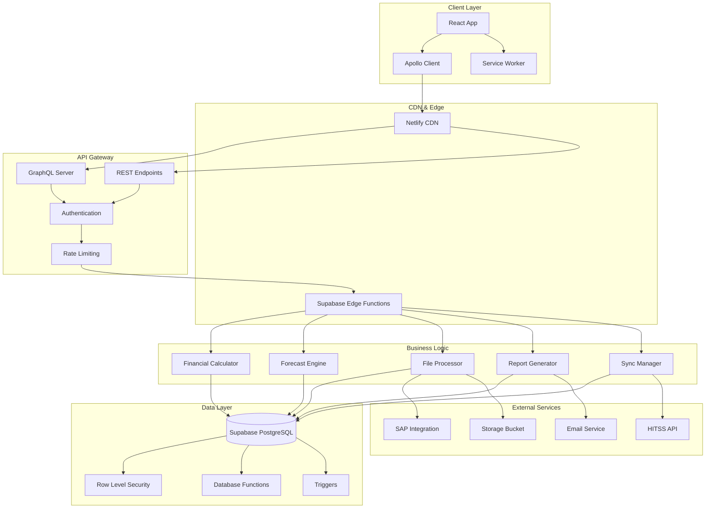

# 🏛️ Arquitetura Técnica - App Financeiro Supabase

## 1. Visão Geral da Arquitetura

Este documento detalha a arquitetura técnica completa do App Financeiro após a migração para Supabase, incluindo especificações de componentes, Edge Functions, APIs e integrações.

### Princípios Arquiteturais
- **Modularidade**: Componentes independentes e reutilizáveis
- **Escalabilidade**: Arquitetura preparada para crescimento
- **Performance**: Otimização em todas as camadas
- **Segurança**: Implementação de melhores práticas
- **Manutenibilidade**: Código limpo e bem documentado

## 2. Diagrama de Arquitetura Geral



## 3. Especificações Técnicas

### 3.1 Frontend Stack

#### Core Technologies
- **React**: 18.2.0 com Concurrent Features
- **TypeScript**: 5.0+ com strict mode
- **Vite**: 4.0+ para build e desenvolvimento
- **Apollo Client**: 3.8+ para GraphQL
- **TailwindCSS**: 3.3+ para styling

#### State Management
```typescript
// Apollo Client Configuration
import { ApolloClient, InMemoryCache, createHttpLink } from '@apollo/client'
import { setContext } from '@apollo/client/link/context'

const httpLink = createHttpLink({
  uri: process.env.VITE_GRAPHQL_ENDPOINT
})

const authLink = setContext((_, { headers }) => {
  const token = localStorage.getItem('supabase.auth.token')
  return {
    headers: {
      ...headers,
      authorization: token ? `Bearer ${token}` : ""
    }
  }
})

export const apolloClient = new ApolloClient({
  link: authLink.concat(httpLink),
  cache: new InMemoryCache({
    typePolicies: {
      Project: {
        fields: {
          transactions: {
            merge(existing = [], incoming) {
              return [...existing, ...incoming]
            }
          }
        }
      }
    }
  }),
  defaultOptions: {
    watchQuery: {
      errorPolicy: 'all',
      fetchPolicy: 'cache-and-network'
    }
  }
})
```

#### Component Architecture
```typescript
// Base Component Interface
interface BaseComponentProps {
  className?: string
  testId?: string
  loading?: boolean
  error?: Error | null
}

// Higher-Order Component for Error Boundary
export function withErrorBoundary<P extends object>(
  Component: React.ComponentType<P>
) {
  return function WrappedComponent(props: P) {
    return (
      <ErrorBoundary>
        <Suspense fallback={<LoadingSpinner />}>
          <Component {...props} />
        </Suspense>
      </ErrorBoundary>
    )
  }
}

// Custom Hook for Data Fetching
export function useFinancialData(filters: FinancialFilters) {
  const { data, loading, error, refetch } = useQuery(GET_FINANCIAL_DATA, {
    variables: { filters },
    errorPolicy: 'all',
    notifyOnNetworkStatusChange: true
  })

  const memoizedData = useMemo(() => {
    return data?.transactions?.map(transformTransaction) || []
  }, [data])

  return {
    transactions: memoizedData,
    loading,
    error,
    refetch
  }
}
```

### 3.2 Backend Architecture

#### Supabase Edge Functions Structure
```
supabase/functions/
├── _shared/
│   ├── auth.ts
│   ├── cors.ts
│   ├── database.ts
│   ├── logger.ts
│   ├── types.ts
│   ├── utils.ts
│   └── validators.ts
├── calculate-financial-metrics/
│   ├── index.ts
│   ├── calculators/
│   ├── models/
│   └── types.ts
├── process-file-upload/
│   ├── index.ts
│   ├── parsers/
│   ├── validators/
│   └── processors/
├── sync-professionals/
│   ├── index.ts
│   ├── connectors/
│   ├── transformers/
│   └── sync-strategies.ts
├── generate-forecast/
│   ├── index.ts
│   ├── algorithms/
│   ├── models/
│   └── validators.ts
└── generate-reports/
    ├── index.ts
    ├── generators/
    ├── templates/
    └── exporters.ts
```

#### Shared Modules

##### Authentication Module
```typescript
// _shared/auth.ts
import { createClient } from '@supabase/supabase-js'

interface AuthContext {
  user: any
  session: any
  permissions: string[]
}

export async function authenticateRequest(
  request: Request
): Promise<AuthContext> {
  const authHeader = request.headers.get('Authorization')
  
  if (!authHeader?.startsWith('Bearer ')) {
    throw new Error('Missing or invalid authorization header')
  }

  const token = authHeader.substring(7)
  const supabase = createClient(
    Deno.env.get('SUPABASE_URL')!,
    Deno.env.get('SUPABASE_SERVICE_ROLE_KEY')!
  )

  const { data: { user }, error } = await supabase.auth.getUser(token)
  
  if (error || !user) {
    throw new Error('Invalid token')
  }

  // Get user permissions
  const { data: profile } = await supabase
    .from('user_profiles')
    .select(`
      *,
      role:user_roles(permissions)
    `)
    .eq('id', user.id)
    .single()

  return {
    user,
    session: { user },
    permissions: profile?.role?.permissions || []
  }
}

export function requirePermission(
  context: AuthContext,
  resource: string,
  action: string
) {
  const resourcePermissions = context.permissions[resource] || []
  
  if (!resourcePermissions.includes(action)) {
    throw new Error(`Insufficient permissions: ${resource}:${action}`)
  }
}
```

##### Database Module
```typescript
// _shared/database.ts
import { createClient, SupabaseClient } from '@supabase/supabase-js'

export class DatabaseService {
  private client: SupabaseClient

  constructor() {
    this.client = createClient(
      Deno.env.get('SUPABASE_URL')!,
      Deno.env.get('SUPABASE_SERVICE_ROLE_KEY')!
    )
  }

  async executeTransaction<T>(
    operations: (client: SupabaseClient) => Promise<T>
  ): Promise<T> {
    try {
      return await operations(this.client)
    } catch (error) {
      console.error('Database transaction failed:', error)
      throw error
    }
  }

  async batchInsert<T>(
    table: string,
    data: T[],
    batchSize: number = 100
  ): Promise<void> {
    for (let i = 0; i < data.length; i += batchSize) {
      const batch = data.slice(i, i + batchSize)
      
      const { error } = await this.client
        .from(table)
        .insert(batch)
      
      if (error) {
        throw new Error(`Batch insert failed: ${error.message}`)
      }
    }
  }

  async executeRPC<T>(
    functionName: string,
    params: Record<string, any>
  ): Promise<T> {
    const { data, error } = await this.client
      .rpc(functionName, params)
    
    if (error) {
      throw new Error(`RPC call failed: ${error.message}`)
    }
    
    return data
  }
}
```

##### Logger Module
```typescript
// _shared/logger.ts
interface LogEntry {
  level: 'info' | 'warn' | 'error' | 'debug'
  message: string
  metadata?: Record<string, any>
  timestamp: string
  functionName: string
  userId?: string
}

export class Logger {
  constructor(private functionName: string) {}

  private log(level: LogEntry['level'], message: string, metadata?: Record<string, any>) {
    const entry: LogEntry = {
      level,
      message,
      metadata,
      timestamp: new Date().toISOString(),
      functionName: this.functionName
    }

    console.log(JSON.stringify(entry))
  }

  info(message: string, metadata?: Record<string, any>) {
    this.log('info', message, metadata)
  }

  warn(message: string, metadata?: Record<string, any>) {
    this.log('warn', message, metadata)
  }

  error(message: string, metadata?: Record<string, any>) {
    this.log('error', message, metadata)
  }

  debug(message: string, metadata?: Record<string, any>) {
    this.log('debug', message, metadata)
  }
}
```

## 4. Edge Functions Detalhadas

### 4.1 Calculate Financial Metrics

```typescript
// calculate-financial-metrics/index.ts
import { serve } from 'https://deno.land/std@0.168.0/http/server.ts'
import { corsHeaders } from '../_shared/cors.ts'
import { authenticateRequest } from '../_shared/auth.ts'
import { DatabaseService } from '../_shared/database.ts'
import { Logger } from '../_shared/logger.ts'
import { FinancialCalculator } from './calculators/financial-calculator.ts'

interface MetricsRequest {
  projectId?: string
  startDate: string
  endDate: string
  metrics: string[]
  groupBy: 'month' | 'quarter' | 'year'
}

serve(async (req) => {
  const logger = new Logger('calculate-financial-metrics')
  
  if (req.method === 'OPTIONS') {
    return new Response('ok', { headers: corsHeaders })
  }

  try {
    // Authentication
    const authContext = await authenticateRequest(req)
    logger.info('Request authenticated', { userId: authContext.user.id })

    // Parse request
    const requestData: MetricsRequest = await req.json()
    logger.info('Processing metrics request', { requestData })

    // Initialize services
    const db = new DatabaseService()
    const calculator = new FinancialCalculator(db, logger)

    // Calculate metrics
    const metrics = await calculator.calculateMetrics({
      ...requestData,
      userId: authContext.user.id
    })

    logger.info('Metrics calculated successfully', { 
      metricsCount: Object.keys(metrics).length 
    })

    return new Response(
      JSON.stringify({
        success: true,
        data: metrics
      }),
      {
        headers: { ...corsHeaders, 'Content-Type': 'application/json' },
        status: 200
      }
    )
  } catch (error) {
    logger.error('Error calculating metrics', { error: error.message })
    
    return new Response(
      JSON.stringify({
        success: false,
        error: error.message
      }),
      {
        headers: { ...corsHeaders, 'Content-Type': 'application/json' },
        status: 500
      }
    )
  }
})
```

#### Financial Calculator
```typescript
// calculate-financial-metrics/calculators/financial-calculator.ts
import { DatabaseService } from '../../_shared/database.ts'
import { Logger } from '../../_shared/logger.ts'

interface MetricsInput {
  projectId?: string
  startDate: string
  endDate: string
  metrics: string[]
  groupBy: 'month' | 'quarter' | 'year'
  userId: string
}

interface MetricsOutput {
  revenue: MetricData[]
  cost: MetricData[]
  profit: MetricData[]
  margin: MetricData[]
  summary: {
    totalRevenue: number
    totalCost: number
    netProfit: number
    marginPercentage: number
  }
}

interface MetricData {
  period: string
  value: number
  change?: number
  changePercentage?: number
}

export class FinancialCalculator {
  constructor(
    private db: DatabaseService,
    private logger: Logger
  ) {}

  async calculateMetrics(input: MetricsInput): Promise<MetricsOutput> {
    this.logger.info('Starting metrics calculation', { input })

    // Get transactions data
    const transactions = await this.getTransactions(input)
    
    // Calculate metrics based on groupBy
    const groupedData = this.groupTransactions(transactions, input.groupBy)
    
    // Calculate each metric
    const revenue = this.calculateRevenue(groupedData)
    const cost = this.calculateCost(groupedData)
    const profit = this.calculateProfit(revenue, cost)
    const margin = this.calculateMargin(revenue, cost)
    
    // Calculate summary
    const summary = this.calculateSummary(revenue, cost)
    
    return {
      revenue,
      cost,
      profit,
      margin,
      summary
    }
  }

  private async getTransactions(input: MetricsInput) {
    const query = this.db.client
      .from('financial_transactions')
      .select('*')
      .gte('created_at', input.startDate)
      .lte('created_at', input.endDate)
    
    if (input.projectId) {
      query.eq('project_id', input.projectId)
    }
    
    const { data, error } = await query
    
    if (error) {
      throw new Error(`Failed to fetch transactions: ${error.message}`)
    }
    
    return data || []
  }

  private groupTransactions(transactions: any[], groupBy: string) {
    const grouped = new Map()
    
    transactions.forEach(transaction => {
      const period = this.getPeriodKey(transaction, groupBy)
      
      if (!grouped.has(period)) {
        grouped.set(period, {
          period,
          revenue: 0,
          cost: 0,
          transactions: []
        })
      }
      
      const group = grouped.get(period)
      group.transactions.push(transaction)
      
      if (transaction.nature === 'RECEITA') {
        group.revenue += transaction.amount
      } else if (transaction.nature === 'CUSTO') {
        group.cost += transaction.amount
      }
    })
    
    return Array.from(grouped.values())
  }

  private getPeriodKey(transaction: any, groupBy: string): string {
    const date = new Date(transaction.created_at)
    
    switch (groupBy) {
      case 'month':
        return `${date.getFullYear()}-${String(date.getMonth() + 1).padStart(2, '0')}`
      case 'quarter':
        const quarter = Math.floor(date.getMonth() / 3) + 1
        return `${date.getFullYear()}-Q${quarter}`
      case 'year':
        return String(date.getFullYear())
      default:
        return `${date.getFullYear()}-${String(date.getMonth() + 1).padStart(2, '0')}`
    }
  }

  private calculateRevenue(groupedData: any[]): MetricData[] {
    return groupedData.map((group, index) => {
      const previousValue = index > 0 ? groupedData[index - 1].revenue : 0
      const change = group.revenue - previousValue
      const changePercentage = previousValue > 0 ? (change / previousValue) * 100 : 0
      
      return {
        period: group.period,
        value: group.revenue,
        change,
        changePercentage
      }
    })
  }

  private calculateCost(groupedData: any[]): MetricData[] {
    return groupedData.map((group, index) => {
      const previousValue = index > 0 ? groupedData[index - 1].cost : 0
      const change = group.cost - previousValue
      const changePercentage = previousValue > 0 ? (change / previousValue) * 100 : 0
      
      return {
        period: group.period,
        value: group.cost,
        change,
        changePercentage
      }
    })
  }

  private calculateProfit(revenue: MetricData[], cost: MetricData[]): MetricData[] {
    return revenue.map((rev, index) => {
      const costValue = cost[index]?.value || 0
      const profit = rev.value - costValue
      
      const previousProfit = index > 0 
        ? revenue[index - 1].value - (cost[index - 1]?.value || 0)
        : 0
      
      const change = profit - previousProfit
      const changePercentage = previousProfit !== 0 ? (change / Math.abs(previousProfit)) * 100 : 0
      
      return {
        period: rev.period,
        value: profit,
        change,
        changePercentage
      }
    })
  }

  private calculateMargin(revenue: MetricData[], cost: MetricData[]): MetricData[] {
    return revenue.map((rev, index) => {
      const costValue = cost[index]?.value || 0
      const margin = rev.value > 0 ? ((rev.value - costValue) / rev.value) * 100 : 0
      
      const previousMargin = index > 0 && revenue[index - 1].value > 0
        ? ((revenue[index - 1].value - (cost[index - 1]?.value || 0)) / revenue[index - 1].value) * 100
        : 0
      
      const change = margin - previousMargin
      
      return {
        period: rev.period,
        value: margin,
        change,
        changePercentage: 0 // Margin is already a percentage
      }
    })
  }

  private calculateSummary(revenue: MetricData[], cost: MetricData[]) {
    const totalRevenue = revenue.reduce((sum, item) => sum + item.value, 0)
    const totalCost = cost.reduce((sum, item) => sum + item.value, 0)
    const netProfit = totalRevenue - totalCost
    const marginPercentage = totalRevenue > 0 ? (netProfit / totalRevenue) * 100 : 0
    
    return {
      totalRevenue,
      totalCost,
      netProfit,
      marginPercentage
    }
  }
}
```

### 4.2 Process File Upload

```typescript
// process-file-upload/index.ts
import { serve } from 'https://deno.land/std@0.168.0/http/server.ts'
import { corsHeaders } from '../_shared/cors.ts'
import { authenticateRequest } from '../_shared/auth.ts'
import { DatabaseService } from '../_shared/database.ts'
import { Logger } from '../_shared/logger.ts'
import { FileProcessor } from './processors/file-processor.ts'

interface UploadRequest {
  fileName: string
  fileData: string // Base64
  fileType: 'excel' | 'csv'
  uploadType: 'dre' | 'transactions' | 'professionals'
  projectId?: string
}

serve(async (req) => {
  const logger = new Logger('process-file-upload')
  
  if (req.method === 'OPTIONS') {
    return new Response('ok', { headers: corsHeaders })
  }

  try {
    // Authentication
    const authContext = await authenticateRequest(req)
    logger.info('Upload request authenticated', { userId: authContext.user.id })

    // Parse request
    const uploadData: UploadRequest = await req.json()
    logger.info('Processing file upload', { 
      fileName: uploadData.fileName,
      fileType: uploadData.fileType,
      uploadType: uploadData.uploadType
    })

    // Initialize services
    const db = new DatabaseService()
    const processor = new FileProcessor(db, logger)

    // Process file
    const result = await processor.processFile({
      ...uploadData,
      userId: authContext.user.id
    })

    logger.info('File processed successfully', { 
      processedRows: result.processedRows,
      errors: result.errors.length
    })

    return new Response(
      JSON.stringify({
        success: true,
        data: result
      }),
      {
        headers: { ...corsHeaders, 'Content-Type': 'application/json' },
        status: 200
      }
    )
  } catch (error) {
    logger.error('Error processing file upload', { error: error.message })
    
    return new Response(
      JSON.stringify({
        success: false,
        error: error.message
      }),
      {
        headers: { ...corsHeaders, 'Content-Type': 'application/json' },
        status: 500
      }
    )
  }
})
```

## 5. Database Functions e Triggers

### 5.1 Database Functions

```sql
-- Function para calcular métricas financeiras
CREATE OR REPLACE FUNCTION calculate_project_metrics(
  p_project_id UUID,
  p_start_date DATE,
  p_end_date DATE
)
RETURNS TABLE (
  period TEXT,
  revenue DECIMAL(15,2),
  cost DECIMAL(15,2),
  profit DECIMAL(15,2),
  margin DECIMAL(5,2)
)
LANGUAGE plpgsql
AS $$
BEGIN
  RETURN QUERY
  SELECT 
    TO_CHAR(DATE_TRUNC('month', 
      MAKE_DATE(period_year, period_month, 1)
    ), 'YYYY-MM') as period,
    COALESCE(SUM(CASE WHEN nature = 'RECEITA' THEN amount ELSE 0 END), 0) as revenue,
    COALESCE(SUM(CASE WHEN nature = 'CUSTO' THEN amount ELSE 0 END), 0) as cost,
    COALESCE(SUM(CASE WHEN nature = 'RECEITA' THEN amount ELSE -amount END), 0) as profit,
    CASE 
      WHEN SUM(CASE WHEN nature = 'RECEITA' THEN amount ELSE 0 END) > 0 THEN
        (SUM(CASE WHEN nature = 'RECEITA' THEN amount ELSE -amount END) / 
         SUM(CASE WHEN nature = 'RECEITA' THEN amount ELSE 0 END)) * 100
      ELSE 0
    END as margin
  FROM financial_transactions
  WHERE 
    (p_project_id IS NULL OR project_id = p_project_id)
    AND MAKE_DATE(period_year, period_month, 1) BETWEEN p_start_date AND p_end_date
  GROUP BY period_year, period_month
  ORDER BY period_year, period_month;
END;
$$;

-- Function para validar dados de transação
CREATE OR REPLACE FUNCTION validate_transaction_data()
RETURNS TRIGGER
LANGUAGE plpgsql
AS $$
BEGIN
  -- Validar período
  IF NEW.period_month < 1 OR NEW.period_month > 12 THEN
    RAISE EXCEPTION 'Invalid month: %', NEW.period_month;
  END IF;
  
  IF NEW.period_year < 2000 OR NEW.period_year > EXTRACT(YEAR FROM NOW()) + 10 THEN
    RAISE EXCEPTION 'Invalid year: %', NEW.period_year;
  END IF;
  
  -- Validar valor
  IF NEW.amount IS NULL OR NEW.amount = 0 THEN
    RAISE EXCEPTION 'Amount cannot be null or zero';
  END IF;
  
  -- Normalizar dados
  NEW.account_code = UPPER(TRIM(NEW.account_code));
  NEW.account_name = TRIM(NEW.account_name);
  
  RETURN NEW;
END;
$$;

-- Function para auditoria
CREATE OR REPLACE FUNCTION audit_changes()
RETURNS TRIGGER
LANGUAGE plpgsql
AS $$
BEGIN
  INSERT INTO audit_logs (
    table_name,
    record_id,
    action,
    old_values,
    new_values,
    user_id
  ) VALUES (
    TG_TABLE_NAME,
    COALESCE(NEW.id, OLD.id),
    TG_OP,
    CASE WHEN TG_OP = 'DELETE' THEN to_jsonb(OLD) ELSE NULL END,
    CASE WHEN TG_OP = 'INSERT' OR TG_OP = 'UPDATE' THEN to_jsonb(NEW) ELSE NULL END,
    auth.uid()
  );
  
  RETURN COALESCE(NEW, OLD);
END;
$$;
```

### 5.2 Triggers

```sql
-- Trigger para validação de transações
CREATE TRIGGER validate_transaction_trigger
  BEFORE INSERT OR UPDATE ON financial_transactions
  FOR EACH ROW
  EXECUTE FUNCTION validate_transaction_data();

-- Triggers para auditoria
CREATE TRIGGER audit_projects_trigger
  AFTER INSERT OR UPDATE OR DELETE ON projects
  FOR EACH ROW
  EXECUTE FUNCTION audit_changes();

CREATE TRIGGER audit_transactions_trigger
  AFTER INSERT OR UPDATE OR DELETE ON financial_transactions
  FOR EACH ROW
  EXECUTE FUNCTION audit_changes();

CREATE TRIGGER audit_professionals_trigger
  AFTER INSERT OR UPDATE OR DELETE ON professionals
  FOR EACH ROW
  EXECUTE FUNCTION audit_changes();

-- Trigger para atualizar timestamp
CREATE OR REPLACE FUNCTION update_updated_at_column()
RETURNS TRIGGER
LANGUAGE plpgsql
AS $$
BEGIN
  NEW.updated_at = NOW();
  RETURN NEW;
END;
$$;

CREATE TRIGGER update_projects_updated_at
  BEFORE UPDATE ON projects
  FOR EACH ROW
  EXECUTE FUNCTION update_updated_at_column();

CREATE TRIGGER update_transactions_updated_at
  BEFORE UPDATE ON financial_transactions
  FOR EACH ROW
  EXECUTE FUNCTION update_updated_at_column();

CREATE TRIGGER update_professionals_updated_at
  BEFORE UPDATE ON professionals
  FOR EACH ROW
  EXECUTE FUNCTION update_updated_at_column();
```

## 6. Performance e Otimização

### 6.1 Estratégias de Cache

```typescript
// Cache Strategy Implementation
interface CacheConfig {
  ttl: number // Time to live in seconds
  maxSize: number // Maximum cache size
  strategy: 'lru' | 'fifo' | 'lfu'
}

class CacheManager {
  private cache = new Map<string, { data: any; timestamp: number; hits: number }>()
  private config: CacheConfig

  constructor(config: CacheConfig) {
    this.config = config
  }

  set(key: string, data: any): void {
    // Implement cache eviction if needed
    if (this.cache.size >= this.config.maxSize) {
      this.evict()
    }

    this.cache.set(key, {
      data,
      timestamp: Date.now(),
      hits: 0
    })
  }

  get(key: string): any | null {
    const entry = this.cache.get(key)
    
    if (!entry) {
      return null
    }

    // Check TTL
    if (Date.now() - entry.timestamp > this.config.ttl * 1000) {
      this.cache.delete(key)
      return null
    }

    entry.hits++
    return entry.data
  }

  private evict(): void {
    switch (this.config.strategy) {
      case 'lru':
        // Remove least recently used
        const oldestKey = Array.from(this.cache.keys())[0]
        this.cache.delete(oldestKey)
        break
      case 'lfu':
        // Remove least frequently used
        let minHits = Infinity
        let lfuKey = ''
        
        for (const [key, entry] of this.cache.entries()) {
          if (entry.hits < minHits) {
            minHits = entry.hits
            lfuKey = key
          }
        }
        
        this.cache.delete(lfuKey)
        break
    }
  }
}

// Usage in Edge Functions
const metricsCache = new CacheManager({
  ttl: 300, // 5 minutes
  maxSize: 1000,
  strategy: 'lru'
})

export async function getCachedMetrics(
  cacheKey: string,
  calculator: () => Promise<any>
): Promise<any> {
  // Try cache first
  const cached = metricsCache.get(cacheKey)
  if (cached) {
    return cached
  }

  // Calculate and cache
  const result = await calculator()
  metricsCache.set(cacheKey, result)
  
  return result
}
```

### 6.2 Query Optimization

```sql
-- Materialized View para métricas frequentes
CREATE MATERIALIZED VIEW monthly_project_metrics AS
SELECT 
  project_id,
  period_year,
  period_month,
  SUM(CASE WHEN nature = 'RECEITA' THEN amount ELSE 0 END) as total_revenue,
  SUM(CASE WHEN nature = 'CUSTO' THEN amount ELSE 0 END) as total_cost,
  SUM(CASE WHEN nature = 'RECEITA' THEN amount ELSE -amount END) as net_profit,
  COUNT(*) as transaction_count
FROM financial_transactions
GROUP BY project_id, period_year, period_month;

-- Índice para a materialized view
CREATE UNIQUE INDEX idx_monthly_metrics_unique 
ON monthly_project_metrics(project_id, period_year, period_month);

-- Function para refresh automático
CREATE OR REPLACE FUNCTION refresh_monthly_metrics()
RETURNS void
LANGUAGE plpgsql
AS $$
BEGIN
  REFRESH MATERIALIZED VIEW CONCURRENTLY monthly_project_metrics;
END;
$$;

-- Trigger para refresh automático após inserção
CREATE OR REPLACE FUNCTION trigger_metrics_refresh()
RETURNS TRIGGER
LANGUAGE plpgsql
AS $$
BEGIN
  -- Refresh apenas se necessário (evitar refresh excessivo)
  PERFORM pg_notify('refresh_metrics', NEW.project_id::text);
  RETURN NEW;
END;
$$;

CREATE TRIGGER refresh_metrics_trigger
  AFTER INSERT OR UPDATE OR DELETE ON financial_transactions
  FOR EACH ROW
  EXECUTE FUNCTION trigger_metrics_refresh();
```

## 7. Monitoramento e Observabilidade

### 7.1 Métricas de Performance

```typescript
// Performance Monitoring
interface PerformanceMetric {
  functionName: string
  executionTime: number
  memoryUsage: number
  timestamp: string
  success: boolean
  errorMessage?: string
}

export class PerformanceMonitor {
  private metrics: PerformanceMetric[] = []

  async measureExecution<T>(
    functionName: string,
    operation: () => Promise<T>
  ): Promise<T> {
    const startTime = performance.now()
    const startMemory = Deno.memoryUsage().heapUsed
    
    try {
      const result = await operation()
      
      this.recordMetric({
        functionName,
        executionTime: performance.now() - startTime,
        memoryUsage: Deno.memoryUsage().heapUsed - startMemory,
        timestamp: new Date().toISOString(),
        success: true
      })
      
      return result
    } catch (error) {
      this.recordMetric({
        functionName,
        executionTime: performance.now() - startTime,
        memoryUsage: Deno.memoryUsage().heapUsed - startMemory,
        timestamp: new Date().toISOString(),
        success: false,
        errorMessage: error.message
      })
      
      throw error
    }
  }

  private recordMetric(metric: PerformanceMetric): void {
    this.metrics.push(metric)
    
    // Log to console for Supabase monitoring
    console.log(JSON.stringify({
      type: 'performance_metric',
      ...metric
    }))
    
    // Keep only last 100 metrics in memory
    if (this.metrics.length > 100) {
      this.metrics.shift()
    }
  }

  getMetrics(): PerformanceMetric[] {
    return [...this.metrics]
  }

  getAverageExecutionTime(functionName: string): number {
    const functionMetrics = this.metrics.filter(m => m.functionName === functionName)
    
    if (functionMetrics.length === 0) return 0
    
    const total = functionMetrics.reduce((sum, m) => sum + m.executionTime, 0)
    return total / functionMetrics.length
  }
}
```

### 7.2 Health Checks

```typescript
// Health Check Implementation
export async function healthCheck(): Promise<{
  status: 'healthy' | 'degraded' | 'unhealthy'
  checks: Record<string, any>
  timestamp: string
}> {
  const checks: Record<string, any> = {}
  let overallStatus: 'healthy' | 'degraded' | 'unhealthy' = 'healthy'

  // Database connectivity
  try {
    const db = new DatabaseService()
    const { data } = await db.client.from('projects').select('count').limit(1)
    checks.database = { status: 'healthy', responseTime: 0 }
  } catch (error) {
    checks.database = { status: 'unhealthy', error: error.message }
    overallStatus = 'unhealthy'
  }

  // Memory usage
  const memoryUsage = Deno.memoryUsage()
  const memoryUsagePercent = (memoryUsage.heapUsed / memoryUsage.heapTotal) * 100
  
  checks.memory = {
    status: memoryUsagePercent > 90 ? 'unhealthy' : memoryUsagePercent > 70 ? 'degraded' : 'healthy',
    usagePercent: memoryUsagePercent,
    heapUsed: memoryUsage.heapUsed,
    heapTotal: memoryUsage.heapTotal
  }

  if (checks.memory.status !== 'healthy' && overallStatus === 'healthy') {
    overallStatus = checks.memory.status
  }

  return {
    status: overallStatus,
    checks,
    timestamp: new Date().toISOString()
  }
}
```

## 8. Segurança e Compliance

### 8.1 Validação de Input

```typescript
// Input Validation
import { z } from 'https://deno.land/x/zod@v3.21.4/mod.ts'

// Schema definitions
export const TransactionSchema = z.object({
  projectId: z.string().uuid().optional(),
  transactionType: z.enum(['receita', 'despesa']),
  nature: z.enum(['RECEITA', 'CUSTO']),
  accountCode: z.string().min(1).max(50),
  accountName: z.string().max(255).optional(),
  amount: z.number().positive(),
  periodYear: z.number().int().min(2000).max(2100),
  periodMonth: z.number().int().min(1).max(12),
  description: z.string().max(1000).optional()
})

export const MetricsRequestSchema = z.object({
  projectId: z.string().uuid().optional(),
  startDate: z.string().regex(/^\d{4}-\d{2}-\d{2}$/),
  endDate: z.string().regex(/^\d{4}-\d{2}-\d{2}$/),
  metrics: z.array(z.enum(['revenue', 'cost', 'profit', 'margin'])),
  groupBy: z.enum(['month', 'quarter', 'year'])
})

export const FileUploadSchema = z.object({
  fileName: z.string().min(1).max(255),
  fileData: z.string().min(1),
  fileType: z.enum(['excel', 'csv']),
  uploadType: z.enum(['dre', 'transactions', 'professionals']),
  projectId: z.string().uuid().optional()
})

// Validation middleware
export function validateInput<T>(
  schema: z.ZodSchema<T>,
  data: unknown
): T {
  try {
    return schema.parse(data)
  } catch (error) {
    if (error instanceof z.ZodError) {
      const errorMessages = error.errors.map(err => 
        `${err.path.join('.')}: ${err.message}`
      ).join(', ')
      
      throw new Error(`Validation failed: ${errorMessages}`)
    }
    throw error
  }
}

// Sanitization functions
export function sanitizeString(input: string): string {
  return input
    .trim()
    .replace(/[<>"'&]/g, '') // Remove potentially dangerous characters
    .substring(0, 1000) // Limit length
}

export function sanitizeNumber(input: any): number {
  const num = Number(input)
  if (isNaN(num) || !isFinite(num)) {
    throw new Error('Invalid number')
  }
  return num
}
```

### 8.2 Rate Limiting

```typescript
// Rate Limiting Implementation
interface RateLimitConfig {
  windowMs: number // Time window in milliseconds
  maxRequests: number // Maximum requests per window
  keyGenerator: (req: Request) => string
}

class RateLimiter {
  private requests = new Map<string, number[]>()
  
  constructor(private config: RateLimitConfig) {}
  
  isAllowed(req: Request): boolean {
    const key = this.config.keyGenerator(req)
    const now = Date.now()
    const windowStart = now - this.config.windowMs
    
    // Get existing requests for this key
    const userRequests = this.requests.get(key) || []
    
    // Filter out old requests
    const recentRequests = userRequests.filter(timestamp => timestamp > windowStart)
    
    // Check if limit exceeded
    if (recentRequests.length >= this.config.maxRequests) {
      return false
    }
    
    // Add current request
    recentRequests.push(now)
    this.requests.set(key, recentRequests)
    
    return true
  }
  
  getRemainingRequests(req: Request): number {
    const key = this.config.keyGenerator(req)
    const now = Date.now()
    const windowStart = now - this.config.windowMs
    
    const userRequests = this.requests.get(key) || []
    const recentRequests = userRequests.filter(timestamp => timestamp > windowStart)
    
    return Math.max(0, this.config.maxRequests - recentRequests.length)
  }
}

// Usage in Edge Functions
const rateLimiter = new RateLimiter({
  windowMs: 60 * 1000, // 1 minute
  maxRequests: 100, // 100 requests per minute
  keyGenerator: (req) => {
    // Use IP address or user ID for rate limiting
    const authHeader = req.headers.get('Authorization')
    return authHeader || req.headers.get('x-forwarded-for') || 'anonymous'
  }
})

export function checkRateLimit(req: Request): void {
  if (!rateLimiter.isAllowed(req)) {
    throw new Error('Rate limit exceeded')
  }
}
```

---

**Esta documentação técnica fornece a base completa para implementação da nova arquitetura do App Financeiro com Supabase. Cada seção deve ser utilizada como referência durante o desenvolvimento e pode ser expandida conforme necessário.**