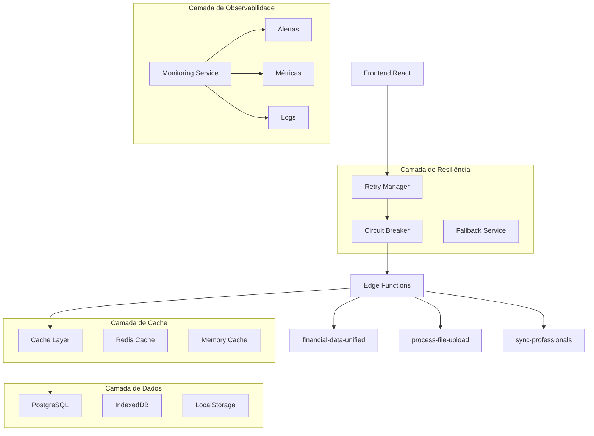
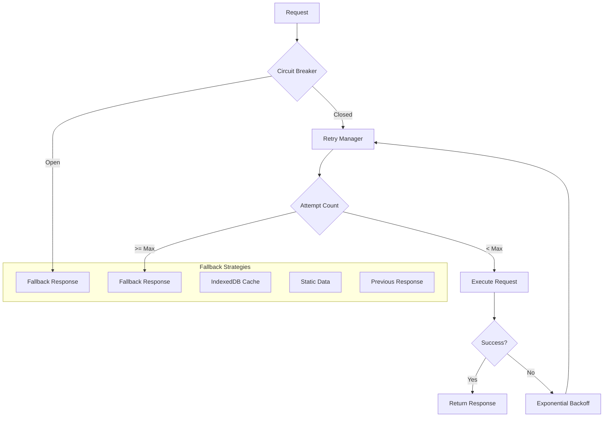
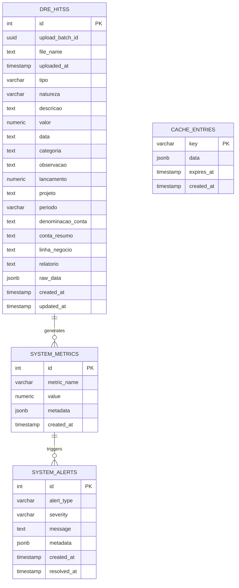

# 🏗️ ARQUITETURA TÉCNICA - CORREÇÕES DO SISTEMA DE EXTRAÇÃO

**Data:** 10 de Janeiro de 2025  
**Projeto:** App Financeiro HITSS  
**Versão:** 2.1.0 (Correções)  
**Status:** 📋 PLANO DE ARQUITETURA

---

## 1. Arquitetura de Correções



## 2. Tecnologias de Correção

- **Frontend:** React@18 + TypeScript + Retry Logic
- **Backend:** Supabase Edge Functions + Deno Runtime
- **Cache:** Redis + Memory Cache + IndexedDB
- **Monitoramento:** Custom Metrics + Supabase Logs
- **Banco:** PostgreSQL + Índices Otimizados
- **Resiliência:** Circuit Breaker + Exponential Backoff

## 3. Definições de Rotas Corrigidas

| Rota | Propósito | Correções Aplicadas |
|------|-----------|--------------------|
| `/dashboard` | Dashboard principal | Retry logic + Cache + Fallback |
| `/planilhas` | Dados de planilhas | Paginação + Índices otimizados |
| `/forecast` | Previsões financeiras | Cache inteligente + Validação |
| `/profissionais` | Dados de RH | Sync otimizado + Batch processing |
| `/admin/health` | Monitoramento | Nova rota para health checks |

## 4. APIs Corrigidas

### 4.1 Edge Function: financial-data-unified

**Endpoint:** `POST /functions/v1/financial-data-unified`

**Correções Implementadas:**
- Cache em memória (5 min TTL)
- Queries otimizadas com índices
- Validação de schema
- Timeout configurável
- Retry automático

**Request Corrigido:**
```json
{
  "type": "dashboard",
  "filters": {
    "projeto": "PROJETO_A",
    "ano": 2024,
    "mes": 12
  },
  "options": {
    "useCache": true,
    "timeout": 25000,
    "retryCount": 3
  }
}
```

**Response Padronizada:**
```json
{
  "success": true,
  "data": {
    "receitaTotal": 150000.00,
    "custoTotal": 120000.00,
    "margemBruta": 30000.00,
    "margemPercentual": 20.00,
    "projetos": ["PROJETO_A", "PROJETO_B"],
    "anos": [2024, 2023, 2022]
  },
  "metadata": {
    "source": "cache",
    "executionTime": 150,
    "cacheHit": true,
    "queryOptimized": true
  },
  "filters": {
    "projeto": "PROJETO_A",
    "ano": 2024,
    "mes": 12
  },
  "timestamp": "2025-01-10T10:30:00Z"
}
```

### 4.2 Health Check API

**Endpoint:** `GET /functions/v1/health-check`

**Request:**
```bash
curl -X GET 'https://xxx.supabase.co/functions/v1/health-check' \
  -H 'Authorization: Bearer [token]'
```

**Response:**
```json
{
  "success": true,
  "data": {
    "database": {
      "status": "healthy",
      "latency": 45,
      "connections": 12
    },
    "edgeFunctions": {
      "status": "healthy",
      "activeInstances": 3,
      "avgResponseTime": 180
    },
    "cache": {
      "status": "healthy",
      "hitRate": 0.85,
      "memoryUsage": 0.45
    }
  },
  "timestamp": "2025-01-10T10:30:00Z"
}
```

### 4.3 Metrics API

**Endpoint:** `GET /functions/v1/metrics`

**Request:**
```bash
curl -X GET 'https://xxx.supabase.co/functions/v1/metrics?period=1h' \
  -H 'Authorization: Bearer [token]'
```

**Response:**
```json
{
  "success": true,
  "data": {
    "period": "1h",
    "metrics": {
      "totalRequests": 1250,
      "successRate": 0.98,
      "avgLatency": 185,
      "errorRate": 0.02,
      "cacheHitRate": 0.82
    },
    "breakdown": {
      "dashboard": { "requests": 450, "avgLatency": 120 },
      "planilhas": { "requests": 300, "avgLatency": 200 },
      "forecast": { "requests": 250, "avgLatency": 350 },
      "profissionais": { "requests": 250, "avgLatency": 180 }
    }
  }
}
```

## 5. Arquitetura de Resiliência



### 5.1 Circuit Breaker Implementation

```typescript
class CircuitBreaker {
  private state: 'CLOSED' | 'OPEN' | 'HALF_OPEN' = 'CLOSED';
  private failureCount = 0;
  private lastFailureTime = 0;
  private readonly failureThreshold = 5;
  private readonly recoveryTimeout = 30000; // 30s
  
  async execute<T>(operation: () => Promise<T>): Promise<T> {
    if (this.state === 'OPEN') {
      if (Date.now() - this.lastFailureTime > this.recoveryTimeout) {
        this.state = 'HALF_OPEN';
      } else {
        throw new Error('Circuit breaker is OPEN');
      }
    }
    
    try {
      const result = await operation();
      this.onSuccess();
      return result;
    } catch (error) {
      this.onFailure();
      throw error;
    }
  }
  
  private onSuccess(): void {
    this.failureCount = 0;
    this.state = 'CLOSED';
  }
  
  private onFailure(): void {
    this.failureCount++;
    this.lastFailureTime = Date.now();
    
    if (this.failureCount >= this.failureThreshold) {
      this.state = 'OPEN';
    }
  }
}
```

### 5.2 Retry Manager com Backoff

```typescript
class RetryManager {
  async executeWithRetry<T>(
    operation: () => Promise<T>,
    options: {
      maxRetries?: number;
      baseDelay?: number;
      maxDelay?: number;
      backoffFactor?: number;
    } = {}
  ): Promise<T> {
    const {
      maxRetries = 3,
      baseDelay = 1000,
      maxDelay = 30000,
      backoffFactor = 2
    } = options;
    
    let lastError: Error;
    
    for (let attempt = 1; attempt <= maxRetries; attempt++) {
      try {
        return await operation();
      } catch (error) {
        lastError = error as Error;
        
        if (attempt === maxRetries) {
          break;
        }
        
        const delay = Math.min(
          baseDelay * Math.pow(backoffFactor, attempt - 1),
          maxDelay
        );
        
        await this.sleep(delay);
      }
    }
    
    throw lastError!;
  }
  
  private sleep(ms: number): Promise<void> {
    return new Promise(resolve => setTimeout(resolve, ms));
  }
}
```

## 6. Modelo de Dados Otimizado

### 6.1 Estrutura da Tabela dre_hitss



### 6.2 Índices Otimizados

```sql
-- Índices compostos para queries frequentes
CREATE INDEX CONCURRENTLY idx_dre_hitss_projeto_periodo 
  ON dre_hitss(projeto, periodo);

CREATE INDEX CONCURRENTLY idx_dre_hitss_tipo_natureza_data 
  ON dre_hitss(tipo, natureza, data);

CREATE INDEX CONCURRENTLY idx_dre_hitss_valor_data 
  ON dre_hitss(valor DESC, data DESC);

-- Índice para agregações
CREATE INDEX CONCURRENTLY idx_dre_hitss_aggregation 
  ON dre_hitss(projeto, periodo, tipo, natureza) 
  INCLUDE (valor);

-- Índice para busca textual
CREATE INDEX CONCURRENTLY idx_dre_hitss_search 
  ON dre_hitss USING gin(to_tsvector('portuguese', descricao));
```

### 6.3 Particionamento por Data

```sql
-- Criar tabela particionada
CREATE TABLE dre_hitss_partitioned (
  LIKE dre_hitss INCLUDING ALL
) PARTITION BY RANGE (created_at);

-- Partições mensais
CREATE TABLE dre_hitss_2024_01 PARTITION OF dre_hitss_partitioned
  FOR VALUES FROM ('2024-01-01') TO ('2024-02-01');

CREATE TABLE dre_hitss_2024_02 PARTITION OF dre_hitss_partitioned
  FOR VALUES FROM ('2024-02-01') TO ('2024-03-01');

-- Automatizar criação de partições
CREATE OR REPLACE FUNCTION create_monthly_partition()
RETURNS void AS $$
DECLARE
  start_date date;
  end_date date;
  table_name text;
BEGIN
  start_date := date_trunc('month', CURRENT_DATE + interval '1 month');
  end_date := start_date + interval '1 month';
  table_name := 'dre_hitss_' || to_char(start_date, 'YYYY_MM');
  
  EXECUTE format('CREATE TABLE %I PARTITION OF dre_hitss_partitioned FOR VALUES FROM (%L) TO (%L)',
                 table_name, start_date, end_date);
END;
$$ LANGUAGE plpgsql;
```

## 7. Sistema de Cache Inteligente

### 7.1 Estratégia de Cache Multi-Layer

```typescript
class CacheManager {
  private memoryCache = new Map<string, CacheEntry>();
  private readonly TTL = {
    dashboard: 5 * 60 * 1000,    // 5 min
    planilhas: 10 * 60 * 1000,  // 10 min
    forecast: 30 * 60 * 1000,   // 30 min
    profissionais: 60 * 60 * 1000 // 1 hour
  };
  
  async get<T>(key: string, type: keyof typeof this.TTL): Promise<T | null> {
    // 1. Verificar cache em memória
    const memoryEntry = this.memoryCache.get(key);
    if (memoryEntry && !this.isExpired(memoryEntry, this.TTL[type])) {
      return memoryEntry.data;
    }
    
    // 2. Verificar IndexedDB
    const indexedDBEntry = await this.getFromIndexedDB(key);
    if (indexedDBEntry && !this.isExpired(indexedDBEntry, this.TTL[type])) {
      // Promover para cache em memória
      this.memoryCache.set(key, indexedDBEntry);
      return indexedDBEntry.data;
    }
    
    return null;
  }
  
  async set<T>(key: string, data: T): Promise<void> {
    const entry: CacheEntry = {
      data,
      timestamp: Date.now()
    };
    
    // Salvar em ambos os caches
    this.memoryCache.set(key, entry);
    await this.saveToIndexedDB(key, entry);
  }
  
  private isExpired(entry: CacheEntry, ttl: number): boolean {
    return Date.now() - entry.timestamp > ttl;
  }
}

interface CacheEntry {
  data: any;
  timestamp: number;
}
```

### 7.2 Cache Warming Strategy

```typescript
class CacheWarmer {
  async warmCriticalData(): Promise<void> {
    const criticalQueries = [
      { type: 'dashboard', filters: {} },
      { type: 'projetos', filters: {} },
      { type: 'anos', filters: {} }
    ];
    
    await Promise.all(
      criticalQueries.map(query => this.preloadData(query))
    );
  }
  
  private async preloadData(query: any): Promise<void> {
    try {
      await financialDataService.callUnifiedFunction(query.type, query.filters);
    } catch (error) {
      console.warn(`Failed to warm cache for ${query.type}:`, error);
    }
  }
}
```

## 8. Monitoramento e Observabilidade

### 8.1 Métricas Customizadas

```typescript
class MetricsCollector {
  private metrics = new Map<string, number[]>();
  
  recordLatency(operation: string, latency: number): void {
    if (!this.metrics.has(operation)) {
      this.metrics.set(operation, []);
    }
    
    const values = this.metrics.get(operation)!;
    values.push(latency);
    
    // Manter apenas últimas 100 medições
    if (values.length > 100) {
      values.shift();
    }
  }
  
  getAverageLatency(operation: string): number {
    const values = this.metrics.get(operation) || [];
    if (values.length === 0) return 0;
    
    return values.reduce((sum, val) => sum + val, 0) / values.length;
  }
  
  getPercentile(operation: string, percentile: number): number {
    const values = this.metrics.get(operation) || [];
    if (values.length === 0) return 0;
    
    const sorted = [...values].sort((a, b) => a - b);
    const index = Math.ceil((percentile / 100) * sorted.length) - 1;
    return sorted[index];
  }
}
```

### 8.2 Health Check Endpoint

```typescript
// supabase/functions/health-check/index.ts
import { serve } from 'https://deno.land/std@0.168.0/http/server.ts';
import { createClient } from 'https://esm.sh/@supabase/supabase-js@2';

serve(async (req) => {
  try {
    const supabase = createClient(
      Deno.env.get('SUPABASE_URL') ?? '',
      Deno.env.get('SUPABASE_SERVICE_ROLE_KEY') ?? ''
    );
    
    // Verificar conexão com banco
    const dbStart = Date.now();
    const { error: dbError } = await supabase
      .from('dre_hitss')
      .select('id')
      .limit(1);
    const dbLatency = Date.now() - dbStart;
    
    // Verificar cache
    const cacheStart = Date.now();
    // Implementar verificação de cache
    const cacheLatency = Date.now() - cacheStart;
    
    const health = {
      database: {
        status: dbError ? 'unhealthy' : 'healthy',
        latency: dbLatency,
        error: dbError?.message
      },
      cache: {
        status: 'healthy',
        latency: cacheLatency
      },
      timestamp: new Date().toISOString()
    };
    
    return new Response(JSON.stringify({ success: true, data: health }), {
      headers: { 'Content-Type': 'application/json' }
    });
  } catch (error) {
    return new Response(
      JSON.stringify({ success: false, error: error.message }),
      { status: 500, headers: { 'Content-Type': 'application/json' } }
    );
  }
});
```

---

## 🎯 IMPLEMENTAÇÃO PRÁTICA

### Ordem de Implementação

1. **Correção da Tabela dre_hitss** (Prioridade Máxima)
2. **Implementação do Retry Manager**
3. **Otimização das Edge Functions**
4. **Sistema de Cache Multi-Layer**
5. **Circuit Breaker e Fallbacks**
6. **Monitoramento e Alertas**
7. **Testes de Performance**
8. **Deploy Gradual**

### Scripts de Deploy

```bash
#!/bin/bash
# deploy-corrections.sh

echo "🚀 Iniciando deploy das correções..."

# 1. Aplicar migrações
echo "📊 Aplicando migrações do banco..."
npx supabase db push

# 2. Deploy das Edge Functions
echo "⚡ Fazendo deploy das Edge Functions..."
npx supabase functions deploy financial-data-unified
npx supabase functions deploy health-check
npx supabase functions deploy metrics

# 3. Verificar saúde do sistema
echo "🔍 Verificando saúde do sistema..."
curl -f https://xxx.supabase.co/functions/v1/health-check || exit 1

# 4. Executar testes
echo "🧪 Executando testes..."
npm run test:integration

echo "✅ Deploy concluído com sucesso!"
```

---

**Próximos Passos:** Implementar as correções seguindo a ordem de prioridade definida e monitorar métricas de performance continuamente.