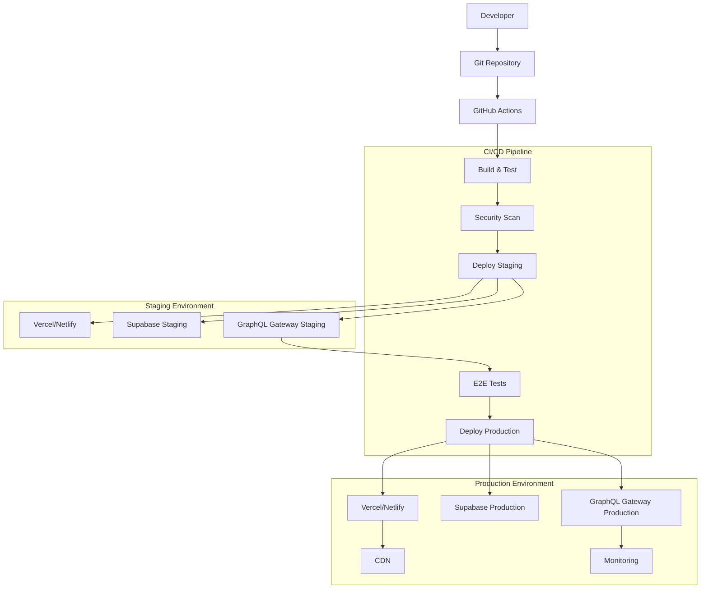

# 🚀 Configuração de Ambiente e Deploy

## 🎯 Visão Geral

Este documento detalha a configuração completa do ambiente de desenvolvimento, staging e produção para o App Financeiro com arquitetura Supabase Edge Functions e GraphQL Gateway.

### Arquitetura de Deploy



## 🔧 Configuração de Ambiente

### Variáveis de Ambiente

#### Frontend (.env)

```bash
# Supabase Configuration
REACT_APP_SUPABASE_URL=https://your-project.supabase.co
REACT_APP_SUPABASE_ANON_KEY=your-anon-key

# GraphQL Gateway
REACT_APP_GRAPHQL_ENDPOINT=https://your-gateway.vercel.app/graphql
REACT_APP_GRAPHQL_WS_ENDPOINT=wss://your-gateway.vercel.app/graphql

# Application Settings
REACT_APP_VERSION=1.0.0
REACT_APP_ENVIRONMENT=development
REACT_APP_API_TIMEOUT=30000

# External Services
REACT_APP_SENTRY_DSN=your-sentry-dsn
REACT_APP_ANALYTICS_ID=your-analytics-id

# Feature Flags
REACT_APP_ENABLE_REAL_TIME=true
REACT_APP_ENABLE_OFFLINE_MODE=true
REACT_APP_ENABLE_PWA=true

# Development
REACT_APP_DEBUG_MODE=true
REACT_APP_MOCK_API=false
```

#### GraphQL Gateway (.env)

```bash
# Server Configuration
PORT=4000
NODE_ENV=development
CORS_ORIGIN=http://localhost:3000,https://your-frontend.vercel.app

# Supabase Configuration
SUPABASE_URL=https://your-project.supabase.co
SUPABASE_SERVICE_ROLE_KEY=your-service-role-key
SUPABASE_ANON_KEY=your-anon-key

# Authentication
JWT_SECRET=your-jwt-secret
JWT_EXPIRES_IN=7d
AUTH_COOKIE_SECURE=true
AUTH_COOKIE_SAME_SITE=strict

# Redis Configuration (Production)
REDIS_URL=redis://localhost:6379
REDIS_HOST=localhost
REDIS_PORT=6379
REDIS_PASSWORD=your-redis-password

# Rate Limiting
RATE_LIMIT_WINDOW_MS=900000
RATE_LIMIT_MAX_REQUESTS=1000
RATE_LIMIT_SKIP_SUCCESSFUL_REQUESTS=true

# Monitoring
SENTRY_DSN=your-sentry-dsn
NEW_RELIC_LICENSE_KEY=your-newrelic-key
DATADOG_API_KEY=your-datadog-key

# External APIs
HITSS_API_URL=https://api.hitss.com
HITSS_API_KEY=your-hitss-api-key
SAP_API_URL=https://sap.your-company.com
SAP_API_USERNAME=your-sap-username
SAP_API_PASSWORD=your-sap-password

# File Upload
MAX_FILE_SIZE=52428800
MAX_FILES_PER_UPLOAD=10
UPLOAD_TIMEOUT=300000

# Logging
LOG_LEVEL=info
LOG_FORMAT=json
LOG_FILE_PATH=/var/log/app-financeiro

# Performance
CACHE_TTL=3600
QUERY_TIMEOUT=30000
CONNECTION_POOL_SIZE=20
```

#### Supabase Edge Functions (.env)

```bash
# Supabase Configuration
SUPABASE_URL=https://your-project.supabase.co
SUPABASE_SERVICE_ROLE_KEY=your-service-role-key

# External APIs
HITSS_API_URL=https://api.hitss.com
HITSS_API_KEY=your-hitss-api-key
SAP_API_URL=https://sap.your-company.com
SAP_USERNAME=your-sap-username
SAP_PASSWORD=your-sap-password

# Email Service
SMTP_HOST=smtp.gmail.com
SMTP_PORT=587
SMTP_USER=your-email@gmail.com
SMTP_PASS=your-app-password

# Monitoring
SENTRY_DSN=your-sentry-dsn

# Feature Flags
ENABLE_AUDIT_LOGS=true
ENABLE_PERFORMANCE_MONITORING=true
ENABLE_ERROR_REPORTING=true
```

### Docker Configuration

#### GraphQL Gateway Dockerfile

```dockerfile
# Build stage
FROM node:18-alpine AS builder

WORKDIR /app

# Copy package files
COPY package*.json ./
COPY yarn.lock ./

# Install dependencies
RUN yarn install --frozen-lockfile

# Copy source code
COPY . .

# Build application
RUN yarn build

# Production stage
FROM node:18-alpine AS production

WORKDIR /app

# Install dumb-init for proper signal handling
RUN apk add --no-cache dumb-init

# Create non-root user
RUN addgroup -g 1001 -S nodejs
RUN adduser -S nextjs -u 1001

# Copy package files
COPY package*.json ./
COPY yarn.lock ./

# Install production dependencies only
RUN yarn install --frozen-lockfile --production && yarn cache clean

# Copy built application
COPY --from=builder --chown=nextjs:nodejs /app/dist ./dist

# Switch to non-root user
USER nextjs

# Expose port
EXPOSE 4000

# Health check
HEALTHCHECK --interval=30s --timeout=3s --start-period=5s --retries=3 \
  CMD node healthcheck.js

# Start application
ENTRYPOINT ["dumb-init", "--"]
CMD ["node", "dist/index.js"]
```

#### Docker Compose para Desenvolvimento

```yaml
version: '3.8'

services:
  # GraphQL Gateway
  graphql-gateway:
    build:
      context: ./graphql-gateway
      dockerfile: Dockerfile
    ports:
      - "4000:4000"
    environment:
      - NODE_ENV=development
      - SUPABASE_URL=${SUPABASE_URL}
      - SUPABASE_SERVICE_ROLE_KEY=${SUPABASE_SERVICE_ROLE_KEY}
      - REDIS_URL=redis://redis:6379
    depends_on:
      - redis
    volumes:
      - ./graphql-gateway:/app
      - /app/node_modules
    restart: unless-stopped
    networks:
      - app-network

  # Redis for caching
  redis:
    image: redis:7-alpine
    ports:
      - "6379:6379"
    volumes:
      - redis_data:/data
    restart: unless-stopped
    networks:
      - app-network
    command: redis-server --appendonly yes

  # Frontend (development)
  frontend:
    build:
      context: ./frontend
      dockerfile: Dockerfile.dev
    ports:
      - "3000:3000"
    environment:
      - REACT_APP_GRAPHQL_ENDPOINT=http://localhost:4000/graphql
      - REACT_APP_GRAPHQL_WS_ENDPOINT=ws://localhost:4000/graphql
    volumes:
      - ./frontend:/app
      - /app/node_modules
    restart: unless-stopped
    networks:
      - app-network

  # Monitoring
  prometheus:
    image: prom/prometheus:latest
    ports:
      - "9090:9090"
    volumes:
      - ./monitoring/prometheus.yml:/etc/prometheus/prometheus.yml
      - prometheus_data:/prometheus
    restart: unless-stopped
    networks:
      - app-network

  grafana:
    image: grafana/grafana:latest
    ports:
      - "3001:3000"
    environment:
      - GF_SECURITY_ADMIN_PASSWORD=admin
    volumes:
      - grafana_data:/var/lib/grafana
      - ./monitoring/grafana/dashboards:/etc/grafana/provisioning/dashboards
      - ./monitoring/grafana/datasources:/etc/grafana/provisioning/datasources
    restart: unless-stopped
    networks:
      - app-network

volumes:
  redis_data:
  prometheus_data:
  grafana_data:

networks:
  app-network:
    driver: bridge
```

## 🔄 CI/CD Pipeline

### GitHub Actions Workflow

**Arquivo:** `.github/workflows/deploy.yml`

```yaml
name: Deploy App Financeiro

on:
  push:
    branches: [main, develop]
  pull_request:
    branches: [main]

env:
  NODE_VERSION: '18'
  PNPM_VERSION: '8'

jobs:
  # Test and Build
  test:
    runs-on: ubuntu-latest
    
    steps:
      - name: Checkout code
        uses: actions/checkout@v4
        
      - name: Setup Node.js
        uses: actions/setup-node@v4
        with:
          node-version: ${{ env.NODE_VERSION }}
          
      - name: Setup pnpm
        uses: pnpm/action-setup@v2
        with:
          version: ${{ env.PNPM_VERSION }}
          
      - name: Get pnpm store directory
        id: pnpm-cache
        shell: bash
        run: |
          echo "STORE_PATH=$(pnpm store path)" >> $GITHUB_OUTPUT
          
      - name: Setup pnpm cache
        uses: actions/cache@v3
        with:
          path: ${{ steps.pnpm-cache.outputs.STORE_PATH }}
          key: ${{ runner.os }}-pnpm-store-${{ hashFiles('**/pnpm-lock.yaml') }}
          restore-keys: |
            ${{ runner.os }}-pnpm-store-
            
      - name: Install dependencies
        run: pnpm install --frozen-lockfile
        
      - name: Run linting
        run: pnpm lint
        
      - name: Run type checking
        run: pnpm type-check
        
      - name: Run unit tests
        run: pnpm test:coverage
        
      - name: Upload coverage to Codecov
        uses: codecov/codecov-action@v3
        with:
          file: ./coverage/lcov.info
          
      - name: Build frontend
        run: pnpm build
        env:
          REACT_APP_SUPABASE_URL: ${{ secrets.SUPABASE_URL }}
          REACT_APP_SUPABASE_ANON_KEY: ${{ secrets.SUPABASE_ANON_KEY }}
          REACT_APP_GRAPHQL_ENDPOINT: ${{ secrets.GRAPHQL_ENDPOINT }}
          
      - name: Build GraphQL Gateway
        run: |
          cd graphql-gateway
          pnpm install --frozen-lockfile
          pnpm build

  # Security Scan
  security:
    runs-on: ubuntu-latest
    needs: test
    
    steps:
      - name: Checkout code
        uses: actions/checkout@v4
        
      - name: Run Trivy vulnerability scanner
        uses: aquasecurity/trivy-action@master
        with:
          scan-type: 'fs'
          scan-ref: '.'
          format: 'sarif'
          output: 'trivy-results.sarif'
          
      - name: Upload Trivy scan results
        uses: github/codeql-action/upload-sarif@v2
        with:
          sarif_file: 'trivy-results.sarif'
          
      - name: Run npm audit
        run: |
          npm audit --audit-level=high
          cd graphql-gateway && npm audit --audit-level=high

  # Deploy to Staging
  deploy-staging:
    runs-on: ubuntu-latest
    needs: [test, security]
    if: github.ref == 'refs/heads/develop'
    
    environment:
      name: staging
      url: https://app-financeiro-staging.vercel.app
      
    steps:
      - name: Checkout code
        uses: actions/checkout@v4
        
      - name: Deploy Frontend to Vercel
        uses: amondnet/vercel-action@v25
        with:
          vercel-token: ${{ secrets.VERCEL_TOKEN }}
          vercel-org-id: ${{ secrets.VERCEL_ORG_ID }}
          vercel-project-id: ${{ secrets.VERCEL_PROJECT_ID }}
          working-directory: ./
          scope: ${{ secrets.VERCEL_ORG_ID }}
          
      - name: Deploy GraphQL Gateway
        run: |
          cd graphql-gateway
          npm install -g vercel
          vercel --token ${{ secrets.VERCEL_TOKEN }} --prod
          
      - name: Deploy Supabase Edge Functions
        run: |
          npm install -g supabase
          supabase functions deploy --project-ref ${{ secrets.SUPABASE_PROJECT_REF }}
        env:
          SUPABASE_ACCESS_TOKEN: ${{ secrets.SUPABASE_ACCESS_TOKEN }}
          
      - name: Run E2E Tests
        run: |
          pnpm install -g playwright
          pnpm test:e2e
        env:
          PLAYWRIGHT_BASE_URL: https://app-financeiro-staging.vercel.app

  # Deploy to Production
  deploy-production:
    runs-on: ubuntu-latest
    needs: [test, security, deploy-staging]
    if: github.ref == 'refs/heads/main'
    
    environment:
      name: production
      url: https://app-financeiro.vercel.app
      
    steps:
      - name: Checkout code
        uses: actions/checkout@v4
        
      - name: Deploy Frontend to Vercel
        uses: amondnet/vercel-action@v25
        with:
          vercel-token: ${{ secrets.VERCEL_TOKEN }}
          vercel-org-id: ${{ secrets.VERCEL_ORG_ID }}
          vercel-project-id: ${{ secrets.VERCEL_PROJECT_ID_PROD }}
          working-directory: ./
          scope: ${{ secrets.VERCEL_ORG_ID }}
          vercel-args: '--prod'
          
      - name: Deploy GraphQL Gateway
        run: |
          cd graphql-gateway
          npm install -g vercel
          vercel --token ${{ secrets.VERCEL_TOKEN }} --prod
          
      - name: Deploy Supabase Edge Functions
        run: |
          npm install -g supabase
          supabase functions deploy --project-ref ${{ secrets.SUPABASE_PROJECT_REF_PROD }}
        env:
          SUPABASE_ACCESS_TOKEN: ${{ secrets.SUPABASE_ACCESS_TOKEN_PROD }}
          
      - name: Notify Deployment
        uses: 8398a7/action-slack@v3
        with:
          status: ${{ job.status }}
          channel: '#deployments'
          webhook_url: ${{ secrets.SLACK_WEBHOOK }}
        if: always()
```

### Scripts de Deploy

#### Deploy do Frontend

**Arquivo:** `scripts/deploy-frontend.sh`

```bash
#!/bin/bash

set -e

echo "🚀 Deploying Frontend to Vercel..."

# Check if environment is provided
if [ -z "$1" ]; then
  echo "Usage: $0 [staging|production]"
  exit 1
fi

ENVIRONMENT=$1

# Set environment variables
if [ "$ENVIRONMENT" = "staging" ]; then
  export VERCEL_PROJECT_ID=$VERCEL_PROJECT_ID_STAGING
  export REACT_APP_ENVIRONMENT=staging
  export REACT_APP_GRAPHQL_ENDPOINT=$GRAPHQL_ENDPOINT_STAGING
elif [ "$ENVIRONMENT" = "production" ]; then
  export VERCEL_PROJECT_ID=$VERCEL_PROJECT_ID_PROD
  export REACT_APP_ENVIRONMENT=production
  export REACT_APP_GRAPHQL_ENDPOINT=$GRAPHQL_ENDPOINT_PROD
else
  echo "Invalid environment: $ENVIRONMENT"
  exit 1
fi

# Install dependencies
echo "📦 Installing dependencies..."
pnpm install --frozen-lockfile

# Run tests
echo "🧪 Running tests..."
pnpm test:ci

# Build application
echo "🔨 Building application..."
pnpm build

# Deploy to Vercel
echo "🚀 Deploying to Vercel ($ENVIRONMENT)..."
if [ "$ENVIRONMENT" = "production" ]; then
  vercel --prod --token $VERCEL_TOKEN
else
  vercel --token $VERCEL_TOKEN
fi

echo "✅ Frontend deployed successfully to $ENVIRONMENT!"
```

#### Deploy do GraphQL Gateway

**Arquivo:** `scripts/deploy-gateway.sh`

```bash
#!/bin/bash

set -e

echo "🚀 Deploying GraphQL Gateway..."

# Check if environment is provided
if [ -z "$1" ]; then
  echo "Usage: $0 [staging|production]"
  exit 1
fi

ENVIRONMENT=$1

# Navigate to gateway directory
cd graphql-gateway

# Install dependencies
echo "📦 Installing dependencies..."
pnpm install --frozen-lockfile

# Run tests
echo "🧪 Running tests..."
pnpm test

# Build application
echo "🔨 Building application..."
pnpm build

# Deploy to Vercel
echo "🚀 Deploying to Vercel ($ENVIRONMENT)..."
if [ "$ENVIRONMENT" = "production" ]; then
  vercel --prod --token $VERCEL_TOKEN
else
  vercel --token $VERCEL_TOKEN
fi

echo "✅ GraphQL Gateway deployed successfully to $ENVIRONMENT!"
```

#### Deploy das Edge Functions

**Arquivo:** `scripts/deploy-edge-functions.sh`

```bash
#!/bin/bash

set -e

echo "🚀 Deploying Supabase Edge Functions..."

# Check if environment is provided
if [ -z "$1" ]; then
  echo "Usage: $0 [staging|production]"
  exit 1
fi

ENVIRONMENT=$1

# Set Supabase project reference
if [ "$ENVIRONMENT" = "staging" ]; then
  export SUPABASE_PROJECT_REF=$SUPABASE_PROJECT_REF_STAGING
  export SUPABASE_ACCESS_TOKEN=$SUPABASE_ACCESS_TOKEN_STAGING
elif [ "$ENVIRONMENT" = "production" ]; then
  export SUPABASE_PROJECT_REF=$SUPABASE_PROJECT_REF_PROD
  export SUPABASE_ACCESS_TOKEN=$SUPABASE_ACCESS_TOKEN_PROD
else
  echo "Invalid environment: $ENVIRONMENT"
  exit 1
fi

# Login to Supabase
echo "🔐 Logging in to Supabase..."
supabase auth login --token $SUPABASE_ACCESS_TOKEN

# Link to project
echo "🔗 Linking to Supabase project..."
supabase link --project-ref $SUPABASE_PROJECT_REF

# Deploy functions
echo "📤 Deploying Edge Functions..."
supabase functions deploy calculate-financial-metrics
supabase functions deploy process-file-upload
supabase functions deploy sync-professionals
supabase functions deploy generate-forecast
supabase functions deploy validate-data
supabase functions deploy export-reports
supabase functions deploy audit-logs

# Set function secrets
echo "🔑 Setting function secrets..."
supabase secrets set HITSS_API_KEY=$HITSS_API_KEY
supabase secrets set SAP_USERNAME=$SAP_USERNAME
supabase secrets set SAP_PASSWORD=$SAP_PASSWORD
supabase secrets set SMTP_USER=$SMTP_USER
supabase secrets set SMTP_PASS=$SMTP_PASS

echo "✅ Edge Functions deployed successfully to $ENVIRONMENT!"
```

## 📊 Monitoramento e Observabilidade

### Configuração do Prometheus

**Arquivo:** `monitoring/prometheus.yml`

```yaml
global:
  scrape_interval: 15s
  evaluation_interval: 15s

rule_files:
  - "rules/*.yml"

alerting:
  alertmanagers:
    - static_configs:
        - targets:
          - alertmanager:9093

scrape_configs:
  - job_name: 'prometheus'
    static_configs:
      - targets: ['localhost:9090']

  - job_name: 'graphql-gateway'
    static_configs:
      - targets: ['graphql-gateway:4000']
    metrics_path: '/metrics'
    scrape_interval: 30s

  - job_name: 'supabase-edge-functions'
    static_configs:
      - targets: ['supabase.co:443']
    scheme: https
    metrics_path: '/rest/v1/functions/metrics'
    params:
      apikey: ['your-supabase-anon-key']

  - job_name: 'redis'
    static_configs:
      - targets: ['redis:6379']

  - job_name: 'node-exporter'
    static_configs:
      - targets: ['node-exporter:9100']
```

### Dashboard do Grafana

**Arquivo:** `monitoring/grafana/dashboards/app-financeiro.json`

```json
{
  "dashboard": {
    "id": null,
    "title": "App Financeiro - Monitoring",
    "tags": ["app-financeiro", "graphql", "supabase"],
    "timezone": "browser",
    "panels": [
      {
        "id": 1,
        "title": "Request Rate",
        "type": "graph",
        "targets": [
          {
            "expr": "rate(http_requests_total[5m])",
            "legendFormat": "{{method}} {{route}}"
          }
        ],
        "yAxes": [
          {
            "label": "Requests/sec"
          }
        ]
      },
      {
        "id": 2,
        "title": "Response Time",
        "type": "graph",
        "targets": [
          {
            "expr": "histogram_quantile(0.95, rate(http_request_duration_seconds_bucket[5m]))",
            "legendFormat": "95th percentile"
          },
          {
            "expr": "histogram_quantile(0.50, rate(http_request_duration_seconds_bucket[5m]))",
            "legendFormat": "50th percentile"
          }
        ],
        "yAxes": [
          {
            "label": "Seconds"
          }
        ]
      },
      {
        "id": 3,
        "title": "Error Rate",
        "type": "graph",
        "targets": [
          {
            "expr": "rate(http_requests_total{status=~\"5..\"}[5m]) / rate(http_requests_total[5m])",
            "legendFormat": "Error Rate"
          }
        ],
        "yAxes": [
          {
            "label": "Percentage",
            "max": 1,
            "min": 0
          }
        ]
      },
      {
        "id": 4,
        "title": "Active Users",
        "type": "singlestat",
        "targets": [
          {
            "expr": "sum(websocket_connections_active)",
            "legendFormat": "Active WebSocket Connections"
          }
        ]
      },
      {
        "id": 5,
        "title": "Database Connections",
        "type": "graph",
        "targets": [
          {
            "expr": "supabase_db_connections_active",
            "legendFormat": "Active Connections"
          },
          {
            "expr": "supabase_db_connections_idle",
            "legendFormat": "Idle Connections"
          }
        ]
      },
      {
        "id": 6,
        "title": "Edge Function Invocations",
        "type": "graph",
        "targets": [
          {
            "expr": "rate(supabase_edge_function_invocations_total[5m])",
            "legendFormat": "{{function_name}}"
          }
        ]
      }
    ],
    "time": {
      "from": "now-1h",
      "to": "now"
    },
    "refresh": "30s"
  }
}
```

### Health Check

**Arquivo:** `graphql-gateway/healthcheck.js`

```javascript
const http = require('http')

const options = {
  hostname: 'localhost',
  port: 4000,
  path: '/health',
  method: 'GET',
  timeout: 3000
}

const req = http.request(options, (res) => {
  if (res.statusCode === 200) {
    process.exit(0)
  } else {
    console.error(`Health check failed with status: ${res.statusCode}`)
    process.exit(1)
  }
})

req.on('error', (err) => {
  console.error(`Health check failed: ${err.message}`)
  process.exit(1)
})

req.on('timeout', () => {
  console.error('Health check timed out')
  req.destroy()
  process.exit(1)
})

req.end()
```

## 🔒 Segurança

### Configuração de Segurança

**Arquivo:** `security/security-headers.js`

```javascript
const helmet = require('helmet')

module.exports = helmet({
  contentSecurityPolicy: {
    directives: {
      defaultSrc: ["'self'"],
      scriptSrc: [
        "'self'",
        "'unsafe-inline'",
        "https://cdn.jsdelivr.net",
        "https://unpkg.com"
      ],
      styleSrc: [
        "'self'",
        "'unsafe-inline'",
        "https://fonts.googleapis.com",
        "https://cdn.jsdelivr.net"
      ],
      fontSrc: [
        "'self'",
        "https://fonts.gstatic.com",
        "https://cdn.jsdelivr.net"
      ],
      imgSrc: [
        "'self'",
        "data:",
        "https:",
        "blob:"
      ],
      connectSrc: [
        "'self'",
        "https://api.supabase.co",
        "wss://api.supabase.co",
        "https://your-gateway.vercel.app"
      ],
      frameSrc: ["'none'"],
      objectSrc: ["'none'"],
      upgradeInsecureRequests: []
    }
  },
  hsts: {
    maxAge: 31536000,
    includeSubDomains: true,
    preload: true
  },
  noSniff: true,
  frameguard: { action: 'deny' },
  xssFilter: true,
  referrerPolicy: { policy: 'strict-origin-when-cross-origin' }
})
```

### Rate Limiting

**Arquivo:** `security/rate-limiting.js`

```javascript
const rateLimit = require('express-rate-limit')
const RedisStore = require('rate-limit-redis')
const Redis = require('redis')

const redisClient = Redis.createClient({
  url: process.env.REDIS_URL
})

// General API rate limiting
const apiLimiter = rateLimit({
  store: new RedisStore({
    sendCommand: (...args) => redisClient.sendCommand(args)
  }),
  windowMs: 15 * 60 * 1000, // 15 minutes
  max: 1000, // limit each IP to 1000 requests per windowMs
  message: {
    error: 'Too many requests from this IP, please try again later.',
    retryAfter: 15 * 60
  },
  standardHeaders: true,
  legacyHeaders: false,
  skip: (req) => {
    // Skip rate limiting for health checks
    return req.path === '/health'
  }
})

// Strict rate limiting for authentication endpoints
const authLimiter = rateLimit({
  store: new RedisStore({
    sendCommand: (...args) => redisClient.sendCommand(args)
  }),
  windowMs: 15 * 60 * 1000, // 15 minutes
  max: 5, // limit each IP to 5 auth requests per windowMs
  message: {
    error: 'Too many authentication attempts, please try again later.',
    retryAfter: 15 * 60
  },
  standardHeaders: true,
  legacyHeaders: false
})

// File upload rate limiting
const uploadLimiter = rateLimit({
  store: new RedisStore({
    sendCommand: (...args) => redisClient.sendCommand(args)
  }),
  windowMs: 60 * 60 * 1000, // 1 hour
  max: 10, // limit each IP to 10 uploads per hour
  message: {
    error: 'Too many file uploads, please try again later.',
    retryAfter: 60 * 60
  },
  standardHeaders: true,
  legacyHeaders: false
})

module.exports = {
  apiLimiter,
  authLimiter,
  uploadLimiter
}
```

## 📋 Checklist de Deploy

### Pré-Deploy

- [ ] Todos os testes passando
- [ ] Code review aprovado
- [ ] Variáveis de ambiente configuradas
- [ ] Secrets configurados no GitHub
- [ ] Backup do banco de dados realizado
- [ ] Documentação atualizada

### Deploy

- [ ] Frontend deployado no Vercel
- [ ] GraphQL Gateway deployado
- [ ] Edge Functions deployadas no Supabase
- [ ] DNS configurado corretamente
- [ ] SSL/TLS configurado
- [ ] CDN configurado

### Pós-Deploy

- [ ] Health checks passando
- [ ] Monitoramento ativo
- [ ] Logs sendo coletados
- [ ] Performance dentro dos SLAs
- [ ] Testes de fumaça executados
- [ ] Rollback plan testado

### Monitoramento

- [ ] Dashboards do Grafana configurados
- [ ] Alertas do Prometheus ativos
- [ ] Error tracking (Sentry) funcionando
- [ ] Métricas de negócio sendo coletadas
- [ ] Uptime monitoring ativo

---

**📝 Próximos Passos:**
1. Configurar ambientes de staging e produção
2. Implementar pipeline de CI/CD completo
3. Configurar monitoramento e alertas
4. Realizar testes de carga e performance
5. Documentar procedimentos de rollback
6. Treinar equipe nos novos processos
7. Implementar disaster recovery plan

**🔗 Recursos Úteis:**
- [Vercel Documentation](https://vercel.com/docs)
- [Supabase CLI Documentation](https://supabase.com/docs/reference/cli)
- [GitHub Actions Documentation](https://docs.github.com/en/actions)
- [Prometheus Documentation](https://prometheus.io/docs/)
- [Grafana Documentation](https://grafana.com/docs/)