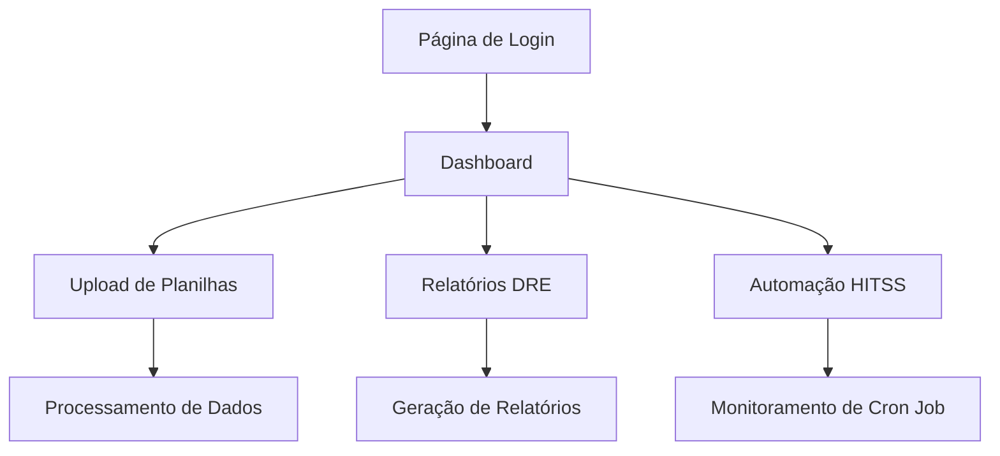

# Configuração de Usuário Demo - Sistema Financeiro

## 1. Visão Geral do Projeto
Sistema financeiro completo com autenticação, dashboard de métricas, upload de planilhas e automação de extração de dados do HITSS via cron job.

## 2. Funcionalidades Principais

### 2.1 Papéis de Usuário
| Papel | Método de Registro | Permissões Principais |
|-------|-------------------|----------------------|
| Admin | Login local (admin/admin) | Acesso completo ao sistema, configurações |
| Demo | Credenciais pré-configuradas | Acesso limitado para demonstração |
| Usuário Autenticado | Registro via Supabase | Acesso completo às funcionalidades |

### 2.2 Módulos de Funcionalidade
Nosso sistema financeiro consiste nas seguintes páginas principais:
1. **Página de Login**: autenticação de usuários, validação de credenciais
2. **Dashboard**: métricas financeiras, gráficos, indicadores de performance
3. **Upload de Planilhas**: importação de dados financeiros, processamento de arquivos
4. **Relatórios DRE**: demonstrativo de resultados, análise financeira
5. **Automação HITSS**: extração automática de dados via cron job

### 2.3 Detalhes das Páginas
| Nome da Página | Nome do Módulo | Descrição da Funcionalidade |
|----------------|----------------|-----------------------------|
| Login | Autenticação | Validar credenciais, redirecionar para dashboard, suporte a login local e Supabase |
| Dashboard | Métricas Financeiras | Exibir KPIs, gráficos de receita/despesa, indicadores de performance |
| Upload | Processamento de Arquivos | Fazer upload de planilhas Excel, validar dados, processar informações financeiras |
| Relatórios DRE | Demonstrativo de Resultados | Gerar relatórios financeiros, filtrar por período, exportar dados |
| Automação | Cron Job HITSS | Configurar extração automática, monitorar execuções, visualizar logs |

## 3. Processo Principal

### Fluxo do Usuário Demo
1. Acesso com credenciais demo (demo@hitss.com / demo123)
2. Visualização do dashboard com dados de exemplo
3. Exploração das funcionalidades de upload e relatórios
4. Verificação do status da automação HITSS

### Fluxo do Administrador
1. Login com admin/admin
2. Acesso completo a todas as funcionalidades
3. Configuração da automação HITSS
4. Monitoramento de execuções do cron job



## 4. Interface do Usuário

### 4.1 Estilo de Design
- Cores primárias: #007bff (azul), #28a745 (verde)
- Cores secundárias: #6c757d (cinza), #dc3545 (vermelho)
- Estilo de botões: Arredondados com sombra sutil
- Fonte: Inter, tamanhos 14px-24px
- Layout: Baseado em cards, navegação superior
- Ícones: Bootstrap Icons e Font Awesome

### 4.2 Visão Geral do Design das Páginas
| Nome da Página | Nome do Módulo | Elementos da UI |
|----------------|----------------|----------------|
| Login | Formulário de Autenticação | Card centralizado, campos de entrada com validação, botão azul (#007bff), feedback de erro |
| Dashboard | Painel de Métricas | Grid de cards com KPIs, gráficos Chart.js, cores verde/azul, layout responsivo |
| Upload | Interface de Upload | Área de drag-and-drop, barra de progresso, lista de arquivos, botões de ação |
| Relatórios | Tabelas e Filtros | DataTables responsivas, filtros de data, botões de exportação, paginação |

### 4.3 Responsividade
Sistema mobile-first com adaptação para desktop, otimizado para interação touch em dispositivos móveis.

## 5. Configuração do Usuário Demo

### 5.1 Credenciais de Acesso Demo
- **Email**: demo@hitss.com
- **Senha**: demo123
- **Tipo**: Usuário com acesso limitado para demonstração

### 5.2 Como Configurar o Usuário Demo

1. **No AuthContext.tsx**, o sistema já suporta autenticação via Supabase
2. **Criar usuário no Supabase**:
   ```sql
   -- Executar no SQL Editor do Supabase
   INSERT INTO auth.users (email