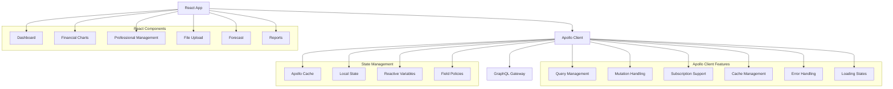

# ⚛️ Frontend React com Apollo Client

## 🎯 Visão Geral

Este documento detalha a implementação completa do frontend React integrado com Apollo Client para comunicação com o GraphQL Gateway do App Financeiro.

### Arquitetura Frontend



## 🏗️ Estrutura do Projeto Frontend

```
src/
├── apollo/
│   ├── client.ts
│   ├── cache.ts
│   ├── links/
│   │   ├── auth-link.ts
│   │   ├── error-link.ts
│   │   ├── upload-link.ts
│   │   └── ws-link.ts
│   ├── queries/
│   │   ├── projects.ts
│   │   ├── financial.ts
│   │   ├── professionals.ts
│   │   ├── uploads.ts
│   │   └── forecasts.ts
│   ├── mutations/
│   │   ├── projects.ts
│   │   ├── uploads.ts
│   │   ├── professionals.ts
│   │   └── reports.ts
│   ├── subscriptions/
│   │   ├── upload-progress.ts
│   │   ├── financial-updates.ts
│   │   └── sync-progress.ts
│   ├── fragments/
│   │   ├── project.ts
│   │   ├── financial.ts
│   │   └── professional.ts
│   └── types/
│       └── generated.ts
├── components/
│   ├── common/
│   │   ├── Loading/
│   │   ├── ErrorBoundary/
│   │   ├── Layout/
│   │   └── Charts/
│   ├── dashboard/
│   │   ├── DashboardContainer.tsx
│   │   ├── FinancialMetrics.tsx
│   │   ├── ProjectSummary.tsx
│   │   └── KPICards.tsx
│   ├── financial/
│   │   ├── FinancialTable.tsx
│   │   ├── FinancialCharts.tsx
│   │   ├── MarginAnalysis.tsx
│   │   └── TrendAnalysis.tsx
│   ├── professionals/
│   │   ├── ProfessionalList.tsx
│   │   ├── ProfessionalForm.tsx
│   │   ├── SyncStatus.tsx
│   │   └── CostAnalysis.tsx
│   ├── upload/
│   │   ├── FileUpload.tsx
│   │   ├── UploadProgress.tsx
│   │   ├── ValidationResults.tsx
│   │   └── UploadHistory.tsx
│   ├── forecast/
│   │   ├── ForecastChart.tsx
│   │   ├── ForecastTable.tsx
│   │   ├── ScenarioAnalysis.tsx
│   │   └── AccuracyMetrics.tsx
│   └── reports/
│       ├── ReportGenerator.tsx
│       ├── ReportViewer.tsx
│       └── ExportOptions.tsx
├── hooks/
│   ├── useFinancialMetrics.ts
│   ├── useProfessionals.ts
│   ├── useFileUpload.ts
│   ├── useForecast.ts
│   ├── useRealTimeUpdates.ts
│   └── useErrorHandling.ts
├── utils/
│   ├── formatters.ts
│   ├── validators.ts
│   ├── constants.ts
│   └── helpers.ts
├── types/
│   ├── apollo.ts
│   ├── financial.ts
│   ├── professional.ts
│   └── common.ts
└── App.tsx
```

## 🔧 Configuração do Apollo Client

### Cliente Principal

**Arquivo:** `src/apollo/client.ts`

```typescript
import { ApolloClient, from, split } from '@apollo/client'
import { getMainDefinition } from '@apollo/client/utilities'
import { GraphQLWsLink } from '@apollo/client/link/subscriptions'
import { createClient } from 'graphql-ws'
import { createUploadLink } from 'apollo-upload-client'

import { cache } from './cache'
import { authLink } from './links/auth-link'
import { errorLink } from './links/error-link'
import { retryLink } from './links/retry-link'

// HTTP Link with upload support
const httpLink = createUploadLink({
  uri: process.env.REACT_APP_GRAPHQL_ENDPOINT || 'http://localhost:4000/graphql',
  credentials: 'include'
})

// WebSocket Link for subscriptions
const wsLink = new GraphQLWsLink(
  createClient({
    url: process.env.REACT_APP_GRAPHQL_WS_ENDPOINT || 'ws://localhost:4000/graphql',
    connectionParams: () => {
      const token = localStorage.getItem('authToken')
      return {
        authorization: token ? `Bearer ${token}` : ''
      }
    },
    retryAttempts: 5,
    shouldRetry: () => true
  })
)

// Split link based on operation type
const splitLink = split(
  ({ query }) => {
    const definition = getMainDefinition(query)
    return (
      definition.kind === 'OperationDefinition' &&
      definition.operation === 'subscription'
    )
  },
  wsLink,
  httpLink
)

// Create Apollo Client
export const apolloClient = new ApolloClient({
  link: from([
    errorLink,
    authLink,
    retryLink,
    splitLink
  ]),
  cache,
  defaultOptions: {
    watchQuery: {
      errorPolicy: 'all',
      notifyOnNetworkStatusChange: true
    },
    query: {
      errorPolicy: 'all'
    },
    mutate: {
      errorPolicy: 'all'
    }
  },
  connectToDevTools: process.env.NODE_ENV === 'development'
})
```

### Configuração do Cache

**Arquivo:** `src/apollo/cache.ts`

```typescript
import { InMemoryCache, makeVar } from '@apollo/client'
import { relayStylePagination } from '@apollo/client/utilities'

// Reactive variables for global state
export const isLoadingVar = makeVar<boolean>(false)
export const currentProjectVar = makeVar<string | null>(null)
export const notificationsVar = makeVar<Notification[]>([])
export const themeVar = makeVar<'light' | 'dark'>('light')

// Type policies for cache normalization
export const cache = new InMemoryCache({
  typePolicies: {
    Query: {
      fields: {
        // Global reactive variables
        isLoading: {
          read() {
            return isLoadingVar()
          }
        },
        currentProject: {
          read() {
            return currentProjectVar()
          }
        },
        notifications: {
          read() {
            return notificationsVar()
          }
        },
        theme: {
          read() {
            return themeVar()
          }
        },
        
        // Pagination
        projects: relayStylePagination(),
        professionals: relayStylePagination(['projectId']),
        financialTransactions: relayStylePagination(['projectId', 'period'])
      }
    },
    
    Project: {
      fields: {
        financialTransactions: relayStylePagination(['period']),
        professionals: {
          merge(existing = [], incoming) {
            return [...existing, ...incoming]
          }
        },
        
        // Computed fields with caching
        totalRevenue: {
          merge(existing, incoming, { args }) {
            const key = JSON.stringify(args?.period || {})
            return {
              ...existing,
              [key]: incoming
            }
          },
          read(existing, { args }) {
            const key = JSON.stringify(args?.period || {})
            return existing?.[key]
          }
        },
        
        totalCosts: {
          merge(existing, incoming, { args }) {
            const key = JSON.stringify(args?.period || {})
            return {
              ...existing,
              [key]: incoming
            }
          },
          read(existing, { args }) {
            const key = JSON.stringify(args?.period || {})
            return existing?.[key]
          }
        }
      }
    },
    
    FinancialTransaction: {
      fields: {
        amount: {
          merge(existing, incoming) {
            return incoming
          }
        }
      }
    },
    
    Professional: {
      fields: {
        totalCost: {
          merge(existing, incoming, { args }) {
            const key = JSON.stringify(args?.period || {})
            return {
              ...existing,
              [key]: incoming
            }
          },
          read(existing, { args }) {
            const key = JSON.stringify(args?.period || {})
            return existing?.[key]
          }
        }
      }
    },
    
    UploadResult: {
      keyFields: ['batchId']
    },
    
    ForecastResult: {
      keyFields: ['metadata', ['generatedAt']]
    }
  }
})
```

### Links de Autenticação

**Arquivo:** `src/apollo/links/auth-link.ts`

```typescript
import { setContext } from '@apollo/client/link/context'
import { onError } from '@apollo/client/link/error'

export const authLink = setContext((_, { headers }) => {
  const token = localStorage.getItem('authToken')
  
  return {
    headers: {
      ...headers,
      authorization: token ? `Bearer ${token}` : '',
      'x-client-version': process.env.REACT_APP_VERSION || '1.0.0',
      'x-client-platform': 'web'
    }
  }
})

// Handle authentication errors
export const authErrorLink = onError(({ graphQLErrors, networkError, operation, forward }) => {
  if (graphQLErrors) {
    for (const error of graphQLErrors) {
      if (error.extensions?.code === 'UNAUTHENTICATED') {
        // Clear token and redirect to login
        localStorage.removeItem('authToken')
        window.location.href = '/login'
        return
      }
    }
  }
  
  if (networkError && 'statusCode' in networkError) {
    if (networkError.statusCode === 401) {
      localStorage.removeItem('authToken')
      window.location.href = '/login'
      return
    }
  }
})
```

### Link de Tratamento de Erros

**Arquivo:** `src/apollo/links/error-link.ts`

```typescript
import { onError } from '@apollo/client/link/error'
import { notificationsVar } from '../cache'

export const errorLink = onError(({ graphQLErrors, networkError, operation, forward }) => {
  if (graphQLErrors) {
    graphQLErrors.forEach(({ message, locations, path, extensions }) => {
      console.error(
        `[GraphQL error]: Message: ${message}, Location: ${locations}, Path: ${path}`
      )
      
      // Add user-friendly error notification
      const notifications = notificationsVar()
      notificationsVar([
        ...notifications,
        {
          id: Date.now().toString(),
          type: 'error',
          title: 'Erro na Operação',
          message: getUserFriendlyMessage(message, extensions?.code),
          timestamp: new Date()
        }
      ])
    })
  }
  
  if (networkError) {
    console.error(`[Network error]: ${networkError}`)
    
    const notifications = notificationsVar()
    notificationsVar([
      ...notifications,
      {
        id: Date.now().toString(),
        type: 'error',
        title: 'Erro de Conexão',
        message: 'Verifique sua conexão com a internet e tente novamente.',
        timestamp: new Date()
      }
    ])
  }
})

function getUserFriendlyMessage(message: string, code?: string): string {
  const errorMessages: Record<string, string> = {
    'UNAUTHENTICATED': 'Você precisa fazer login para acessar esta funcionalidade.',
    'FORBIDDEN': 'Você não tem permissão para realizar esta ação.',
    'BAD_USER_INPUT': 'Os dados fornecidos são inválidos. Verifique e tente novamente.',
    'INTERNAL_ERROR': 'Ocorreu um erro interno. Tente novamente em alguns instantes.',
    'NETWORK_ERROR': 'Erro de conexão. Verifique sua internet e tente novamente.'
  }
  
  return errorMessages[code || ''] || message || 'Ocorreu um erro inesperado.'
}
```

## 📊 Queries e Mutations

### Queries Financeiras

**Arquivo:** `src/apollo/queries/financial.ts`

```typescript
import { gql } from '@apollo/client'
import { FINANCIAL_TRANSACTION_FRAGMENT, PROJECT_SUMMARY_FRAGMENT } from '../fragments/financial'

export const GET_FINANCIAL_METRICS = gql`
  query GetFinancialMetrics($input: FinancialMetricsInput!) {
    financialMetrics(input: $input) {
      revenue {
        total
        taxRelief
        netRevenue
        monthlyBreakdown {
          month
          total
          breakdown
        }
        averageMonthly
        growthRate
        trend
      }
      costs {
        total
        clt
        subcontractors
        others
        monthlyBreakdown {
          month
          total
          breakdown
        }
        averageMonthly
        growthRate
        trend
      }
      margin {
        grossMargin
        marginPercentage
        monthlyMargins {
          month
          revenue
          costs
          margin
          marginPercentage
        }
        trend
        alerts {
          type
          message
          severity
          createdAt
        }
      }
      summary {
        ...ProjectSummaryFragment
      }
    }
  }
  ${PROJECT_SUMMARY_FRAGMENT}
`

export const GET_FINANCIAL_SUMMARY = gql`
  query GetFinancialSummary($projectId: ID!, $period: PeriodInput!) {
    financialSummary(projectId: $projectId, period: $period) {
      ...ProjectSummaryFragment
    }
  }
  ${PROJECT_SUMMARY_FRAGMENT}
`

export const GET_PROJECT_FINANCIAL_TRANSACTIONS = gql`
  query GetProjectFinancialTransactions(
    $projectId: ID!
    $period: PeriodInput
    $pagination: PaginationInput
  ) {
    project(id: $projectId) {
      id
      name
      financialTransactions(period: $period, pagination: $pagination) {
        edges {
          node {
            ...FinancialTransactionFragment
          }
          cursor
        }
        pageInfo {
          hasNextPage
          hasPreviousPage
          startCursor
          endCursor
          totalCount
        }
      }
    }
  }
  ${FINANCIAL_TRANSACTION_FRAGMENT}
`

export const GET_PROJECT_METRICS = gql`
  query GetProjectMetrics($projectId: ID!, $period: PeriodInput) {
    project(id: $projectId) {
      id
      name
      totalRevenue(period: $period)
      totalCosts(period: $period)
      grossMargin(period: $period)
      marginPercentage(period: $period)
    }
  }
`
```

### Mutations de Upload

**Arquivo:** `src/apollo/mutations/uploads.ts`

```typescript
import { gql } from '@apollo/client'

export const UPLOAD_FINANCIAL_DATA = gql`
  mutation UploadFinancialData($input: UploadInput!) {
    uploadFinancialData(input: $input) {
      success
      batchId
      summary {
        fileName
        fileSize
        totalRows
        processedRows
        validRows
        invalidRows
        skippedRows
        duplicateRows
      }
      errors {
        row
        column
        value
        error
        severity
      }
      warnings
      processedAt
    }
  }
`

export const VALIDATE_DATA = gql`
  mutation ValidateData($input: ValidationInput!) {
    validateData(input: $input) {
      success
      summary {
        totalRecords
        validRecords
        invalidRecords
        warnings
      }
      errors {
        row
        column
        value
        error
        severity
      }
      validatedAt
    }
  }
`
```

### Subscriptions

**Arquivo:** `src/apollo/subscriptions/upload-progress.ts`

```typescript
import { gql } from '@apollo/client'

export const UPLOAD_PROGRESS_SUBSCRIPTION = gql`
  subscription UploadProgress($batchId: ID!) {
    uploadProgress(batchId: $batchId) {
      batchId
      status
      progress
      currentStep
      totalSteps
      completedSteps
      estimatedTimeRemaining
      errors {
        row
        column
        value
        error
        severity
      }
    }
  }
`

export const FINANCIAL_DATA_UPDATED_SUBSCRIPTION = gql`
  subscription FinancialDataUpdated($projectId: ID!) {
    financialDataUpdated(projectId: $projectId) {
      projectId
      updateType
      affectedRecords
      timestamp
      summary {
        totalRevenue
        totalCosts
        grossMargin
        marginPercentage
      }
    }
  }
`

export const SYNC_PROGRESS_SUBSCRIPTION = gql`
  subscription SyncProgress($projectId: ID!) {
    syncProgress(projectId: $projectId) {
      projectId
      status
      progress
      currentStep
      totalSteps
      completedSteps
      summary {
        totalProcessed
        created
        updated
        deactivated
        skipped
        failed
      }
      errors {
        code
        message
        details
      }
    }
  }
`
```

## 🎣 Custom Hooks

### Hook de Métricas Financeiras

**Arquivo:** `src/hooks/useFinancialMetrics.ts`

```typescript
import { useQuery, useSubscription } from '@apollo/client'
import { useState, useEffect, useMemo } from 'react'
import { GET_FINANCIAL_METRICS } from '../apollo/queries/financial'
import { FINANCIAL_DATA_UPDATED_SUBSCRIPTION } from '../apollo/subscriptions/upload-progress'
import { FinancialMetricsInput, MetricType } from '../types/financial'

interface UseFinancialMetricsOptions {
  projectId: string
  period: { startDate: string; endDate: string }
  metrics?: MetricType[]
  autoRefresh?: boolean
  refreshInterval?: number
}

export function useFinancialMetrics({
  projectId,
  period,
  metrics = ['REVENUE', 'COSTS', 'MARGIN', 'SUMMARY'],
  autoRefresh = true,
  refreshInterval = 30000
}: UseFinancialMetricsOptions) {
  const [lastUpdated, setLastUpdated] = useState<Date>(new Date())
  
  const input: FinancialMetricsInput = {
    projectId,
    period,
    metrics
  }
  
  const {
    data,
    loading,
    error,
    refetch,
    networkStatus
  } = useQuery(GET_FINANCIAL_METRICS, {
    variables: { input },
    errorPolicy: 'all',
    notifyOnNetworkStatusChange: true,
    fetchPolicy: 'cache-and-network',
    pollInterval: autoRefresh ? refreshInterval : 0
  })
  
  // Subscribe to real-time updates
  const { data: subscriptionData } = useSubscription(
    FINANCIAL_DATA_UPDATED_SUBSCRIPTION,
    {
      variables: { projectId },
      onData: ({ data }) => {
        if (data?.data?.financialDataUpdated) {
          setLastUpdated(new Date())
          // Refetch data when updates are received
          refetch()
        }
      }
    }
  )
  
  // Computed values
  const metrics_data = useMemo(() => {
    if (!data?.financialMetrics) return null
    
    const { revenue, costs, margin, summary } = data.financialMetrics
    
    return {
      revenue: {
        ...revenue,
        formatted: {
          total: formatCurrency(revenue?.total || 0),
          taxRelief: formatCurrency(revenue?.taxRelief || 0),
          netRevenue: formatCurrency(revenue?.netRevenue || 0)
        }
      },
      costs: {
        ...costs,
        formatted: {
          total: formatCurrency(costs?.total || 0),
          clt: formatCurrency(costs?.clt || 0),
          subcontractors: formatCurrency(costs?.subcontractors || 0),
          others: formatCurrency(costs?.others || 0)
        }
      },
      margin: {
        ...margin,
        formatted: {
          grossMargin: formatCurrency(margin?.grossMargin || 0),
          marginPercentage: formatPercentage(margin?.marginPercentage || 0)
        }
      },
      summary,
      lastUpdated
    }
  }, [data, lastUpdated])
  
  // Chart data preparation
  const chartData = useMemo(() => {
    if (!metrics_data) return null
    
    const monthlyData = metrics_data.revenue?.monthlyBreakdown?.map((revenue, index) => {
      const costs = metrics_data.costs?.monthlyBreakdown?.[index]
      const margin = metrics_data.margin?.monthlyMargins?.[index]
      
      return {
        month: revenue.month,
        revenue: revenue.total,
        costs: costs?.total || 0,
        margin: margin?.margin || 0,
        marginPercentage: margin?.marginPercentage || 0
      }
    }) || []
    
    return {
      monthly: monthlyData,
      trends: {
        revenue: metrics_data.revenue?.trend,
        costs: metrics_data.costs?.trend,
        margin: metrics_data.margin?.trend
      }
    }
  }, [metrics_data])
  
  return {
    data: metrics_data,
    chartData,
    loading,
    error,
    refetch,
    networkStatus,
    lastUpdated
  }
}

// Utility functions
function formatCurrency(value: number): string {
  return new Intl.NumberFormat('pt-BR', {
    style: 'currency',
    currency: 'BRL'
  }).format(value)
}

function formatPercentage(value: number): string {
  return new Intl.NumberFormat('pt-BR', {
    style: 'percent',
    minimumFractionDigits: 2
  }).format(value / 100)
}
```

### Hook de Upload de Arquivos

**Arquivo:** `src/hooks/useFileUpload.ts`

```typescript
import { useMutation, useSubscription } from '@apollo/client'
import { useState, useCallback } from 'react'
import { UPLOAD_FINANCIAL_DATA } from '../apollo/mutations/uploads'
import { UPLOAD_PROGRESS_SUBSCRIPTION } from '../apollo/subscriptions/upload-progress'
import { FileType, UploadOptions } from '../types/upload'

interface UseFileUploadOptions {
  projectId: string
  onSuccess?: (result: any) => void
  onError?: (error: any) => void
  onProgress?: (progress: any) => void
}

export function useFileUpload({
  projectId,
  onSuccess,
  onError,
  onProgress
}: UseFileUploadOptions) {
  const [uploadState, setUploadState] = useState<{
    isUploading: boolean
    progress: number
    currentStep: string
    batchId?: string
    errors: any[]
  }>({
    isUploading: false,
    progress: 0,
    currentStep: '',
    errors: []
  })
  
  const [uploadFinancialData, { loading, error }] = useMutation(
    UPLOAD_FINANCIAL_DATA,
    {
      onCompleted: (data) => {
        if (data.uploadFinancialData.success) {
          setUploadState(prev => ({
            ...prev,
            batchId: data.uploadFinancialData.batchId
          }))
          onSuccess?.(data.uploadFinancialData)
        } else {
          setUploadState(prev => ({
            ...prev,
            isUploading: false,
            errors: data.uploadFinancialData.errors
          }))
          onError?.(data.uploadFinancialData.errors)
        }
      },
      onError: (error) => {
        setUploadState(prev => ({
          ...prev,
          isUploading: false,
          errors: [{ message: error.message }]
        }))
        onError?.(error)
      }
    }
  )
  
  // Subscribe to upload progress
  useSubscription(UPLOAD_PROGRESS_SUBSCRIPTION, {
    variables: { batchId: uploadState.batchId },
    skip: !uploadState.batchId,
    onData: ({ data }) => {
      if (data?.data?.uploadProgress) {
        const progress = data.data.uploadProgress
        setUploadState(prev => ({
          ...prev,
          progress: progress.progress,
          currentStep: progress.currentStep,
          errors: progress.errors,
          isUploading: progress.status !== 'COMPLETED' && progress.status !== 'FAILED'
        }))
        onProgress?.(progress)
        
        if (progress.status === 'COMPLETED') {
          setUploadState(prev => ({
            ...prev,
            isUploading: false,
            progress: 100
          }))
        }
      }
    }
  })
  
  const uploadFile = useCallback(async (
    file: File,
    fileType: FileType,
    options?: UploadOptions
  ) => {
    setUploadState({
      isUploading: true,
      progress: 0,
      currentStep: 'Iniciando upload...',
      errors: []
    })
    
    try {
      await uploadFinancialData({
        variables: {
          input: {
            file,
            projectId,
            fileType,
            options
          }
        }
      })
    } catch (error) {
      console.error('Upload error:', error)
    }
  }, [uploadFinancialData, projectId])
  
  const resetUpload = useCallback(() => {
    setUploadState({
      isUploading: false,
      progress: 0,
      currentStep: '',
      errors: []
    })
  }, [])
  
  return {
    uploadFile,
    resetUpload,
    ...uploadState,
    loading,
    error
  }
}
```

## 🎨 Componentes React

### Dashboard Container

**Arquivo:** `src/components/dashboard/DashboardContainer.tsx`

```typescript
import React, { useState, useMemo } from 'react'
import { Container, Row, Col, Card, Alert, Spinner } from 'react-bootstrap'
import { useParams } from 'react-router-dom'
import { useFinancialMetrics } from '../../hooks/useFinancialMetrics'
import { FinancialMetrics } from './FinancialMetrics'
import { ProjectSummary } from './ProjectSummary'
import { KPICards } from './KPICards'
import { ErrorBoundary } from '../common/ErrorBoundary'
import { DateRangePicker } from '../common/DateRangePicker'

interface DashboardContainerProps {
  projectId?: string
}

export const DashboardContainer: React.FC<DashboardContainerProps> = ({ 
  projectId: propProjectId 
}) => {
  const { projectId: paramProjectId } = useParams<{ projectId: string }>()
  const projectId = propProjectId || paramProjectId
  
  const [dateRange, setDateRange] = useState({
    startDate: new Date(new Date().getFullYear(), 0, 1).toISOString().split('T')[0],
    endDate: new Date().toISOString().split('T')[0]
  })
  
  const {
    data: metrics,
    chartData,
    loading,
    error,
    refetch,
    lastUpdated
  } = useFinancialMetrics({
    projectId: projectId!,
    period: dateRange,
    autoRefresh: true
  })
  
  const kpiData = useMemo(() => {
    if (!metrics) return []
    
    return [
      {
        title: 'Receita Total',
        value: metrics.revenue?.formatted.total || 'R$ 0,00',
        trend: metrics.revenue?.trend,
        change: metrics.revenue?.growthRate || 0,
        icon: 'trending-up',
        color: 'success'
      },
      {
        title: 'Custo Total',
        value: metrics.costs?.formatted.total || 'R$ 0,00',
        trend: metrics.costs?.trend,
        change: metrics.costs?.growthRate || 0,
        icon: 'trending-down',
        color: 'warning'
      },
      {
        title: 'Margem Bruta',
        value: metrics.margin?.formatted.grossMargin || 'R$ 0,00',
        trend: metrics.margin?.trend,
        change: 0,
        icon: 'bar-chart',
        color: 'info'
      },
      {
        title: 'Margem %',
        value: metrics.margin?.formatted.marginPercentage || '0%',
        trend: metrics.margin?.trend,
        change: 0,
        icon: 'percent',
        color: 'primary'
      }
    ]
  }, [metrics])
  
  if (!projectId) {
    return (
      <Alert variant="warning">
        Nenhum projeto selecionado. Selecione um projeto para visualizar o dashboard.
      </Alert>
    )
  }
  
  if (error) {
    return (
      <Alert variant="danger">
        <Alert.Heading>Erro ao carregar dados</Alert.Heading>
        <p>{error.message}</p>
        <button 
          className="btn btn-outline-danger" 
          onClick={() => refetch()}
        >
          Tentar novamente
        </button>
      </Alert>
    )
  }
  
  return (
    <ErrorBoundary>
      <Container fluid>
        <Row className="mb-4">
          <Col>
            <div className="d-flex justify-content-between align-items-center">
              <h2>Dashboard Financeiro</h2>
              <div className="d-flex align-items-center gap-3">
                <DateRangePicker
                  startDate={dateRange.startDate}
                  endDate={dateRange.endDate}
                  onChange={setDateRange}
                />
                <small className="text-muted">
                  Última atualização: {lastUpdated.toLocaleTimeString()}
                </small>
                {loading && <Spinner animation="border" size="sm" />}
              </div>
            </div>
          </Col>
        </Row>
        
        <Row className="mb-4">
          <Col>
            <KPICards data={kpiData} loading={loading} />
          </Col>
        </Row>
        
        <Row>
          <Col lg={8}>
            <Card>
              <Card.Header>
                <Card.Title>Métricas Financeiras</Card.Title>
              </Card.Header>
              <Card.Body>
                <FinancialMetrics 
                  data={metrics} 
                  chartData={chartData}
                  loading={loading}
                />
              </Card.Body>
            </Card>
          </Col>
          
          <Col lg={4}>
            <ProjectSummary 
              data={metrics?.summary}
              loading={loading}
            />
          </Col>
        </Row>
        
        {metrics?.margin?.alerts && metrics.margin.alerts.length > 0 && (
          <Row className="mt-4">
            <Col>
              <Card>
                <Card.Header>
                  <Card.Title>Alertas</Card.Title>
                </Card.Header>
                <Card.Body>
                  {metrics.margin.alerts.map((alert, index) => (
                    <Alert 
                      key={index} 
                      variant={getAlertVariant(alert.severity)}
                      className="mb-2"
                    >
                      <strong>{alert.type}:</strong> {alert.message}
                    </Alert>
                  ))}
                </Card.Body>
              </Card>
            </Col>
          </Row>
        )}
      </Container>
    </ErrorBoundary>
  )
}

function getAlertVariant(severity: string): string {
  const variants: Record<string, string> = {
    'INFO': 'info',
    'WARNING': 'warning',
    'ERROR': 'danger',
    'CRITICAL': 'danger'
  }
  return variants[severity] || 'info'
}
```

### Componente de Upload

**Arquivo:** `src/components/upload/FileUpload.tsx`

```typescript
import React, { useState, useCallback } from 'react'
import { Card, Form, Button, Alert, ProgressBar, ListGroup } from 'react-bootstrap'
import { useDropzone } from 'react-dropzone'
import { useFileUpload } from '../../hooks/useFileUpload'
import { FileType, UploadOptions } from '../../types/upload'
import { UploadProgress } from './UploadProgress'
import { ValidationResults } from './ValidationResults'

interface FileUploadProps {
  projectId: string
  onUploadComplete?: (result: any) => void
}

export const FileUpload: React.FC<FileUploadProps> = ({ 
  projectId, 
  onUploadComplete 
}) => {
  const [selectedFile, setSelectedFile] = useState<File | null>(null)
  const [fileType, setFileType] = useState<FileType>('DRE')
  const [uploadOptions, setUploadOptions] = useState<UploadOptions>({
    skipValidation: false,
    allowDuplicates: false,
    hasHeader: true,
    delimiter: ',',
    encoding: 'utf-8'
  })
  const [uploadResult, setUploadResult] = useState<any>(null)
  
  const {
    uploadFile,
    resetUpload,
    isUploading,
    progress,
    currentStep,
    errors,
    loading
  } = useFileUpload({
    projectId,
    onSuccess: (result) => {
      setUploadResult(result)
      onUploadComplete?.(result)
    },
    onError: (error) => {
      console.error('Upload failed:', error)
    }
  })
  
  const onDrop = useCallback((acceptedFiles: File[]) => {
    if (acceptedFiles.length > 0) {
      setSelectedFile(acceptedFiles[0])
      resetUpload()
      setUploadResult(null)
    }
  }, [resetUpload])
  
  const { getRootProps, getInputProps, isDragActive } = useDropzone({
    onDrop,
    accept: {
      'text/csv': ['.csv'],
      'application/vnd.ms-excel': ['.xls'],
      'application/vnd.openxmlformats-officedocument.spreadsheetml.sheet': ['.xlsx']
    },
    maxFiles: 1,
    disabled: isUploading
  })
  
  const handleUpload = async () => {
    if (!selectedFile) return
    
    await uploadFile(selectedFile, fileType, uploadOptions)
  }
  
  const handleReset = () => {
    setSelectedFile(null)
    setUploadResult(null)
    resetUpload()
  }
  
  return (
    <Card>
      <Card.Header>
        <Card.Title>Upload de Dados Financeiros</Card.Title>
      </Card.Header>
      <Card.Body>
        {!isUploading && !uploadResult && (
          <>
            {/* File Drop Zone */}
            <div
              {...getRootProps()}
              className={`border-2 border-dashed rounded p-4 text-center mb-3 ${
                isDragActive ? 'border-primary bg-light' : 'border-secondary'
              }`}
              style={{ cursor: 'pointer' }}
            >
              <input {...getInputProps()} />
              {selectedFile ? (
                <div>
                  <i className="bi bi-file-earmark-text fs-1 text-success"></i>
                  <p className="mb-0 mt-2">
                    <strong>{selectedFile.name}</strong>
                  </p>
                  <small className="text-muted">
                    {(selectedFile.size / 1024 / 1024).toFixed(2)} MB
                  </small>
                </div>
              ) : (
                <div>
                  <i className="bi bi-cloud-upload fs-1 text-muted"></i>
                  <p className="mb-0 mt-2">
                    {isDragActive
                      ? 'Solte o arquivo aqui...'
                      : 'Arraste um arquivo aqui ou clique para selecionar'
                    }
                  </p>
                  <small className="text-muted">
                    Formatos aceitos: CSV, XLS, XLSX (máx. 50MB)
                  </small>
                </div>
              )}
            </div>
            
            {/* File Type Selection */}
            <Form.Group className="mb-3">
              <Form.Label>Tipo de Arquivo</Form.Label>
              <Form.Select
                value={fileType}
                onChange={(e) => setFileType(e.target.value as FileType)}
              >
                <option value="DRE">DRE (Demonstrativo de Resultado)</option>
                <option value="FINANCIAL_TRANSACTIONS">Transações Financeiras</option>
                <option value="PROFESSIONALS">Profissionais</option>
                <option value="BUDGET">Orçamento</option>
                <option value="FORECAST">Previsão</option>
              </Form.Select>
            </Form.Group>
            
            {/* Upload Options */}
            <Card className="mb-3">
              <Card.Header>
                <small>Opções de Upload</small>
              </Card.Header>
              <Card.Body>
                <Form.Check
                  type="checkbox"
                  label="Arquivo possui cabeçalho"
                  checked={uploadOptions.hasHeader}
                  onChange={(e) => setUploadOptions(prev => ({
                    ...prev,
                    hasHeader: e.target.checked
                  }))}
                  className="mb-2"
                />
                <Form.Check
                  type="checkbox"
                  label="Permitir registros duplicados"
                  checked={uploadOptions.allowDuplicates}
                  onChange={(e) => setUploadOptions(prev => ({
                    ...prev,
                    allowDuplicates: e.target.checked
                  }))}
                  className="mb-2"
                />
                <Form.Check
                  type="checkbox"
                  label="Pular validação"
                  checked={uploadOptions.skipValidation}
                  onChange={(e) => setUploadOptions(prev => ({
                    ...prev,
                    skipValidation: e.target.checked
                  }))}
                />
              </Card.Body>
            </Card>
            
            {/* Action Buttons */}
            <div className="d-flex gap-2">
              <Button
                variant="primary"
                onClick={handleUpload}
                disabled={!selectedFile || loading}
              >
                {loading ? 'Processando...' : 'Fazer Upload'}
              </Button>
              <Button
                variant="outline-secondary"
                onClick={handleReset}
                disabled={loading}
              >
                Limpar
              </Button>
            </div>
          </>
        )}
        
        {/* Upload Progress */}
        {isUploading && (
          <UploadProgress
            progress={progress}
            currentStep={currentStep}
            errors={errors}
          />
        )}
        
        {/* Upload Results */}
        {uploadResult && (
          <ValidationResults
            result={uploadResult}
            onReset={handleReset}
          />
        )}
      </Card.Body>
    </Card>
  )
}
```

## 🚀 Configuração da Aplicação

### App Principal

**Arquivo:** `src/App.tsx`

```typescript
import React from 'react'
import { BrowserRouter as Router, Routes, Route } from 'react-router-dom'
import { ApolloProvider } from '@apollo/client'
import { ToastContainer } from 'react-toastify'
import { apolloClient } from './apollo/client'
import { Layout } from './components/common/Layout'
import { ErrorBoundary } from './components/common/ErrorBoundary'
import { DashboardContainer } from './components/dashboard/DashboardContainer'
import { ProfessionalManagement } from './components/professionals/ProfessionalManagement'
import { FileUploadPage } from './pages/FileUploadPage'
import { ForecastPage } from './pages/ForecastPage'
import { ReportsPage } from './pages/ReportsPage'
import { ProjectsPage } from './pages/ProjectsPage'
import { AuthProvider } from './contexts/AuthContext'
import { ThemeProvider } from './contexts/ThemeContext'

// Styles
import 'bootstrap/dist/css/bootstrap.min.css'
import 'bootstrap-icons/font/bootstrap-icons.css'
import 'react-toastify/dist/ReactToastify.css'
import './styles/global.css'

function App() {
  return (
    <ErrorBoundary>
      <ApolloProvider client={apolloClient}>
        <ThemeProvider>
          <AuthProvider>
            <Router>
              <Layout>
                <Routes>
                  <Route path="/" element={<ProjectsPage />} />
                  <Route path="/projects" element={<ProjectsPage />} />
                  <Route path="/projects/:projectId" element={<DashboardContainer />} />
                  <Route path="/projects/:projectId/dashboard" element={<DashboardContainer />} />
                  <Route path="/projects/:projectId/professionals" element={<ProfessionalManagement />} />
                  <Route path="/projects/:projectId/upload" element={<FileUploadPage />} />
                  <Route path="/projects/:projectId/forecast" element={<ForecastPage />} />
                  <Route path="/projects/:projectId/reports" element={<ReportsPage />} />
                </Routes>
              </Layout>
            </Router>
            <ToastContainer
              position="top-right"
              autoClose={5000}
              hideProgressBar={false}
              newestOnTop
              closeOnClick
              rtl={false}
              pauseOnFocusLoss
              draggable
              pauseOnHover
            />
          </AuthProvider>
        </ThemeProvider>
      </ApolloProvider>
    </ErrorBoundary>
  )
}

export default App
```

---

**📝 Próximos Passos:**
1. Implementar autenticação com Supabase Auth
2. Configurar testes unitários e de integração
3. Implementar PWA capabilities
4. Configurar error tracking (Sentry)
5. Otimizar performance com React.memo e useMemo
6. Implementar internacionalização (i18n)
7. Configurar analytics e métricas de uso

**🔗 Recursos Úteis:**
- [Apollo Client Documentation](https://www.apollographql.com/docs/react/)
- [React Bootstrap Documentation](https://react-bootstrap.github.io/)
- [GraphQL Code Generator](https://the-guild.dev/graphql/codegen)
