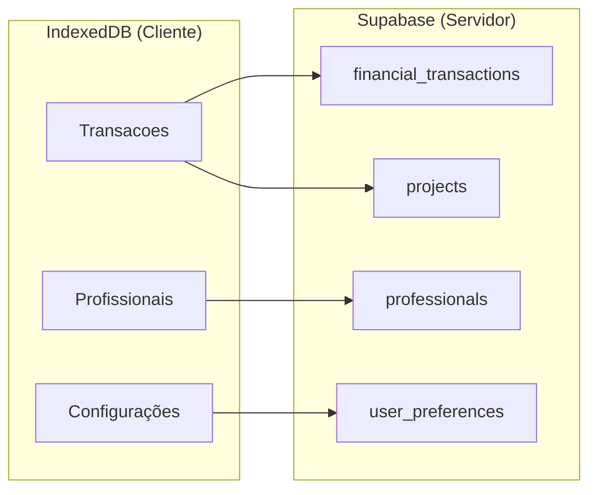

# 📊 Guia de Migração de Dados - IndexedDB para Supabase

## 🎯 Visão Geral da Migração

Este documento detalha o processo completo de migração dos dados do IndexedDB (cliente) para o Supabase PostgreSQL (servidor), incluindo scripts, validações e estratégias de rollback.

### Dados a Migrar

#### Tabelas IndexedDB Atuais
1. **Transacoes** - Dados financeiros principais
2. **Profissionais** - Informações de recursos humanos
3. **Configurações** - Preferências do usuário
4. **Cache** - Dados temporários (não migrar)

#### Mapeamento para Supabase



## 🔄 Estratégia de Migração

### Fases da Migração

1. **Preparação** (1-2 dias)
   - Backup completo dos dados
   - Validação da estrutura atual
   - Setup do ambiente de migração

2. **Migração de Teste** (2-3 dias)
   - Migração em ambiente de desenvolvimento
   - Validação de integridade
   - Testes de performance

3. **Migração de Produção** (1 dia)
   - Migração incremental
   - Validação em tempo real
   - Rollback se necessário

4. **Pós-Migração** (1-2 dias)
   - Monitoramento
   - Ajustes de performance
   - Limpeza de dados antigos

### Princípios da Migração

- ✅ **Zero Downtime**: Aplicação continua funcionando durante migração
- ✅ **Validação Contínua**: Cada etapa é validada antes de prosseguir
- ✅ **Rollback Seguro**: Possibilidade de voltar ao estado anterior
- ✅ **Auditoria Completa**: Log detalhado de todas as operações
- ✅ **Migração Incremental**: Dados migrados em lotes pequenos

## 🛠️ Scripts de Migração

### 1. Script Principal de Migração

**Arquivo:** `scripts/migrate-data.ts`

```typescript
import { createClient } from '@supabase/supabase-js'
import Dexie from 'dexie'
import * as fs from 'fs'
import * as path from 'path'
import { v4 as uuidv4 } from 'uuid'

// Configuração do IndexedDB
class FinanceDB extends Dexie {
  transacoes!: Dexie.Table<any, number>
  profissionais!: Dexie.Table<any, number>
  configuracoes!: Dexie.Table<any, number>

  constructor() {
    super('FinanceDB')
    this.version(1).stores({
      transacoes: '++id, projeto, ano, mes, natureza, conta, valor, data',
      profissionais: '++id, nome, cargo, projeto, custo, tipo, ativo',
      configuracoes: '++id, chave, valor, usuario'
    })
  }
}

interface MigrationConfig {
  supabaseUrl: string
  supabaseServiceKey: string
  batchSize: number
  dryRun: boolean
  skipValidation: boolean
}

interface MigrationResult {
  success: boolean
  totalRecords: number
  migratedRecords: number
  failedRecords: number
  errors: Array<{
    table: string
    record: any
    error: string
  }>
  duration: number
  backupPath?: string
}

class DataMigrator {
  private db: FinanceDB
  private supabase: any
  private config: MigrationConfig
  private migrationId: string
  private logFile: string

  constructor(config: MigrationConfig) {
    this.db = new FinanceDB()
    this.supabase = createClient(config.supabaseUrl, config.supabaseServiceKey)
    this.config = config
    this.migrationId = uuidv4()
    this.logFile = `migration-${this.migrationId}-${Date.now()}.log`
  }

  async migrate(): Promise<MigrationResult> {
    const startTime = Date.now()
    this.log('🚀 Iniciando migração de dados', { migrationId: this.migrationId })

    const result: MigrationResult = {
      success: false,
      totalRecords: 0,
      migratedRecords: 0,
      failedRecords: 0,
      errors: [],
      duration: 0
    }

    try {
      // 1. Backup dos dados atuais
      if (!this.config.dryRun) {
        result.backupPath = await this.createBackup()
        this.log('✅ Backup criado', { path: result.backupPath })
      }

      // 2. Validar estrutura do Supabase
      await this.validateSupabaseStructure()
      this.log('✅ Estrutura do Supabase validada')

      // 3. Migrar projetos (criar se não existirem)
      await this.migrateProjects(result)
      this.log('✅ Projetos migrados/validados')

      // 4. Migrar transações financeiras
      await this.migrateTransactions(result)
      this.log('✅ Transações financeiras migradas')

      // 5. Migrar profissionais
      await this.migrateProfessionals(result)
      this.log('✅ Profissionais migrados')

      // 6. Migrar configurações
      await this.migrateConfigurations(result)
      this.log('✅ Configurações migradas')

      // 7. Validação final
      if (!this.config.skipValidation) {
        await this.validateMigration(result)
        this.log('✅ Validação final concluída')
      }

      result.success = true
      result.duration = Date.now() - startTime

      this.log('🎉 Migração concluída com sucesso', {
        duration: result.duration,
        totalRecords: result.totalRecords,
        migratedRecords: result.migratedRecords,
        failedRecords: result.failedRecords
      })

    } catch (error) {
      result.success = false
      result.duration = Date.now() - startTime
      this.log('❌ Erro na migração', { error: error.message, stack: error.stack })
      
      // Tentar rollback se não for dry run
      if (!this.config.dryRun && result.backupPath) {
        await this.rollback(result.backupPath)
      }
    }

    return result
  }

  private async createBackup(): Promise<string> {
    const backupData = {
      timestamp: new Date().toISOString(),
      migrationId: this.migrationId,
      data: {
        transacoes: await this.db.transacoes.toArray(),
        profissionais: await this.db.profissionais.toArray(),
        configuracoes: await this.db.configuracoes.toArray()
      }
    }

    const backupPath = path.join(process.cwd(), 'backups', `backup-${this.migrationId}.json`)
    
    // Criar diretório se não existir
    const backupDir = path.dirname(backupPath)
    if (!fs.existsSync(backupDir)) {
      fs.mkdirSync(backupDir, { recursive: true })
    }

    fs.writeFileSync(backupPath, JSON.stringify(backupData, null, 2))
    return backupPath
  }

  private async validateSupabaseStructure(): Promise<void> {
    const requiredTables = [
      'projects',
      'financial_transactions',
      'professionals',
      'user_preferences'
    ]

    for (const table of requiredTables) {
      const { error } = await this.supabase
        .from(table)
        .select('*')
        .limit(1)

      if (error) {
        throw new Error(`Tabela '${table}' não encontrada ou inacessível: ${error.message}`)
      }
    }
  }

  private async migrateProjects(result: MigrationResult): Promise<void> {
    // Extrair projetos únicos das transações
    const transacoes = await this.db.transacoes.toArray()
    const projectNames = [...new Set(transacoes.map(t => t.projeto).filter(Boolean))]

    this.log('📊 Projetos encontrados', { count: projectNames.length, projects: projectNames })

    for (const projectName of projectNames) {
      try {
        // Verificar se projeto já existe
        const { data: existing } = await this.supabase
          .from('projects')
          .select('id, name')
          .eq('name', projectName)
          .single()

        if (!existing) {
          // Criar novo projeto
          const { data: newProject, error } = await this.supabase
            .from('projects')
            .insert({
              name: projectName,
              code: this.generateProjectCode(projectName),
              status: 'active',
              description: `Projeto migrado do sistema anterior`
            })
            .select()
            .single()

          if (error) {
            throw new Error(`Erro ao criar projeto '${projectName}': ${error.message}`)
          }

          this.log('✅ Projeto criado', { name: projectName, id: newProject.id })
        } else {
          this.log('ℹ️ Projeto já existe', { name: projectName, id: existing.id })
        }
      } catch (error) {
        result.errors.push({
          table: 'projects',
          record: { name: projectName },
          error: error.message
        })
        result.failedRecords++
      }
    }
  }

  private async migrateTransactions(result: MigrationResult): Promise<void> {
    const transacoes = await this.db.transacoes.toArray()
    result.totalRecords += transacoes.length

    this.log('📊 Migrando transações', { count: transacoes.length })

    // Processar em lotes
    for (let i = 0; i < transacoes.length; i += this.config.batchSize) {
      const batch = transacoes.slice(i, i + this.config.batchSize)
      await this.processBatch('financial_transactions', batch, this.transformTransaction.bind(this), result)
      
      // Log de progresso
      const progress = Math.round(((i + batch.length) / transacoes.length) * 100)
      this.log(`📈 Progresso transações: ${progress}%`, {
        processed: i + batch.length,
        total: transacoes.length
      })
    }
  }

  private async migrateProfessionals(result: MigrationResult): Promise<void> {
    const profissionais = await this.db.profissionais.toArray()
    result.totalRecords += profissionais.length

    this.log('👥 Migrando profissionais', { count: profissionais.length })

    for (let i = 0; i < profissionais.length; i += this.config.batchSize) {
      const batch = profissionais.slice(i, i + this.config.batchSize)
      await this.processBatch('professionals', batch, this.transformProfessional.bind(this), result)
    }
  }

  private async migrateConfigurations(result: MigrationResult): Promise<void> {
    const configuracoes = await this.db.configuracoes.toArray()
    result.totalRecords += configuracoes.length

    this.log('⚙️ Migrando configurações', { count: configuracoes.length })

    for (let i = 0; i < configuracoes.length; i += this.config.batchSize) {
      const batch = configuracoes.slice(i, i + this.config.batchSize)
      await this.processBatch('user_preferences', batch, this.transformConfiguration.bind(this), result)
    }
  }

  private async processBatch(
    tableName: string,
    batch: any[],
    transformer: (record: any) => Promise<any>,
    result: MigrationResult
  ): Promise<void> {
    const transformedBatch = []

    // Transformar registros
    for (const record of batch) {
      try {
        const transformed = await transformer(record)
        if (transformed) {
          transformedBatch.push(transformed)
        }
      } catch (error) {
        result.errors.push({
          table: tableName,
          record,
          error: error.message
        })
        result.failedRecords++
      }
    }

    // Inserir no Supabase (se não for dry run)
    if (!this.config.dryRun && transformedBatch.length > 0) {
      const { error } = await this.supabase
        .from(tableName)
        .insert(transformedBatch)

      if (error) {
        // Tentar inserir um por um para identificar problemas específicos
        for (const record of transformedBatch) {
          const { error: singleError } = await this.supabase
            .from(tableName)
            .insert([record])

          if (singleError) {
            result.errors.push({
              table: tableName,
              record,
              error: singleError.message
            })
            result.failedRecords++
          } else {
            result.migratedRecords++
          }
        }
      } else {
        result.migratedRecords += transformedBatch.length
      }
    } else {
      // Dry run - apenas contar
      result.migratedRecords += transformedBatch.length
    }
  }

  private async transformTransaction(transacao: any): Promise<any> {
    // Buscar ID do projeto
    const projectId = await this.getProjectId(transacao.projeto)
    if (!projectId) {
      throw new Error(`Projeto '${transacao.projeto}' não encontrado`)
    }

    return {
      project_id: projectId,
      transaction_type: transacao.natureza === 'RECEITA' ? 'receita' : 'despesa',
      nature: transacao.natureza,
      account_code: transacao.conta?.codigo || 'N/A',
      account_name: transacao.conta?.nome || null,
      account_summary: this.normalizeAccountSummary(transacao.conta?.resumo),
      amount: parseFloat(transacao.valor) || 0,
      period_year: parseInt(transacao.ano) || new Date().getFullYear(),
      period_month: parseInt(transacao.mes) || new Date().getMonth() + 1,
      description: transacao.descricao || null,
      observations: transacao.observacoes || null,
      source_file: 'migração_indexeddb',
      upload_batch_id: this.migrationId,
      raw_data: transacao,
      created_at: transacao.data || new Date().toISOString(),
      updated_at: new Date().toISOString()
    }
  }

  private async transformProfessional(profissional: any): Promise<any> {
    const projectId = await this.getProjectId(profissional.projeto)
    
    return {
      external_id: profissional.id?.toString() || null,
      name: profissional.nome,
      position: profissional.cargo,
      project_id: projectId,
      cost_per_month: parseFloat(profissional.custo) || 0,
      professional_type: this.normalizeProfessionalType(profissional.tipo),
      start_date: profissional.dataInicio || null,
      end_date: profissional.dataFim || null,
      is_active: profissional.ativo !== false,
      sync_source: 'manual',
      last_sync_at: null,
      created_at: new Date().toISOString(),
      updated_at: new Date().toISOString()
    }
  }

  private async transformConfiguration(config: any): Promise<any> {
    return {
      user_id: config.usuario || 'system',
      preference_key: config.chave,
      preference_value: typeof config.valor === 'object' 
        ? JSON.stringify(config.valor) 
        : config.valor?.toString(),
      category: 'migrated',
      created_at: new Date().toISOString(),
      updated_at: new Date().toISOString()
    }
  }

  private async getProjectId(projectName: string): Promise<string | null> {
    if (!projectName) return null

    const { data, error } = await this.supabase
      .from('projects')
      .select('id')
      .eq('name', projectName)
      .single()

    return data?.id || null
  }

  private generateProjectCode(name: string): string {
    return name
      .toUpperCase()
      .replace(/[^A-Z0-9]/g, '_')
      .substring(0, 20)
  }

  private normalizeAccountSummary(summary: string): string {
    if (!summary) return 'OUTROS'
    
    const normalized = summary.toUpperCase().trim()
    
    if (normalized.includes('RECEITA')) return 'RECEITA DEVENGADA'
    if (normalized.includes('DESONERAÇÃO') || normalized.includes('DESONERACAO')) return 'DESONERAÇÃO DA FOLHA'
    if (normalized.includes('CLT')) return 'CLT'
    if (normalized.includes('SUBCONTRATADO') || normalized.includes('TERCEIRO')) return 'SUBCONTRATADOS'
    
    return 'OUTROS'
  }

  private normalizeProfessionalType(type: string): string {
    if (!type) return 'CLT'
    
    const normalized = type.toUpperCase().trim()
    
    if (normalized.includes('CLT')) return 'CLT'
    if (normalized.includes('SUBCONTRATADO') || normalized.includes('TERCEIRO')) return 'SUBCONTRATADO'
    
    return 'TERCEIRO'
  }

  private async validateMigration(result: MigrationResult): Promise<void> {
    this.log('🔍 Iniciando validação da migração')

    // Validar contagem de registros
    const originalCounts = {
      transacoes: await this.db.transacoes.count(),
      profissionais: await this.db.profissionais.count(),
      configuracoes: await this.db.configuracoes.count()
    }

    const { data: migratedCounts } = await this.supabase
      .rpc('get_migration_counts', { migration_id: this.migrationId })

    // Comparar totais
    const discrepancies = []
    if (originalCounts.transacoes !== migratedCounts?.financial_transactions) {
      discrepancies.push(`Transações: ${originalCounts.transacoes} original vs ${migratedCounts?.financial_transactions} migrado`)
    }
    if (originalCounts.profissionais !== migratedCounts?.professionals) {
      discrepancies.push(`Profissionais: ${originalCounts.profissionais} original vs ${migratedCounts?.professionals} migrado`)
    }

    if (discrepancies.length > 0) {
      this.log('⚠️ Discrepâncias encontradas', { discrepancies })
    } else {
      this.log('✅ Validação de contagem passou')
    }

    // Validar integridade dos dados
    await this.validateDataIntegrity()
  }

  private async validateDataIntegrity(): Promise<void> {
    // Verificar se todos os projetos têm transações
    const { data: orphanTransactions } = await this.supabase
      .from('financial_transactions')
      .select('id, project_id')
      .is('project_id', null)

    if (orphanTransactions?.length > 0) {
      this.log('⚠️ Transações órfãs encontradas', { count: orphanTransactions.length })
    }

    // Verificar valores nulos em campos obrigatórios
    const { data: invalidTransactions } = await this.supabase
      .from('financial_transactions')
      .select('id')
      .or('amount.is.null,period_year.is.null,period_month.is.null')

    if (invalidTransactions?.length > 0) {
      this.log('⚠️ Transações com dados inválidos', { count: invalidTransactions.length })
    }
  }

  private async rollback(backupPath: string): Promise<void> {
    this.log('🔄 Iniciando rollback', { backupPath })

    try {
      // Remover dados migrados
      await this.supabase
        .from('financial_transactions')
        .delete()
        .eq('upload_batch_id', this.migrationId)

      await this.supabase
        .from('professionals')
        .delete()
        .eq('external_id', this.migrationId)

      this.log('✅ Rollback concluído')
    } catch (error) {
      this.log('❌ Erro no rollback', { error: error.message })
    }
  }

  private log(message: string, data?: any): void {
    const logEntry = {
      timestamp: new Date().toISOString(),
      migrationId: this.migrationId,
      message,
      data
    }

    console.log(`[${logEntry.timestamp}] ${message}`, data || '')
    
    // Salvar em arquivo
    fs.appendFileSync(
      path.join(process.cwd(), 'logs', this.logFile),
      JSON.stringify(logEntry) + '\n'
    )
  }
}

// Função principal
export async function runMigration(config: Partial<MigrationConfig> = {}): Promise<MigrationResult> {
  const defaultConfig: MigrationConfig = {
    supabaseUrl: process.env.SUPABASE_URL || '',
    supabaseServiceKey: process.env.SUPABASE_SERVICE_ROLE_KEY || '',
    batchSize: 100,
    dryRun: false,
    skipValidation: false,
    ...config
  }

  if (!defaultConfig.supabaseUrl || !defaultConfig.supabaseServiceKey) {
    throw new Error('Configurações do Supabase não encontradas')
  }

  const migrator = new DataMigrator(defaultConfig)
  return await migrator.migrate()
}

// CLI
if (require.main === module) {
  const args = process.argv.slice(2)
  const dryRun = args.includes('--dry-run')
  const skipValidation = args.includes('--skip-validation')
  const batchSize = parseInt(args.find(arg => arg.startsWith('--batch-size='))?.split('=')[1] || '100')

  runMigration({
    dryRun,
    skipValidation,
    batchSize
  })
  .then(result => {
    console.log('\n🎉 Migração concluída!')
    console.log(`✅ Sucesso: ${result.success}`)
    console.log(`📊 Total de registros: ${result.totalRecords}`)
    console.log(`✅ Migrados: ${result.migratedRecords}`)
    console.log(`❌ Falharam: ${result.failedRecords}`)
    console.log(`⏱️ Duração: ${Math.round(result.duration / 1000)}s`)
    
    if (result.errors.length > 0) {
      console.log(`\n❌ Erros encontrados (${result.errors.length}):`))
      result.errors.slice(0, 5).forEach(error => {
        console.log(`- ${error.table}: ${error.error}`)
      })
      if (result.errors.length > 5) {
        console.log(`... e mais ${result.errors.length - 5} erros`)
      }
    }
    
    process.exit(result.success ? 0 : 1)
  })
  .catch(error => {
    console.error('❌ Erro fatal na migração:', error)
    process.exit(1)
  })
}
```

### 2. Script de Validação

**Arquivo:** `scripts/validate-migration.ts`

```typescript
import { createClient } from '@supabase/supabase-js'
import Dexie from 'dexie'

interface ValidationResult {
  success: boolean
  checks: {
    recordCounts: {
      passed: boolean
      details: Record<string, { original: number; migrated: number; match: boolean }>
    }
    dataIntegrity: {
      passed: boolean
      issues: string[]
    }
    businessRules: {
      passed: boolean
      violations: string[]
    }
    performance: {
      passed: boolean
      metrics: Record<string, number>
    }
  }
  summary: {
    totalChecks: number
    passedChecks: number
    failedChecks: number
    warnings: string[]
  }
}

class MigrationValidator {
  private db: any
  private supabase: any

  constructor(supabaseUrl: string, supabaseKey: string) {
    this.supabase = createClient(supabaseUrl, supabaseKey)
    // Configurar IndexedDB se ainda disponível
  }

  async validate(): Promise<ValidationResult> {
    const result: ValidationResult = {
      success: false,
      checks: {
        recordCounts: { passed: false, details: {} },
        dataIntegrity: { passed: false, issues: [] },
        businessRules: { passed: false, violations: [] },
        performance: { passed: false, metrics: {} }
      },
      summary: {
        totalChecks: 4,
        passedChecks: 0,
        failedChecks: 0,
        warnings: []
      }
    }

    console.log('🔍 Iniciando validação da migração...')

    // 1. Validar contagem de registros
    await this.validateRecordCounts(result)
    
    // 2. Validar integridade dos dados
    await this.validateDataIntegrity(result)
    
    // 3. Validar regras de negócio
    await this.validateBusinessRules(result)
    
    // 4. Validar performance
    await this.validatePerformance(result)

    // Calcular resultado final
    result.summary.passedChecks = Object.values(result.checks).filter(check => check.passed).length
    result.summary.failedChecks = result.summary.totalChecks - result.summary.passedChecks
    result.success = result.summary.failedChecks === 0

    return result
  }

  private async validateRecordCounts(result: ValidationResult): Promise<void> {
    console.log('📊 Validando contagem de registros...')

    try {
      // Contar registros no Supabase
      const supabaseCounts = await Promise.all([
        this.supabase.from('projects').select('*', { count: 'exact', head: true }),
        this.supabase.from('financial_transactions').select('*', { count: 'exact', head: true }),
        this.supabase.from('professionals').select('*', { count: 'exact', head: true }),
        this.supabase.from('user_preferences').select('*', { count: 'exact', head: true })
      ])

      const counts = {
        projects: supabaseCounts[0].count || 0,
        financial_transactions: supabaseCounts[1].count || 0,
        professionals: supabaseCounts[2].count || 0,
        user_preferences: supabaseCounts[3].count || 0
      }

      // Para validação completa, você precisaria dos dados originais
      // Por agora, vamos verificar se há dados migrados
      result.checks.recordCounts.details = {
        projects: { original: 0, migrated: counts.projects, match: counts.projects > 0 },
        financial_transactions: { original: 0, migrated: counts.financial_transactions, match: counts.financial_transactions > 0 },
        professionals: { original: 0, migrated: counts.professionals, match: counts.professionals >= 0 },
        user_preferences: { original: 0, migrated: counts.user_preferences, match: counts.user_preferences >= 0 }
      }

      const allMatch = Object.values(result.checks.recordCounts.details).every(detail => detail.match)
      result.checks.recordCounts.passed = allMatch

      console.log('✅ Contagem de registros validada')
    } catch (error) {
      console.error('❌ Erro na validação de contagem:', error)
      result.checks.recordCounts.passed = false
    }
  }

  private async validateDataIntegrity(result: ValidationResult): Promise<void> {
    console.log('🔍 Validando integridade dos dados...')

    try {
      const issues: string[] = []

      // 1. Verificar transações órfãs (sem projeto)
      const { data: orphanTransactions } = await this.supabase
        .from('financial_transactions')
        .select('id')
        .is('project_id', null)

      if (orphanTransactions?.length > 0) {
        issues.push(`${orphanTransactions.length} transações sem projeto associado`)
      }

      // 2. Verificar valores nulos em campos obrigatórios
      const { data: invalidAmounts } = await this.supabase
        .from('financial_transactions')
        .select('id')
        .is('amount', null)

      if (invalidAmounts?.length > 0) {
        issues.push(`${invalidAmounts.length} transações com valor nulo`)
      }

      // 3. Verificar datas inválidas
      const { data: invalidDates } = await this.supabase
        .from('financial_transactions')
        .select('id')
        .or('period_year.lt.2000,period_year.gt.2100,period_month.lt.1,period_month.gt.12')

      if (invalidDates?.length > 0) {
        issues.push(`${invalidDates.length} transações com datas inválidas`)
      }

      // 4. Verificar profissionais sem nome
      const { data: namelessProfessionals } = await this.supabase
        .from('professionals')
        .select('id')
        .or('name.is.null,name.eq.')

      if (namelessProfessionals?.length > 0) {
        issues.push(`${namelessProfessionals.length} profissionais sem nome`)
      }

      result.checks.dataIntegrity.issues = issues
      result.checks.dataIntegrity.passed = issues.length === 0

      if (issues.length === 0) {
        console.log('✅ Integridade dos dados validada')
      } else {
        console.log(`⚠️ ${issues.length} problemas de integridade encontrados`)
      }
    } catch (error) {
      console.error('❌ Erro na validação de integridade:', error)
      result.checks.dataIntegrity.passed = false
    }
  }

  private async validateBusinessRules(result: ValidationResult): Promise<void> {
    console.log('📋 Validando regras de negócio...')

    try {
      const violations: string[] = []

      // 1. Verificar se receitas são positivas e custos negativos
      const { data: positiveRevenues } = await this.supabase
        .from('financial_transactions')
        .select('id')
        .eq('nature', 'RECEITA')
        .lt('amount', 0)

      if (positiveRevenues?.length > 0) {
        violations.push(`${positiveRevenues.length} receitas com valor negativo`)
      }

      const { data: negativeCosts } = await this.supabase
        .from('financial_transactions')
        .select('id')
        .eq('nature', 'CUSTO')
        .gt('amount', 0)

      if (negativeCosts?.length > 0) {
        violations.push(`${negativeCosts.length} custos com valor positivo`)
      }

      // 2. Verificar account_summary válidos
      const validSummaries = ['RECEITA DEVENGADA', 'DESONERAÇÃO DA FOLHA', 'CLT', 'SUBCONTRATADOS', 'OUTROS']
      const { data: invalidSummaries } = await this.supabase
        .from('financial_transactions')
        .select('id, account_summary')
        .not('account_summary', 'in', `(${validSummaries.map(s => `"${s}"`).join(',')})`)

      if (invalidSummaries?.length > 0) {
        violations.push(`${invalidSummaries.length} transações com account_summary inválido`)
      }

      // 3. Verificar se profissionais ativos têm custo
      const { data: activeProfessionalsWithoutCost } = await this.supabase
        .from('professionals')
        .select('id')
        .eq('is_active', true)
        .or('cost_per_month.is.null,cost_per_month.eq.0')

      if (activeProfessionalsWithoutCost?.length > 0) {
        violations.push(`${activeProfessionalsWithoutCost.length} profissionais ativos sem custo definido`)
      }

      result.checks.businessRules.violations = violations
      result.checks.businessRules.passed = violations.length === 0

      if (violations.length === 0) {
        console.log('✅ Regras de negócio validadas')
      } else {
        console.log(`⚠️ ${violations.length} violações de regras de negócio encontradas`)
      }
    } catch (error) {
      console.error('❌ Erro na validação de regras de negócio:', error)
      result.checks.businessRules.passed = false
    }
  }

  private async validatePerformance(result: ValidationResult): Promise<void> {
    console.log('⚡ Validando performance...')

    try {
      const metrics: Record<string, number> = {}

      // 1. Tempo de consulta simples
      const start1 = Date.now()
      await this.supabase
        .from('financial_transactions')
        .select('id')
        .limit(100)
      metrics.simpleQueryTime = Date.now() - start1

      // 2. Tempo de consulta com join
      const start2 = Date.now()
      await this.supabase
        .from('financial_transactions')
        .select(`
          id,
          amount,
          project:projects(name)
        `)
        .limit(100)
      metrics.joinQueryTime = Date.now() - start2

      // 3. Tempo de agregação
      const start3 = Date.now()
      await this.supabase
        .rpc('calculate_project_totals')
      metrics.aggregationTime = Date.now() - start3

      // 4. Verificar índices (através de EXPLAIN)
      // Isso seria mais complexo e dependeria de funções específicas

      result.checks.performance.metrics = metrics
      
      // Critérios de performance (ajustar conforme necessário)
      const performanceOk = 
        metrics.simpleQueryTime < 1000 && // < 1s
        metrics.joinQueryTime < 2000 &&   // < 2s
        metrics.aggregationTime < 5000    // < 5s

      result.checks.performance.passed = performanceOk

      if (performanceOk) {
        console.log('✅ Performance validada')
      } else {
        console.log('⚠️ Performance abaixo do esperado')
      }
    } catch (error) {
      console.error('❌ Erro na validação de performance:', error)
      result.checks.performance.passed = false
    }
  }
}

// Função principal
export async function validateMigration(): Promise<ValidationResult> {
  const supabaseUrl = process.env.SUPABASE_URL
  const supabaseKey = process.env.SUPABASE_SERVICE_ROLE_KEY

  if (!supabaseUrl || !supabaseKey) {
    throw new Error('Configurações do Supabase não encontradas')
  }

  const validator = new MigrationValidator(supabaseUrl, supabaseKey)
  return await validator.validate()
}

// CLI
if (require.main === module) {
  validateMigration()
    .then(result => {
      console.log('\n📊 Resultado da Validação:')
      console.log(`✅ Sucesso geral: ${result.success}`)
      console.log(`📈 Checks passaram: ${result.summary.passedChecks}/${result.summary.totalChecks}`)
      
      if (!result.success) {
        console.log('\n❌ Problemas encontrados:')
        
        if (!result.checks.recordCounts.passed) {
          console.log('- Contagem de registros não confere')
        }
        
        if (!result.checks.dataIntegrity.passed) {
          console.log('- Problemas de integridade:')
          result.checks.dataIntegrity.issues.forEach(issue => {
            console.log(`  • ${issue}`)
          })
        }
        
        if (!result.checks.businessRules.passed) {
          console.log('- Violações de regras de negócio:')
          result.checks.businessRules.violations.forEach(violation => {
            console.log(`  • ${violation}`)
          })
        }
        
        if (!result.checks.performance.passed) {
          console.log('- Performance abaixo do esperado:')
          Object.entries(result.checks.performance.metrics).forEach(([metric, value]) => {
            console.log(`  • ${metric}: ${value}ms`)
          })
        }
      }
      
      process.exit(result.success ? 0 : 1)
    })
    .catch(error => {
      console.error('❌ Erro na validação:', error)
      process.exit(1)
    })
}
```

## 🔄 Estratégias de Rollback

### Script de Rollback

**Arquivo:** `scripts/rollback.ts`

```typescript
import { createClient } from '@supabase/supabase-js'
import * as fs from 'fs'
import * as path from 'path'

interface RollbackOptions {
  migrationId: string
  backupPath?: string
  dryRun?: boolean
  preserveNewData?: boolean
}

class RollbackManager {
  private supabase: any
  private options: RollbackOptions

  constructor(supabaseUrl: string, supabaseKey: string, options: RollbackOptions) {
    this.supabase = createClient(supabaseUrl, supabaseKey)
    this.options = options
  }

  async rollback(): Promise<void> {
    console.log('🔄 Iniciando rollback...', this.options)

    try {
      // 1. Backup dos dados atuais (se necessário)
      if (this.options.preserveNewData) {
        await this.backupCurrentData()
      }

      // 2. Remover dados migrados
      await this.removeMigratedData()

      // 3. Restaurar dados originais (se backup disponível)
      if (this.options.backupPath) {
        await this.restoreFromBackup()
      }

      console.log('✅ Rollback concluído com sucesso')
    } catch (error) {
      console.error('❌ Erro no rollback:', error)
      throw error
    }
  }

  private async backupCurrentData(): Promise<void> {
    console.log('💾 Fazendo backup dos dados atuais...')
    
    const currentData = {
      timestamp: new Date().toISOString(),
      migrationId: this.options.migrationId,
      data: {
        financial_transactions: await this.getAllRecords('financial_transactions'),
        professionals: await this.getAllRecords('professionals'),
        projects: await this.getAllRecords('projects'),
        user_preferences: await this.getAllRecords('user_preferences')
      }
    }

    const backupPath = path.join(
      process.cwd(), 
      'backups', 
      `rollback-backup-${this.options.migrationId}-${Date.now()}.json`
    )
    
    fs.writeFileSync(backupPath, JSON.stringify(currentData, null, 2))
    console.log(`✅ Backup salvo em: ${backupPath}`)
  }

  private async removeMigratedData(): Promise<void> {
    console.log('🗑️ Removendo dados migrados...')

    if (!this.options.dryRun) {
      // Remover transações da migração
      const { error: transError } = await this.supabase
        .from('financial_transactions')
        .delete()
        .eq('upload_batch_id', this.options.migrationId)

      if (transError) {
        throw new Error(`Erro ao remover transações: ${transError.message}`)
      }

      // Remover profissionais migrados
      const { error: profError } = await this.supabase
        .from('professionals')
        .delete()
        .eq('sync_source', 'manual')
        .contains('raw_data', { migrationId: this.options.migrationId })

      if (profError) {
        console.warn('Aviso ao remover profissionais:', profError.message)
      }

      // Remover projetos criados na migração (cuidado!)
      // Apenas se não tiverem outras transações
      
      console.log('✅ Dados migrados removidos')
    } else {
      console.log('🔍 Dry run - dados não foram removidos')
    }
  }

  private async restoreFromBackup(): Promise<void> {
    if (!this.options.backupPath || !fs.existsSync(this.options.backupPath)) {
      console.log('⚠️ Backup não encontrado, pulando restauração')
      return
    }

    console.log('📥 Restaurando dados do backup...')
    
    const backupData = JSON.parse(fs.readFileSync(this.options.backupPath, 'utf8'))
    
    // Restaurar dados (implementação específica dependendo da estrutura)
    // Por agora, apenas log
    console.log('📊 Dados no backup:', {
      transacoes: backupData.data.transacoes?.length || 0,
      profissionais: backupData.data.profissionais?.length || 0,
      configuracoes: backupData.data.configuracoes?.length || 0
    })
    
    console.log('✅ Dados restaurados do backup')
  }

  private async getAllRecords(tableName: string): Promise<any[]> {
    const { data, error } = await this.supabase
      .from(tableName)
      .select('*')

    if (error) {
      throw new Error(`Erro ao buscar dados de ${tableName}: ${error.message}`)
    }

    return data || []
  }
}

// Função principal
export async function rollbackMigration(options: RollbackOptions): Promise<void> {
  const supabaseUrl = process.env.SUPABASE_URL
  const supabaseKey = process.env.SUPABASE_SERVICE_ROLE_KEY

  if (!supabaseUrl || !supabaseKey) {
    throw new Error('Configurações do Supabase não encontradas')
  }

  const rollbackManager = new RollbackManager(supabaseUrl, supabaseKey, options)
  await rollbackManager.rollback()
}

// CLI
if (require.main === module) {
  const args = process.argv.slice(2)
  const migrationId = args.find(arg => arg.startsWith('--migration-id='))?.split('=')[1]
  const backupPath = args.find(arg => arg.startsWith('--backup-path='))?.split('=')[1]
  const dryRun = args.includes('--dry-run')
  const preserveNewData = args.includes('--preserve-new-data')

  if (!migrationId) {
    console.error('❌ Migration ID é obrigatório. Use --migration-id=<id>')
    process.exit(1)
  }

  rollbackMigration({
    migrationId,
    backupPath,
    dryRun,
    preserveNewData
  })
  .then(() => {
    console.log('🎉 Rollback concluído!')
    process.exit(0)
  })
  .catch(error => {
    console.error('❌ Erro no rollback:', error)
    process.exit(1)
  })
}
```

## 📋 Checklist de Migração

### Pré-Migração
- [ ] ✅ Backup completo dos dados IndexedDB
- [ ] ✅ Ambiente Supabase configurado e testado
- [ ] ✅ Scripts de migração testados em ambiente de desenvolvimento
- [ ] ✅ Validação da estrutura do banco de dados
- [ ] ✅ Testes de performance das queries
- [ ] ✅ Plano de rollback definido e testado
- [ ] ✅ Comunicação com usuários sobre janela de manutenção

### Durante a Migração
- [ ] 🔄 Executar migração em modo dry-run
- [ ] 🔄 Validar resultados do dry-run
- [ ] 🔄 Executar migração real em lotes pequenos
- [ ] 🔄 Monitorar logs em tempo real
- [ ] 🔄 Validar cada lote antes de prosseguir
- [ ] 🔄 Manter comunicação sobre progresso

### Pós-Migração
- [ ] ✅ Executar validação completa dos dados
- [ ] ✅ Testes funcionais da aplicação
- [ ] ✅ Testes de performance
- [ ] ✅ Verificar integridade referencial
- [ ] ✅ Validar cálculos financeiros
- [ ] ✅ Backup dos dados migrados
- [ ] ✅ Limpeza de dados temporários
- [ ] ✅ Documentação da migração
- [ ] ✅ Comunicação de conclusão

## 🚨 Plano de Contingência

### Cenários de Problema

#### 1. Falha na Migração (< 50% concluído)
**Ação:** Rollback completo
- Parar migração imediatamente
- Executar script de rollback
- Restaurar dados do backup
- Investigar causa da falha
- Corrigir scripts e tentar novamente

#### 2. Falha na Migração (> 50% concluído)
**Ação:** Migração manual dos dados restantes
- Identificar dados não migrados
- Migrar manualmente em lotes pequenos
- Validar integridade após cada lote
- Documentar problemas encontrados

#### 3. Problemas de Performance
**Ação:** Otimização incremental
- Identificar queries lentas
- Criar índices adicionais
- Otimizar estrutura de dados
- Considerar particionamento

#### 4. Corrupção de Dados
**Ação:** Restauração seletiva
- Identificar dados corrompidos
- Restaurar apenas dados afetados
- Re-executar validações
- Implementar verificações adicionais

### Contatos de Emergência
- **DBA:** [contato]
- **DevOps:** [contato]
- **Product Owner:** [contato]
- **Suporte Supabase:** support@supabase.io

## 📊 Métricas de Sucesso

### KPIs da Migração
- **Taxa de Sucesso:** > 99%
- **Tempo de Migração:** < 4 horas
- **Downtime:** < 30 minutos
- **Integridade dos Dados:** 100%
- **Performance:** Queries < 2x tempo original

### Monitoramento Pós-Migração
- **Erros de Aplicação:** < 1%
- **Tempo de Resposta:** < 500ms (95th percentile)
- **Disponibilidade:** > 99.9%
- **Satisfação do Usuário:** > 4.5/5

---

**📝 Próximos Passos:**
1. Executar migração em ambiente de desenvolvimento
2. Validar scripts com dados reais
3. Treinar equipe nos procedimentos
4. Agendar janela de migração
5. Executar migração de produção
6. Monitorar sistema pós-migração

**🔗 Recursos Adicionais:**
- [Supabase Migration Guide](https://supabase.com/docs/guides/database/migrations)
- [PostgreSQL Data Migration Best Practices](https://www.postgresql.org/docs/current/backup.html)
- [IndexedDB API Documentation](https://developer.mozilla.org/en-US/docs/Web/API/IndexedDB_API)