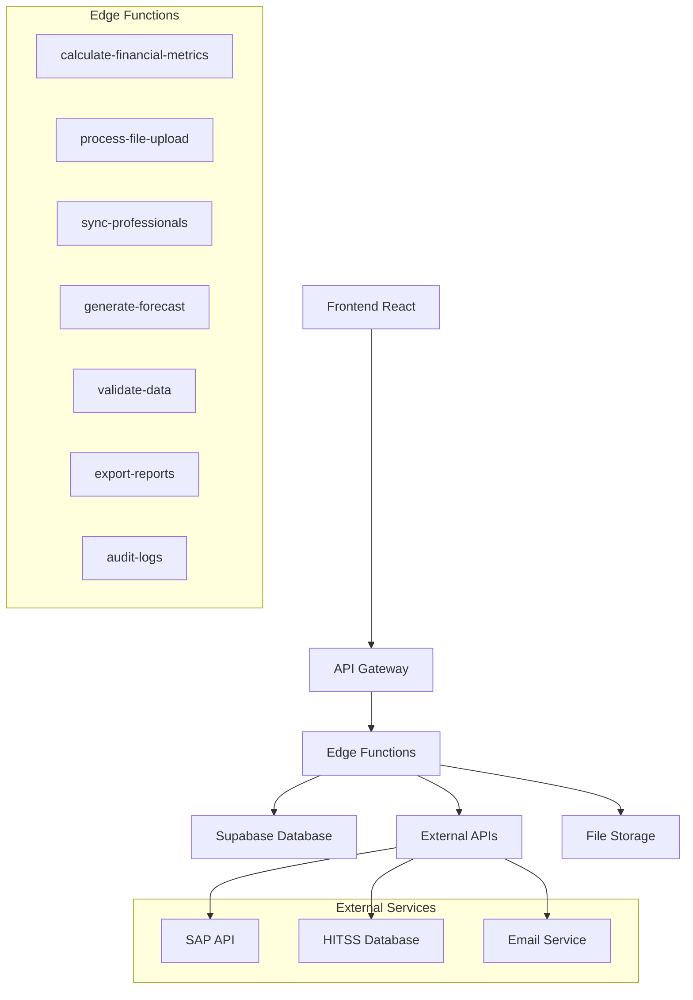

# ⚡ Implementação de Supabase Edge Functions

## 🎯 Visão Geral

Este documento detalha a implementação completa das Supabase Edge Functions para o App Financeiro, incluindo cálculos financeiros, processamento de uploads, sincronização de dados e APIs de integração.

### Arquitetura das Edge Functions



## 🔧 Configuração do Ambiente

### Estrutura de Diretórios

```
supabase/
├── functions/
│   ├── calculate-financial-metrics/
│   │   ├── index.ts
│   │   └── types.ts
│   ├── process-file-upload/
│   │   ├── index.ts
│   │   ├── parsers/
│   │   │   ├── excel-parser.ts
│   │   │   ├── csv-parser.ts
│   │   │   └── dre-parser.ts
│   │   └── validators/
│   │       ├── data-validator.ts
│   │       └── business-rules.ts
│   ├── sync-professionals/
│   │   ├── index.ts
│   │   ├── hitss-connector.ts
│   │   └── sync-strategies.ts
│   ├── generate-forecast/
│   │   ├── index.ts
│   │   ├── algorithms/
│   │   │   ├── linear-regression.ts
│   │   │   ├── seasonal-analysis.ts
│   │   │   └── trend-analysis.ts
│   │   └── models/
│   │       └── forecast-models.ts
│   ├── validate-data/
│   │   ├── index.ts
│   │   └── validation-rules.ts
│   ├── export-reports/
│   │   ├── index.ts
│   │   ├── generators/
│   │   │   ├── pdf-generator.ts
│   │   │   ├── excel-generator.ts
│   │   │   └── chart-generator.ts
│   │   └── templates/
│   ├── audit-logs/
│   │   ├── index.ts
│   │   └── log-processor.ts
│   └── _shared/
│       ├── database.ts
│       ├── auth.ts
│       ├── cors.ts
│       ├── logger.ts
│       ├── validators.ts
│       └── types.ts
├── config.toml
└── .env
```

### Configuração Base

**Arquivo:** `supabase/config.toml`

```toml
[api]
enabled = true
port = 54321
schemas = ["public", "graphql_public"]
extra_search_path = ["public", "extensions"]
max_rows = 1000

[db]
port = 54322
shadow_port = 54320
major_version = 15

[studio]
enabled = true
port = 54323
api_url = "http://localhost:54321"

[inbucket]
enabled = true
port = 54324
smtp_port = 54325
pop3_port = 54326

[storage]
enabled = true
file_size_limit = "50MiB"

[auth]
enabled = true
site_url = "http://localhost:3000"
additional_redirect_urls = ["https://app-financeiro.netlify.app"]
jwt_expiry = 3600
refresh_token_rotation_enabled = true
security_update_password_require_reauthentication = true

[edge_runtime]
enabled = true
ip_version = "ipv4"
port = 54327
inspector_port = 8083

[analytics]
enabled = false
```

**Arquivo:** `supabase/.env`

```env
# Supabase
SUPABASE_URL=https://kxippwliqglukdhatuaa.supabase.co
SUPABASE_ANON_KEY=your_anon_key
SUPABASE_SERVICE_ROLE_KEY=your_service_role_key

# External APIs
HITSS_API_URL=https://api.hitss.com
HITSS_API_KEY=your_hitss_api_key
SAP_API_URL=https://sap.company.com
SAP_USERNAME=your_sap_username
SAP_PASSWORD=your_sap_password

# Email Service
SMTP_HOST=smtp.gmail.com
SMTP_PORT=587
SMTP_USER=your_email@company.com
SMTP_PASS=your_email_password

# Monitoring
SENTRY_DSN=your_sentry_dsn
LOG_LEVEL=info
```

## 🧮 Edge Function: Cálculos Financeiros

### Função Principal

**Arquivo:** `supabase/functions/calculate-financial-metrics/index.ts`

```typescript
import { serve } from "https://deno.land/std@0.168.0/http/server.ts"
import { createClient } from 'https://esm.sh/@supabase/supabase-js@2'
import { corsHeaders, handleCors } from '../_shared/cors.ts'
import { validateRequest, authenticateUser } from '../_shared/auth.ts'
import { logger } from '../_shared/logger.ts'
import { FinancialCalculator } from './financial-calculator.ts'
import { MetricsRequest, MetricsResponse, CalculationError } from './types.ts'

serve(async (req) => {
  // Handle CORS
  if (req.method === 'OPTIONS') {
    return handleCors(req)
  }

  try {
    // Authenticate user
    const user = await authenticateUser(req)
    if (!user) {
      return new Response(
        JSON.stringify({ error: 'Unauthorized' }),
        { status: 401, headers: { ...corsHeaders, 'Content-Type': 'application/json' } }
      )
    }

    // Validate request
    const requestData: MetricsRequest = await validateRequest(req, {
      projectId: 'string',
      startDate: 'string',
      endDate: 'string',
      metrics: 'array',
      filters: 'object?'
    })

    logger.info('Calculating financial metrics', {
      userId: user.id,
      projectId: requestData.projectId,
      metrics: requestData.metrics
    })

    // Initialize Supabase client
    const supabase = createClient(
      Deno.env.get('SUPABASE_URL') ?? '',
      Deno.env.get('SUPABASE_SERVICE_ROLE_KEY') ?? ''
    )

    // Initialize calculator
    const calculator = new FinancialCalculator(supabase)

    // Calculate metrics
    const results = await calculator.calculateMetrics(requestData)

    const response: MetricsResponse = {
      success: true,
      data: results,
      metadata: {
        calculatedAt: new Date().toISOString(),
        userId: user.id,
        projectId: requestData.projectId,
        period: {
          start: requestData.startDate,
          end: requestData.endDate
        }
      }
    }

    logger.info('Financial metrics calculated successfully', {
      userId: user.id,
      projectId: requestData.projectId,
      metricsCount: Object.keys(results).length
    })

    return new Response(
      JSON.stringify(response),
      { status: 200, headers: { ...corsHeaders, 'Content-Type': 'application/json' } }
    )

  } catch (error) {
    logger.error('Error calculating financial metrics', {
      error: error.message,
      stack: error.stack
    })

    const errorResponse: CalculationError = {
      success: false,
      error: {
        code: 'CALCULATION_ERROR',
        message: error.message,
        details: error.details || null
      }
    }

    return new Response(
      JSON.stringify(errorResponse),
      { status: 500, headers: { ...corsHeaders, 'Content-Type': 'application/json' } }
    )
  }
})
```

### Calculadora Financeira

**Arquivo:** `supabase/functions/calculate-financial-metrics/financial-calculator.ts`

```typescript
import { SupabaseClient } from 'https://esm.sh/@supabase/supabase-js@2'
import { MetricsRequest, FinancialMetrics, ProjectSummary } from './types.ts'

export class FinancialCalculator {
  constructor(private supabase: SupabaseClient) {}

  async calculateMetrics(request: MetricsRequest): Promise<FinancialMetrics> {
    const results: FinancialMetrics = {}

    // Calculate each requested metric
    for (const metric of request.metrics) {
      switch (metric) {
        case 'revenue':
          results.revenue = await this.calculateRevenue(request)
          break
        case 'costs':
          results.costs = await this.calculateCosts(request)
          break
        case 'margin':
          results.margin = await this.calculateMargin(request)
          break
        case 'forecast':
          results.forecast = await this.calculateForecast(request)
          break
        case 'summary':
          results.summary = await this.calculateSummary(request)
          break
        default:
          throw new Error(`Unknown metric: ${metric}`)
      }
    }

    return results
  }

  private async calculateRevenue(request: MetricsRequest) {
    const { data: transactions, error } = await this.supabase
      .from('financial_transactions')
      .select(`
        amount,
        period_year,
        period_month,
        account_summary,
        nature
      `)
      .eq('project_id', request.projectId)
      .eq('nature', 'RECEITA')
      .gte('created_at', request.startDate)
      .lte('created_at', request.endDate)

    if (error) throw error

    // Group by month and account summary
    const revenueByMonth = new Map<string, Map<string, number>>()
    let totalRevenue = 0
    let totalTaxRelief = 0

    for (const transaction of transactions || []) {
      const monthKey = `${transaction.period_year}-${String(transaction.period_month).padStart(2, '0')}`
      const accountSummary = transaction.account_summary || 'OUTROS'
      
      if (!revenueByMonth.has(monthKey)) {
        revenueByMonth.set(monthKey, new Map())
      }
      
      const monthData = revenueByMonth.get(monthKey)!
      const currentAmount = monthData.get(accountSummary) || 0
      monthData.set(accountSummary, currentAmount + transaction.amount)
      
      totalRevenue += transaction.amount
      
      if (accountSummary === 'DESONERAÇÃO DA FOLHA') {
        totalTaxRelief += transaction.amount
      }
    }

    // Convert to array format
    const monthlyRevenue = Array.from(revenueByMonth.entries()).map(([month, accounts]) => ({
      month,
      total: Array.from(accounts.values()).reduce((sum, amount) => sum + amount, 0),
      breakdown: Object.fromEntries(accounts.entries())
    }))

    return {
      total: totalRevenue,
      taxRelief: totalTaxRelief,
      netRevenue: totalRevenue - totalTaxRelief,
      monthlyBreakdown: monthlyRevenue,
      averageMonthly: totalRevenue / Math.max(monthlyRevenue.length, 1)
    }
  }

  private async calculateCosts(request: MetricsRequest) {
    const { data: transactions, error } = await this.supabase
      .from('financial_transactions')
      .select(`
        amount,
        period_year,
        period_month,
        account_summary,
        nature
      `)
      .eq('project_id', request.projectId)
      .eq('nature', 'CUSTO')
      .gte('created_at', request.startDate)
      .lte('created_at', request.endDate)

    if (error) throw error

    // Group by month and cost type
    const costsByMonth = new Map<string, Map<string, number>>()
    let totalCosts = 0
    let cltCosts = 0
    let subcontractorCosts = 0

    for (const transaction of transactions || []) {
      const monthKey = `${transaction.period_year}-${String(transaction.period_month).padStart(2, '0')}`
      const accountSummary = transaction.account_summary || 'OUTROS'
      const amount = Math.abs(transaction.amount) // Costs should be positive for calculations
      
      if (!costsByMonth.has(monthKey)) {
        costsByMonth.set(monthKey, new Map())
      }
      
      const monthData = costsByMonth.get(monthKey)!
      const currentAmount = monthData.get(accountSummary) || 0
      monthData.set(accountSummary, currentAmount + amount)
      
      totalCosts += amount
      
      if (accountSummary === 'CLT') {
        cltCosts += amount
      } else if (accountSummary === 'SUBCONTRATADOS') {
        subcontractorCosts += amount
      }
    }

    // Convert to array format
    const monthlyCosts = Array.from(costsByMonth.entries()).map(([month, accounts]) => ({
      month,
      total: Array.from(accounts.values()).reduce((sum, amount) => sum + amount, 0),
      breakdown: Object.fromEntries(accounts.entries())
    }))

    return {
      total: totalCosts,
      clt: cltCosts,
      subcontractors: subcontractorCosts,
      others: totalCosts - cltCosts - subcontractorCosts,
      monthlyBreakdown: monthlyCosts,
      averageMonthly: totalCosts / Math.max(monthlyCosts.length, 1)
    }
  }

  private async calculateMargin(request: MetricsRequest) {
    // Get revenue and costs
    const revenue = await this.calculateRevenue(request)
    const costs = await this.calculateCosts(request)

    const grossMargin = revenue.netRevenue - costs.total
    const marginPercentage = revenue.netRevenue > 0 
      ? (grossMargin / revenue.netRevenue) * 100 
      : 0

    // Calculate monthly margins
    const monthlyMargins = []
    const revenueByMonth = new Map(revenue.monthlyBreakdown.map(r => [r.month, r.total]))
    const costsByMonth = new Map(costs.monthlyBreakdown.map(c => [c.month, c.total]))
    
    const allMonths = new Set([...revenueByMonth.keys(), ...costsByMonth.keys()])
    
    for (const month of Array.from(allMonths).sort()) {
      const monthRevenue = revenueByMonth.get(month) || 0
      const monthCosts = costsByMonth.get(month) || 0
      const monthMargin = monthRevenue - monthCosts
      const monthMarginPercentage = monthRevenue > 0 ? (monthMargin / monthRevenue) * 100 : 0
      
      monthlyMargins.push({
        month,
        revenue: monthRevenue,
        costs: monthCosts,
        margin: monthMargin,
        marginPercentage: monthMarginPercentage
      })
    }

    return {
      grossMargin,
      marginPercentage,
      monthlyMargins,
      trend: this.calculateTrend(monthlyMargins.map(m => m.marginPercentage))
    }
  }

  private async calculateForecast(request: MetricsRequest) {
    // Get historical data for forecasting
    const { data: historicalData, error } = await this.supabase
      .rpc('get_historical_financial_data', {
        project_id: request.projectId,
        months_back: 12
      })

    if (error) throw error

    // Simple linear regression for trend
    const revenues = historicalData.map((d: any) => d.revenue)
    const costs = historicalData.map((d: any) => d.costs)
    
    const revenueTrend = this.linearRegression(revenues)
    const costTrend = this.linearRegression(costs)
    
    // Forecast next 6 months
    const forecastMonths = 6
    const forecast = []
    
    for (let i = 1; i <= forecastMonths; i++) {
      const forecastRevenue = revenueTrend.slope * (revenues.length + i) + revenueTrend.intercept
      const forecastCosts = costTrend.slope * (costs.length + i) + costTrend.intercept
      const forecastMargin = forecastRevenue - forecastCosts
      
      forecast.push({
        month: i,
        revenue: Math.max(0, forecastRevenue),
        costs: Math.max(0, forecastCosts),
        margin: forecastMargin,
        confidence: Math.max(0.5, 1 - (i * 0.1)) // Decreasing confidence over time
      })
    }

    return {
      forecast,
      trends: {
        revenue: revenueTrend,
        costs: costTrend
      },
      accuracy: this.calculateForecastAccuracy(historicalData)
    }
  }

  private async calculateSummary(request: MetricsRequest): Promise<ProjectSummary> {
    // Get all metrics
    const [revenue, costs, margin] = await Promise.all([
      this.calculateRevenue(request),
      this.calculateCosts(request),
      this.calculateMargin(request)
    ])

    // Get project info
    const { data: project, error } = await this.supabase
      .from('projects')
      .select('name, code, status')
      .eq('id', request.projectId)
      .single()

    if (error) throw error

    // Calculate KPIs
    const roi = revenue.total > 0 ? ((revenue.total - costs.total) / costs.total) * 100 : 0
    const burnRate = costs.averageMonthly
    const runway = revenue.total > 0 ? revenue.total / burnRate : 0

    return {
      project: {
        id: request.projectId,
        name: project.name,
        code: project.code,
        status: project.status
      },
      period: {
        start: request.startDate,
        end: request.endDate
      },
      financial: {
        totalRevenue: revenue.total,
        totalCosts: costs.total,
        grossMargin: margin.grossMargin,
        marginPercentage: margin.marginPercentage,
        roi,
        burnRate,
        runway
      },
      trends: {
        revenueGrowth: this.calculateGrowthRate(revenue.monthlyBreakdown.map(r => r.total)),
        costGrowth: this.calculateGrowthRate(costs.monthlyBreakdown.map(c => c.total)),
        marginTrend: margin.trend
      },
      alerts: this.generateAlerts({
        marginPercentage: margin.marginPercentage,
        burnRate,
        runway,
        revenueGrowth: this.calculateGrowthRate(revenue.monthlyBreakdown.map(r => r.total))
      })
    }
  }

  private calculateTrend(values: number[]): 'increasing' | 'decreasing' | 'stable' {
    if (values.length < 2) return 'stable'
    
    const firstHalf = values.slice(0, Math.floor(values.length / 2))
    const secondHalf = values.slice(Math.floor(values.length / 2))
    
    const firstAvg = firstHalf.reduce((sum, val) => sum + val, 0) / firstHalf.length
    const secondAvg = secondHalf.reduce((sum, val) => sum + val, 0) / secondHalf.length
    
    const difference = secondAvg - firstAvg
    const threshold = Math.abs(firstAvg) * 0.05 // 5% threshold
    
    if (difference > threshold) return 'increasing'
    if (difference < -threshold) return 'decreasing'
    return 'stable'
  }

  private linearRegression(values: number[]): { slope: number; intercept: number; r2: number } {
    const n = values.length
    const x = Array.from({ length: n }, (_, i) => i + 1)
    
    const sumX = x.reduce((sum, val) => sum + val, 0)
    const sumY = values.reduce((sum, val) => sum + val, 0)
    const sumXY = x.reduce((sum, val, i) => sum + val * values[i], 0)
    const sumXX = x.reduce((sum, val) => sum + val * val, 0)
    const sumYY = values.reduce((sum, val) => sum + val * val, 0)
    
    const slope = (n * sumXY - sumX * sumY) / (n * sumXX - sumX * sumX)
    const intercept = (sumY - slope * sumX) / n
    
    // Calculate R-squared
    const yMean = sumY / n
    const ssRes = values.reduce((sum, val, i) => {
      const predicted = slope * x[i] + intercept
      return sum + Math.pow(val - predicted, 2)
    }, 0)
    const ssTot = values.reduce((sum, val) => sum + Math.pow(val - yMean, 2), 0)
    const r2 = 1 - (ssRes / ssTot)
    
    return { slope, intercept, r2 }
  }

  private calculateGrowthRate(values: number[]): number {
    if (values.length < 2) return 0
    
    const firstValue = values[0]
    const lastValue = values[values.length - 1]
    
    if (firstValue === 0) return 0
    
    return ((lastValue - firstValue) / Math.abs(firstValue)) * 100
  }

  private calculateForecastAccuracy(historicalData: any[]): number {
    // Simple accuracy calculation based on variance
    if (historicalData.length < 3) return 0.5
    
    const revenues = historicalData.map(d => d.revenue)
    const mean = revenues.reduce((sum, val) => sum + val, 0) / revenues.length
    const variance = revenues.reduce((sum, val) => sum + Math.pow(val - mean, 2), 0) / revenues.length
    const stdDev = Math.sqrt(variance)
    const coefficientOfVariation = mean > 0 ? stdDev / mean : 1
    
    // Convert to accuracy (lower variation = higher accuracy)
    return Math.max(0.1, Math.min(0.95, 1 - coefficientOfVariation))
  }

  private generateAlerts(metrics: {
    marginPercentage: number
    burnRate: number
    runway: number
    revenueGrowth: number
  }): Array<{ type: 'warning' | 'error' | 'info'; message: string }> {
    const alerts = []
    
    if (metrics.marginPercentage < 10) {
      alerts.push({
        type: 'error' as const,
        message: `Margem muito baixa: ${metrics.marginPercentage.toFixed(1)}%`
      })
    } else if (metrics.marginPercentage < 20) {
      alerts.push({
        type: 'warning' as const,
        message: `Margem abaixo do ideal: ${metrics.marginPercentage.toFixed(1)}%`
      })
    }
    
    if (metrics.runway < 3) {
      alerts.push({
        type: 'error' as const,
        message: `Runway crítico: ${metrics.runway.toFixed(1)} meses`
      })
    } else if (metrics.runway < 6) {
      alerts.push({
        type: 'warning' as const,
        message: `Runway baixo: ${metrics.runway.toFixed(1)} meses`
      })
    }
    
    if (metrics.revenueGrowth < -10) {
      alerts.push({
        type: 'error' as const,
        message: `Receita em queda: ${metrics.revenueGrowth.toFixed(1)}%`
      })
    } else if (metrics.revenueGrowth > 50) {
      alerts.push({
        type: 'info' as const,
        message: `Crescimento acelerado: ${metrics.revenueGrowth.toFixed(1)}%`
      })
    }
    
    return alerts
  }
}
```

### Tipos TypeScript

**Arquivo:** `supabase/functions/calculate-financial-metrics/types.ts`

```typescript
export interface MetricsRequest {
  projectId: string
  startDate: string
  endDate: string
  metrics: Array<'revenue' | 'costs' | 'margin' | 'forecast' | 'summary'>
  filters?: {
    accountSummary?: string[]
    nature?: string[]
    minAmount?: number
    maxAmount?: number
  }
}

export interface MetricsResponse {
  success: true
  data: FinancialMetrics
  metadata: {
    calculatedAt: string
    userId: string
    projectId: string
    period: {
      start: string
      end: string
    }
  }
}

export interface CalculationError {
  success: false
  error: {
    code: string
    message: string
    details?: any
  }
}

export interface FinancialMetrics {
  revenue?: {
    total: number
    taxRelief: number
    netRevenue: number
    monthlyBreakdown: Array<{
      month: string
      total: number
      breakdown: Record<string, number>
    }>
    averageMonthly: number
  }
  costs?: {
    total: number
    clt: number
    subcontractors: number
    others: number
    monthlyBreakdown: Array<{
      month: string
      total: number
      breakdown: Record<string, number>
    }>
    averageMonthly: number
  }
  margin?: {
    grossMargin: number
    marginPercentage: number
    monthlyMargins: Array<{
      month: string
      revenue: number
      costs: number
      margin: number
      marginPercentage: number
    }>
    trend: 'increasing' | 'decreasing' | 'stable'
  }
  forecast?: {
    forecast: Array<{
      month: number
      revenue: number
      costs: number
      margin: number
      confidence: number
    }>
    trends: {
      revenue: { slope: number; intercept: number; r2: number }
      costs: { slope: number; intercept: number; r2: number }
    }
    accuracy: number
  }
  summary?: ProjectSummary
}

export interface ProjectSummary {
  project: {
    id: string
    name: string
    code: string
    status: string
  }
  period: {
    start: string
    end: string
  }
  financial: {
    totalRevenue: number
    totalCosts: number
    grossMargin: number
    marginPercentage: number
    roi: number
    burnRate: number
    runway: number
  }
  trends: {
    revenueGrowth: number
    costGrowth: number
    marginTrend: 'increasing' | 'decreasing' | 'stable'
  }
  alerts: Array<{
    type: 'warning' | 'error' | 'info'
    message: string
  }>
}
```

## 📁 Edge Function: Processamento de Upload

### Função Principal

**Arquivo:** `supabase/functions/process-file-upload/index.ts`

```typescript
import { serve } from "https://deno.land/std@0.168.0/http/server.ts"
import { createClient } from 'https://esm.sh/@supabase/supabase-js@2'
import { corsHeaders, handleCors } from '../_shared/cors.ts'
import { validateRequest, authenticateUser } from '../_shared/auth.ts'
import { logger } from '../_shared/logger.ts'
import { FileProcessor } from './file-processor.ts'
import { DataValidator } from './validators/data-validator.ts'
import { UploadRequest, UploadResponse, ProcessingError } from './types.ts'

serve(async (req) => {
  if (req.method === 'OPTIONS') {
    return handleCors(req)
  }

  try {
    const user = await authenticateUser(req)
    if (!user) {
      return new Response(
        JSON.stringify({ error: 'Unauthorized' }),
        { status: 401, headers: { ...corsHeaders, 'Content-Type': 'application/json' } }
      )
    }

    // Parse multipart form data
    const formData = await req.formData()
    const file = formData.get('file') as File
    const projectId = formData.get('projectId') as string
    const fileType = formData.get('fileType') as string
    const options = JSON.parse(formData.get('options') as string || '{}')

    if (!file || !projectId || !fileType) {
      return new Response(
        JSON.stringify({ error: 'Missing required fields: file, projectId, fileType' }),
        { status: 400, headers: { ...corsHeaders, 'Content-Type': 'application/json' } }
      )
    }

    logger.info('Processing file upload', {
      userId: user.id,
      projectId,
      fileType,
      fileName: file.name,
      fileSize: file.size
    })

    const supabase = createClient(
      Deno.env.get('SUPABASE_URL') ?? '',
      Deno.env.get('SUPABASE_SERVICE_ROLE_KEY') ?? ''
    )

    const processor = new FileProcessor(supabase)
    const validator = new DataValidator()

    // Process file
    const result = await processor.processFile({
      file,
      projectId,
      fileType,
      userId: user.id,
      options
    })

    // Validate data
    const validationResult = await validator.validateData(result.data, fileType)
    
    if (!validationResult.isValid) {
      logger.warn('Data validation failed', {
        userId: user.id,
        fileName: file.name,
        errors: validationResult.errors
      })
      
      return new Response(
        JSON.stringify({
          success: false,
          error: 'Data validation failed',
          validationErrors: validationResult.errors
        }),
        { status: 422, headers: { ...corsHeaders, 'Content-Type': 'application/json' } }
      )
    }

    // Save to database
    const saveResult = await processor.saveToDatabase(result.data, {
      projectId,
      userId: user.id,
      fileName: file.name,
      fileType,
      batchId: result.batchId
    })

    const response: UploadResponse = {
      success: true,
      data: {
        batchId: result.batchId,
        recordsProcessed: result.data.length,
        recordsSaved: saveResult.savedCount,
        recordsSkipped: saveResult.skippedCount,
        errors: saveResult.errors,
        summary: result.summary
      },
      metadata: {
        processedAt: new Date().toISOString(),
        userId: user.id,
        fileName: file.name,
        fileSize: file.size
      }
    }

    logger.info('File processed successfully', {
      userId: user.id,
      batchId: result.batchId,
      recordsProcessed: result.data.length,
      recordsSaved: saveResult.savedCount
    })

    return new Response(
      JSON.stringify(response),
      { status: 200, headers: { ...corsHeaders, 'Content-Type': 'application/json' } }
    )

  } catch (error) {
    logger.error('Error processing file upload', {
      error: error.message,
      stack: error.stack
    })

    const errorResponse: ProcessingError = {
      success: false,
      error: {
        code: 'PROCESSING_ERROR',
        message: error.message,
        details: error.details || null
      }
    }

    return new Response(
      JSON.stringify(errorResponse),
      { status: 500, headers: { ...corsHeaders, 'Content-Type': 'application/json' } }
    )
  }
})
```

## 👥 Edge Function: Sincronização de Profissionais

**Arquivo:** `supabase/functions/sync-professionals/index.ts`

```typescript
import { serve } from "https://deno.land/std@0.168.0/http/server.ts"
import { createClient } from 'https://esm.sh/@supabase/supabase-js@2'
import { corsHeaders, handleCors } from '../_shared/cors.ts'
import { authenticateUser } from '../_shared/auth.ts'
import { logger } from '../_shared/logger.ts'
import { HITSSConnector } from './hitss-connector.ts'
import { SyncStrategy } from './sync-strategies.ts'

serve(async (req) => {
  if (req.method === 'OPTIONS') {
    return handleCors(req)
  }

  try {
    const user = await authenticateUser(req)
    if (!user) {
      return new Response(
        JSON.stringify({ error: 'Unauthorized' }),
        { status: 401, headers: { ...corsHeaders, 'Content-Type': 'application/json' } }
      )
    }

    const { projectId, syncType = 'incremental', forceSync = false } = await req.json()

    logger.info('Starting professional sync', {
      userId: user.id,
      projectId,
      syncType,
      forceSync
    })

    const supabase = createClient(
      Deno.env.get('SUPABASE_URL') ?? '',
      Deno.env.get('SUPABASE_SERVICE_ROLE_KEY') ?? ''
    )

    const connector = new HITSSConnector()
    const strategy = new SyncStrategy(supabase)

    // Get professionals from HITSS
    const hitssData = await connector.getProfessionals(projectId)
    
    // Sync with database
    const syncResult = await strategy.sync({
      projectId,
      externalData: hitssData,
      syncType,
      forceSync,
      userId: user.id
    })

    logger.info('Professional sync completed', {
      userId: user.id,
      projectId,
      created: syncResult.created,
      updated: syncResult.updated,
      deactivated: syncResult.deactivated
    })

    return new Response(
      JSON.stringify({
        success: true,
        data: syncResult,
        metadata: {
          syncedAt: new Date().toISOString(),
          userId: user.id,
          projectId
        }
      }),
      { status: 200, headers: { ...corsHeaders, 'Content-Type': 'application/json' } }
    )

  } catch (error) {
    logger.error('Error in professional sync', {
      error: error.message,
      stack: error.stack
    })

    return new Response(
      JSON.stringify({
        success: false,
        error: {
          code: 'SYNC_ERROR',
          message: error.message
        }
      }),
      { status: 500, headers: { ...corsHeaders, 'Content-Type': 'application/json' } }
    )
  }
})
```

## 🔧 Utilitários Compartilhados

### Autenticação e Validação

**Arquivo:** `supabase/functions/_shared/auth.ts`

```typescript
import { createClient } from 'https://esm.sh/@supabase/supabase-js@2'

export async function authenticateUser(req: Request) {
  const authHeader = req.headers.get('Authorization')
  if (!authHeader || !authHeader.startsWith('Bearer ')) {
    return null
  }

  const token = authHeader.substring(7)
  
  const supabase = createClient(
    Deno.env.get('SUPABASE_URL') ?? '',
    Deno.env.get('SUPABASE_ANON_KEY') ?? ''
  )

  const { data: { user }, error } = await supabase.auth.getUser(token)
  
  if (error || !user) {
    return null
  }

  return user
}

export async function validateRequest(req: Request, schema: Record<string, string>): Promise<any> {
  const data = await req.json()
  
  for (const [field, type] of Object.entries(schema)) {
    const isOptional = type.endsWith('?')
    const fieldType = type.replace('?', '')
    
    if (!isOptional && !(field in data)) {
      throw new Error(`Missing required field: ${field}`)
    }
    
    if (field in data) {
      const value = data[field]
      
      switch (fieldType) {
        case 'string':
          if (typeof value !== 'string') {
            throw new Error(`Field ${field} must be a string`)
          }
          break
        case 'number':
          if (typeof value !== 'number') {
            throw new Error(`Field ${field} must be a number`)
          }
          break
        case 'array':
          if (!Array.isArray(value)) {
            throw new Error(`Field ${field} must be an array`)
          }
          break
        case 'object':
          if (typeof value !== 'object' || value === null) {
            throw new Error(`Field ${field} must be an object`)
          }
          break
      }
    }
  }
  
  return data
}
```

### CORS

**Arquivo:** `supabase/functions/_shared/cors.ts`

```typescript
export const corsHeaders = {
  'Access-Control-Allow-Origin': '*',
  'Access-Control-Allow-Headers': 'authorization, x-client-info, apikey, content-type',
  'Access-Control-Allow-Methods': 'GET, POST, PUT, DELETE, OPTIONS'
}

export function handleCors(req: Request): Response {
  return new Response(null, {
    status: 200,
    headers: corsHeaders
  })
}
```

### Logger

**Arquivo:** `supabase/functions/_shared/logger.ts`

```typescript
interface LogEntry {
  level: 'info' | 'warn' | 'error'
  message: string
  data?: any
  timestamp: string
  functionName?: string
}

class Logger {
  private functionName: string

  constructor(functionName?: string) {
    this.functionName = functionName || 'unknown'
  }

  private log(level: LogEntry['level'], message: string, data?: any) {
    const entry: LogEntry = {
      level,
      message,
      data,
      timestamp: new Date().toISOString(),
      functionName: this.functionName
    }

    console.log(JSON.stringify(entry))

    // Send to external logging service if configured
    if (Deno.env.get('SENTRY_DSN')) {
      // Send to Sentry or other logging service
    }
  }

  info(message: string, data?: any) {
    this.log('info', message, data)
  }

  warn(message: string, data?: any) {
    this.log('warn', message, data)
  }

  error(message: string, data?: any) {
    this.log('error', message, data)
  }
}

export const logger = new Logger()
```

## 🚀 Deploy e Configuração

### Script de Deploy

**Arquivo:** `scripts/deploy-functions.sh`

```bash
#!/bin/bash

set -e

echo "🚀 Deploying Supabase Edge Functions..."

# Check if Supabase CLI is installed
if ! command -v supabase &> /dev/null; then
    echo "❌ Supabase CLI not found. Please install it first."
    exit 1
fi

# Check if logged in
if ! supabase projects list &> /dev/null; then
    echo "❌ Not logged in to Supabase. Please run 'supabase login' first."
    exit 1
fi

# Deploy functions
echo "📦 Deploying calculate-financial-metrics..."
supabase functions deploy calculate-financial-metrics

echo "📦 Deploying process-file-upload..."
supabase functions deploy process-file-upload

echo "📦 Deploying sync-professionals..."
supabase functions deploy sync-professionals

echo "📦 Deploying generate-forecast..."
supabase functions deploy generate-forecast

echo "📦 Deploying validate-data..."
supabase functions deploy validate-data

echo "📦 Deploying export-reports..."
supabase functions deploy export-reports

echo "📦 Deploying audit-logs..."
supabase functions deploy audit-logs

# Set environment variables
echo "⚙️ Setting environment variables..."
supabase secrets set HITSS_API_URL="$HITSS_API_URL"
supabase secrets set HITSS_API_KEY="$HITSS_API_KEY"
supabase secrets set SAP_API_URL="$SAP_API_URL"
supabase secrets set SAP_USERNAME="$SAP_USERNAME"
supabase secrets set SAP_PASSWORD="$SAP_PASSWORD"
supabase secrets set SMTP_HOST="$SMTP_HOST"
supabase secrets set SMTP_PORT="$SMTP_PORT"
supabase secrets set SMTP_USER="$SMTP_USER"
supabase secrets set SMTP_PASS="$SMTP_PASS"
supabase secrets set SENTRY_DSN="$SENTRY_DSN"
supabase secrets set LOG_LEVEL="$LOG_LEVEL"

echo "✅ All Edge Functions deployed successfully!"
echo "🔗 Functions are available at:"
echo "   - https://kxippwliqglukdhatuaa.supabase.co/functions/v1/calculate-financial-metrics"
echo "   - https://kxippwliqglukdhatuaa.supabase.co/functions/v1/process-file-upload"
echo "   - https://kxippwliqglukdhatuaa.supabase.co/functions/v1/sync-professionals"
echo "   - https://kxippwliqglukdhatuaa.supabase.co/functions/v1/generate-forecast"
echo "   - https://kxippwliqglukdhatuaa.supabase.co/functions/v1/validate-data"
echo "   - https://kxippwliqglukdhatuaa.supabase.co/functions/v1/export-reports"
echo "   - https://kxippwliqglukdhatuaa.supabase.co/functions/v1/audit-logs"
```

### Testes das Edge Functions

**Arquivo:** `tests/edge-functions.test.ts`

```typescript
import { assertEquals, assertExists } from "https://deno.land/std@0.168.0/testing/asserts.ts"

const SUPABASE_URL = Deno.env.get('SUPABASE_URL')
const SUPABASE_ANON_KEY = Deno.env.get('SUPABASE_ANON_KEY')
const TEST_USER_TOKEN = Deno.env.get('TEST_USER_TOKEN')

Deno.test("Calculate Financial Metrics", async () => {
  const response = await fetch(`${SUPABASE_URL}/functions/v1/calculate-financial-metrics`, {
    method: 'POST',
    headers: {
      'Authorization': `Bearer ${TEST_USER_TOKEN}`,
      'Content-Type': 'application/json'
    },
    body: JSON.stringify({
      projectId: 'test-project-id',
      startDate: '2024-01-01',
      endDate: '2024-12-31',
      metrics: ['revenue', 'costs', 'margin']
    })
  })

  assertEquals(response.status, 200)
  
  const data = await response.json()
  assertExists(data.success)
  assertExists(data.data)
})

Deno.test("Process File Upload", async () => {
  const formData = new FormData()
  formData.append('projectId', 'test-project-id')
  formData.append('fileType', 'dre')
  formData.append('file', new File(['test,data\n1,100'], 'test.csv', { type: 'text/csv' }))
  formData.append('options', JSON.stringify({ skipValidation: true }))

  const response = await fetch(`${SUPABASE_URL}/functions/v1/process-file-upload`, {
    method: 'POST',
    headers: {
      'Authorization': `Bearer ${TEST_USER_TOKEN}`
    },
    body: formData
  })

  assertEquals(response.status, 200)
  
  const data = await response.json()
  assertExists(data.success)
  assertExists(data.data.batchId)
})

Deno.test("Sync Professionals", async () => {
  const response = await fetch(`${SUPABASE_URL}/functions/v1/sync-professionals`, {
    method: 'POST',
    headers: {
      'Authorization': `Bearer ${TEST_USER_TOKEN}`,
      'Content-Type': 'application/json'
    },
    body: JSON.stringify({
      projectId: 'test-project-id',
      syncType: 'incremental'
    })
  })

  assertEquals(response.status, 200)
  
  const data = await response.json()
  assertExists(data.success)
  assertExists(data.data)
})
```

---

**📝 Próximos Passos:**
1. Implementar as Edge Functions restantes (generate-forecast, validate-data, export-reports, audit-logs)
2. Configurar monitoramento e alertas
3. Implementar testes automatizados
4. Configurar CI/CD para deploy automático
5. Documentar APIs para o frontend
6. Implementar rate limiting e cache

**🔗 Recursos Úteis:**
- [Supabase Edge Functions Documentation](https://supabase.com/docs/guides/functions)
- [Deno Runtime Documentation](https://deno.land/manual)
- [TypeScript Handbook](https://www.typescriptlang.org/docs/)
