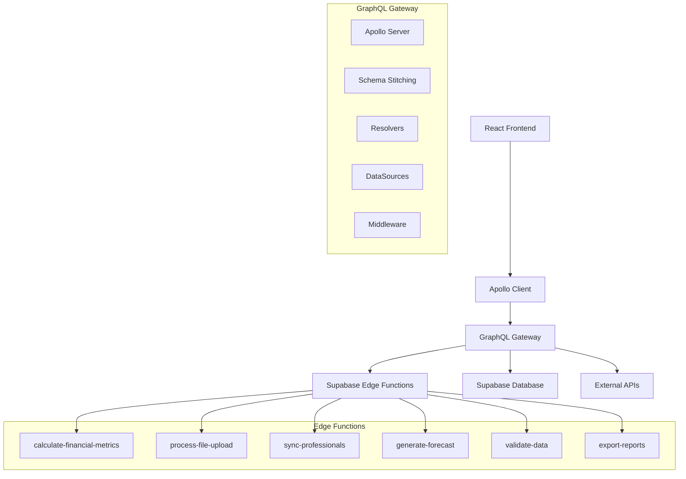

# 🌐 Implementação do GraphQL Gateway

## 🎯 Visão Geral

Este documento detalha a implementação completa do GraphQL Gateway para o App Financeiro, servindo como camada de abstração entre o frontend React e os microserviços Supabase Edge Functions.

### Arquitetura do Gateway



## 🏗️ Estrutura do Projeto

```
graphql-gateway/
├── src/
│   ├── schema/
│   │   ├── index.ts
│   │   ├── types/
│   │   │   ├── project.graphql
│   │   │   ├── financial.graphql
│   │   │   ├── professional.graphql
│   │   │   ├── upload.graphql
│   │   │   ├── forecast.graphql
│   │   │   └── common.graphql
│   │   └── resolvers/
│   │       ├── index.ts
│   │       ├── project.ts
│   │       ├── financial.ts
│   │       ├── professional.ts
│   │       ├── upload.ts
│   │       └── forecast.ts
│   ├── datasources/
│   │   ├── index.ts
│   │   ├── supabase.ts
│   │   ├── edge-functions.ts
│   │   └── external-apis.ts
│   ├── middleware/
│   │   ├── auth.ts
│   │   ├── rate-limit.ts
│   │   ├── cache.ts
│   │   ├── logging.ts
│   │   └── error-handling.ts
│   ├── utils/
│   │   ├── validation.ts
│   │   ├── formatting.ts
│   │   └── constants.ts
│   ├── types/
│   │   ├── context.ts
│   │   ├── datasources.ts
│   │   └── generated.ts
│   ├── server.ts
│   └── index.ts
├── tests/
│   ├── integration/
│   ├── unit/
│   └── fixtures/
├── docker/
│   ├── Dockerfile
│   └── docker-compose.yml
├── scripts/
│   ├── build.sh
│   ├── deploy.sh
│   └── generate-types.sh
├── package.json
├── tsconfig.json
├── codegen.yml
└── .env
```

## 📋 Configuração Base

### Package.json

```json
{
  "name": "app-financeiro-graphql-gateway",
  "version": "1.0.0",
  "description": "GraphQL Gateway for App Financeiro",
  "main": "dist/index.js",
  "scripts": {
    "dev": "ts-node-dev --respawn --transpile-only src/index.ts",
    "build": "tsc",
    "start": "node dist/index.js",
    "test": "jest",
    "test:watch": "jest --watch",
    "test:coverage": "jest --coverage",
    "codegen": "graphql-codegen --config codegen.yml",
    "lint": "eslint src/**/*.ts",
    "lint:fix": "eslint src/**/*.ts --fix",
    "docker:build": "docker build -t app-financeiro-gateway .",
    "docker:run": "docker run -p 4000:4000 app-financeiro-gateway"
  },
  "dependencies": {
    "@apollo/server": "^4.9.5",
    "@apollo/datasource-rest": "^6.2.2",
    "@apollo/subgraph": "^2.5.6",
    "@supabase/supabase-js": "^2.38.4",
    "apollo-server-express": "^3.12.1",
    "express": "^4.18.2",
    "graphql": "^16.8.1",
    "graphql-tag": "^2.12.6",
    "graphql-tools": "^9.0.0",
    "graphql-upload": "^16.0.2",
    "jsonwebtoken": "^9.0.2",
    "redis": "^4.6.10",
    "winston": "^3.11.0",
    "express-rate-limit": "^7.1.5",
    "helmet": "^7.1.0",
    "cors": "^2.8.5",
    "dotenv": "^16.3.1",
    "dataloader": "^2.2.2",
    "joi": "^17.11.0"
  },
  "devDependencies": {
    "@types/node": "^20.8.7",
    "@types/express": "^4.17.20",
    "@types/jsonwebtoken": "^9.0.5",
    "@types/cors": "^2.8.15",
    "@types/jest": "^29.5.7",
    "@typescript-eslint/eslint-plugin": "^6.9.1",
    "@typescript-eslint/parser": "^6.9.1",
    "@graphql-codegen/cli": "^5.0.0",
    "@graphql-codegen/typescript": "^4.0.1",
    "@graphql-codegen/typescript-resolvers": "^4.0.1",
    "eslint": "^8.52.0",
    "jest": "^29.7.0",
    "ts-jest": "^29.1.1",
    "ts-node-dev": "^2.0.0",
    "typescript": "^5.2.2"
  }
}
```

### Configuração TypeScript

**Arquivo:** `tsconfig.json`

```json
{
  "compilerOptions": {
    "target": "ES2020",
    "module": "commonjs",
    "lib": ["ES2020"],
    "outDir": "./dist",
    "rootDir": "./src",
    "strict": true,
    "esModuleInterop": true,
    "skipLibCheck": true,
    "forceConsistentCasingInFileNames": true,
    "resolveJsonModule": true,
    "declaration": true,
    "declarationMap": true,
    "sourceMap": true,
    "experimentalDecorators": true,
    "emitDecoratorMetadata": true,
    "moduleResolution": "node",
    "allowSyntheticDefaultImports": true,
    "noImplicitAny": true,
    "noImplicitReturns": true,
    "noImplicitThis": true,
    "noUnusedLocals": true,
    "noUnusedParameters": true
  },
  "include": [
    "src/**/*"
  ],
  "exclude": [
    "node_modules",
    "dist",
    "tests"
  ]
}
```

## 📊 Schema GraphQL

### Schema Principal

**Arquivo:** `src/schema/types/common.graphql`

```graphql
scalar Date
scalar DateTime
scalar Upload
scalar JSON

type Query {
  # Health check
  health: String!
  
  # Projects
  projects: [Project!]!
  project(id: ID!): Project
  
  # Financial data
  financialMetrics(input: FinancialMetricsInput!): FinancialMetrics!
  financialSummary(projectId: ID!, period: PeriodInput!): FinancialSummary!
  
  # Professionals
  professionals(projectId: ID): [Professional!]!
  professional(id: ID!): Professional
  
  # Forecast
  forecast(input: ForecastInput!): ForecastResult!
  
  # Reports
  reports(projectId: ID!, type: ReportType!): [Report!]!
}

type Mutation {
  # File uploads
  uploadFinancialData(input: UploadInput!): UploadResult!
  
  # Professional sync
  syncProfessionals(projectId: ID!, options: SyncOptions): SyncResult!
  
  # Data validation
  validateData(input: ValidationInput!): ValidationResult!
  
  # Report generation
  generateReport(input: ReportInput!): ReportResult!
  
  # Project management
  createProject(input: CreateProjectInput!): Project!
  updateProject(id: ID!, input: UpdateProjectInput!): Project!
  deleteProject(id: ID!): Boolean!
}

type Subscription {
  # Real-time updates
  financialDataUpdated(projectId: ID!): FinancialDataUpdate!
  uploadProgress(batchId: ID!): UploadProgress!
  syncProgress(projectId: ID!): SyncProgress!
}

# Common types
type Error {
  code: String!
  message: String!
  field: String
  details: JSON
}

type PaginationInfo {
  hasNextPage: Boolean!
  hasPreviousPage: Boolean!
  startCursor: String
  endCursor: String
  totalCount: Int!
}

input PeriodInput {
  startDate: Date!
  endDate: Date!
}

input PaginationInput {
  first: Int
  after: String
  last: Int
  before: String
}

enum SortOrder {
  ASC
  DESC
}
```

### Schema de Projetos

**Arquivo:** `src/schema/types/project.graphql`

```graphql
type Project {
  id: ID!
  name: String!
  code: String!
  description: String
  status: ProjectStatus!
  startDate: Date
  endDate: Date
  budget: Float
  currency: String!
  createdAt: DateTime!
  updatedAt: DateTime!
  
  # Relationships
  financialTransactions(period: PeriodInput, pagination: PaginationInput): FinancialTransactionConnection!
  professionals(active: Boolean): [Professional!]!
  reports: [Report!]!
  
  # Computed fields
  totalRevenue(period: PeriodInput): Float!
  totalCosts(period: PeriodInput): Float!
  grossMargin(period: PeriodInput): Float!
  marginPercentage(period: PeriodInput): Float!
}

type FinancialTransactionConnection {
  edges: [FinancialTransactionEdge!]!
  pageInfo: PaginationInfo!
}

type FinancialTransactionEdge {
  node: FinancialTransaction!
  cursor: String!
}

type FinancialTransaction {
  id: ID!
  projectId: ID!
  transactionType: TransactionType!
  nature: TransactionNature!
  accountCode: String!
  accountName: String
  accountSummary: AccountSummary!
  amount: Float!
  periodYear: Int!
  periodMonth: Int!
  description: String
  observations: String
  sourceFile: String
  uploadBatchId: String
  rawData: JSON
  createdAt: DateTime!
  updatedAt: DateTime!
  
  # Relationships
  project: Project!
}

enum ProjectStatus {
  ACTIVE
  INACTIVE
  COMPLETED
  CANCELLED
}

enum TransactionType {
  RECEITA
  DESPESA
}

enum TransactionNature {
  RECEITA
  CUSTO
  INVESTIMENTO
}

enum AccountSummary {
  RECEITA_DEVENGADA
  DESONERACAO_DA_FOLHA
  CLT
  SUBCONTRATADOS
  OUTROS
}

input CreateProjectInput {
  name: String!
  code: String!
  description: String
  startDate: Date
  endDate: Date
  budget: Float
  currency: String = "BRL"
}

input UpdateProjectInput {
  name: String
  code: String
  description: String
  status: ProjectStatus
  startDate: Date
  endDate: Date
  budget: Float
  currency: String
}
```

### Schema Financeiro

**Arquivo:** `src/schema/types/financial.graphql`

```graphql
type FinancialMetrics {
  revenue: RevenueMetrics
  costs: CostMetrics
  margin: MarginMetrics
  forecast: ForecastMetrics
  summary: ProjectSummary
}

type RevenueMetrics {
  total: Float!
  taxRelief: Float!
  netRevenue: Float!
  monthlyBreakdown: [MonthlyRevenue!]!
  averageMonthly: Float!
  growthRate: Float!
  trend: Trend!
}

type MonthlyRevenue {
  month: String!
  total: Float!
  breakdown: JSON!
}

type CostMetrics {
  total: Float!
  clt: Float!
  subcontractors: Float!
  others: Float!
  monthlyBreakdown: [MonthlyCost!]!
  averageMonthly: Float!
  growthRate: Float!
  trend: Trend!
}

type MonthlyCost {
  month: String!
  total: Float!
  breakdown: JSON!
}

type MarginMetrics {
  grossMargin: Float!
  marginPercentage: Float!
  monthlyMargins: [MonthlyMargin!]!
  trend: Trend!
  alerts: [Alert!]!
}

type MonthlyMargin {
  month: String!
  revenue: Float!
  costs: Float!
  margin: Float!
  marginPercentage: Float!
}

type ForecastMetrics {
  forecast: [ForecastPeriod!]!
  trends: ForecastTrends!
  accuracy: Float!
  confidence: Float!
}

type ForecastPeriod {
  month: Int!
  revenue: Float!
  costs: Float!
  margin: Float!
  confidence: Float!
}

type ForecastTrends {
  revenue: TrendLine!
  costs: TrendLine!
}

type TrendLine {
  slope: Float!
  intercept: Float!
  r2: Float!
}

type ProjectSummary {
  project: ProjectInfo!
  period: Period!
  financial: FinancialSummaryData!
  trends: TrendSummary!
  alerts: [Alert!]!
  kpis: [KPI!]!
}

type ProjectInfo {
  id: ID!
  name: String!
  code: String!
  status: ProjectStatus!
}

type Period {
  start: Date!
  end: Date!
}

type FinancialSummaryData {
  totalRevenue: Float!
  totalCosts: Float!
  grossMargin: Float!
  marginPercentage: Float!
  roi: Float!
  burnRate: Float!
  runway: Float!
}

type TrendSummary {
  revenueGrowth: Float!
  costGrowth: Float!
  marginTrend: Trend!
}

type Alert {
  type: AlertType!
  message: String!
  severity: AlertSeverity!
  createdAt: DateTime!
}

type KPI {
  name: String!
  value: Float!
  unit: String!
  target: Float
  status: KPIStatus!
}

enum Trend {
  INCREASING
  DECREASING
  STABLE
}

enum AlertType {
  LOW_MARGIN
  HIGH_COSTS
  REVENUE_DROP
  BUDGET_EXCEEDED
  FORECAST_WARNING
}

enum AlertSeverity {
  INFO
  WARNING
  ERROR
  CRITICAL
}

enum KPIStatus {
  ON_TARGET
  ABOVE_TARGET
  BELOW_TARGET
  CRITICAL
}

input FinancialMetricsInput {
  projectId: ID!
  period: PeriodInput!
  metrics: [MetricType!]!
  filters: FinancialFiltersInput
}

input FinancialFiltersInput {
  accountSummary: [AccountSummary!]
  nature: [TransactionNature!]
  minAmount: Float
  maxAmount: Float
  sourceFile: String
}

enum MetricType {
  REVENUE
  COSTS
  MARGIN
  FORECAST
  SUMMARY
}
```

### Schema de Profissionais

**Arquivo:** `src/schema/types/professional.graphql`

```graphql
type Professional {
  id: ID!
  externalId: String
  name: String!
  position: String!
  projectId: ID
  costPerMonth: Float!
  professionalType: ProfessionalType!
  startDate: Date
  endDate: Date
  isActive: Boolean!
  syncSource: SyncSource!
  lastSyncAt: DateTime
  createdAt: DateTime!
  updatedAt: DateTime!
  
  # Relationships
  project: Project
  
  # Computed fields
  totalCost(period: PeriodInput): Float!
  utilizationRate(period: PeriodInput): Float!
}

enum ProfessionalType {
  CLT
  SUBCONTRATADO
  TERCEIRO
  ESTAGIARIO
  CONSULTOR
}

enum SyncSource {
  MANUAL
  HITSS
  SAP
  EXTERNAL_API
}

type SyncResult {
  success: Boolean!
  summary: SyncSummary!
  errors: [Error!]!
  warnings: [String!]!
  syncedAt: DateTime!
}

type SyncSummary {
  totalProcessed: Int!
  created: Int!
  updated: Int!
  deactivated: Int!
  skipped: Int!
  failed: Int!
}

input SyncOptions {
  syncType: SyncType = INCREMENTAL
  forceSync: Boolean = false
  dryRun: Boolean = false
  batchSize: Int = 100
}

enum SyncType {
  FULL
  INCREMENTAL
  SELECTIVE
}
```

### Schema de Upload

**Arquivo:** `src/schema/types/upload.graphql`

```graphql
type UploadResult {
  success: Boolean!
  batchId: ID!
  summary: UploadSummary!
  errors: [UploadError!]!
  warnings: [String!]!
  processedAt: DateTime!
}

type UploadSummary {
  fileName: String!
  fileSize: Int!
  totalRows: Int!
  processedRows: Int!
  validRows: Int!
  invalidRows: Int!
  skippedRows: Int!
  duplicateRows: Int!
}

type UploadError {
  row: Int!
  column: String
  value: String
  error: String!
  severity: ErrorSeverity!
}

type UploadProgress {
  batchId: ID!
  status: UploadStatus!
  progress: Float!
  currentStep: String!
  totalSteps: Int!
  completedSteps: Int!
  estimatedTimeRemaining: Int
  errors: [UploadError!]!
}

enum UploadStatus {
  PENDING
  PROCESSING
  VALIDATING
  SAVING
  COMPLETED
  FAILED
  CANCELLED
}

enum ErrorSeverity {
  LOW
  MEDIUM
  HIGH
  CRITICAL
}

input UploadInput {
  file: Upload!
  projectId: ID!
  fileType: FileType!
  options: UploadOptions
}

input UploadOptions {
  skipValidation: Boolean = false
  allowDuplicates: Boolean = false
  batchSize: Int = 1000
  delimiter: String = ","
  encoding: String = "utf-8"
  hasHeader: Boolean = true
  dateFormat: String = "YYYY-MM-DD"
  decimalSeparator: String = "."
  thousandsSeparator: String = ","
}

enum FileType {
  DRE
  FINANCIAL_TRANSACTIONS
  PROFESSIONALS
  BUDGET
  FORECAST
}
```

### Schema de Forecast

**Arquivo:** `src/schema/types/forecast.graphql`

```graphql
type ForecastResult {
  success: Boolean!
  forecast: [ForecastData!]!
  metadata: ForecastMetadata!
  accuracy: ForecastAccuracy!
  scenarios: [ForecastScenario!]!
}

type ForecastData {
  period: String!
  revenue: ForecastValue!
  costs: ForecastValue!
  margin: ForecastValue!
  confidence: Float!
}

type ForecastValue {
  predicted: Float!
  lower: Float!
  upper: Float!
  trend: Trend!
}

type ForecastMetadata {
  algorithm: ForecastAlgorithm!
  trainingPeriod: Period!
  forecastPeriod: Period!
  parameters: JSON!
  generatedAt: DateTime!
}

type ForecastAccuracy {
  overall: Float!
  revenue: Float!
  costs: Float!
  margin: Float!
  mape: Float!
  rmse: Float!
}

type ForecastScenario {
  name: String!
  description: String!
  probability: Float!
  forecast: [ForecastData!]!
  assumptions: [String!]!
}

enum ForecastAlgorithm {
  LINEAR_REGRESSION
  ARIMA
  EXPONENTIAL_SMOOTHING
  NEURAL_NETWORK
  ENSEMBLE
}

input ForecastInput {
  projectId: ID!
  algorithm: ForecastAlgorithm = LINEAR_REGRESSION
  periods: Int = 6
  trainingMonths: Int = 12
  includeSeasonality: Boolean = true
  includeScenarios: Boolean = false
  confidence: Float = 0.95
}
```

## 🔧 Resolvers

### Resolver Principal

**Arquivo:** `src/schema/resolvers/index.ts`

```typescript
import { mergeResolvers } from '@graphql-tools/merge'
import { projectResolvers } from './project'
import { financialResolvers } from './financial'
import { professionalResolvers } from './professional'
import { uploadResolvers } from './upload'
import { forecastResolvers } from './forecast'
import { scalarResolvers } from './scalars'

export const resolvers = mergeResolvers([
  scalarResolvers,
  projectResolvers,
  financialResolvers,
  professionalResolvers,
  uploadResolvers,
  forecastResolvers
])
```

### Resolvers Financeiros

**Arquivo:** `src/schema/resolvers/financial.ts`

```typescript
import { Resolvers } from '../types/generated'
import { Context } from '../../types/context'
import { AuthenticationError, UserInputError } from 'apollo-server-express'
import { validateFinancialMetricsInput } from '../../utils/validation'

export const financialResolvers: Resolvers<Context> = {
  Query: {
    financialMetrics: async (_, { input }, { dataSources, user }) => {
      if (!user) {
        throw new AuthenticationError('Authentication required')
      }

      // Validate input
      const { error, value } = validateFinancialMetricsInput(input)
      if (error) {
        throw new UserInputError('Invalid input', { validationErrors: error.details })
      }

      // Check project access
      const hasAccess = await dataSources.supabase.checkProjectAccess(user.id, input.projectId)
      if (!hasAccess) {
        throw new AuthenticationError('Access denied to project')
      }

      // Call Edge Function
      return await dataSources.edgeFunctions.calculateFinancialMetrics(value)
    },

    financialSummary: async (_, { projectId, period }, { dataSources, user }) => {
      if (!user) {
        throw new AuthenticationError('Authentication required')
      }

      const hasAccess = await dataSources.supabase.checkProjectAccess(user.id, projectId)
      if (!hasAccess) {
        throw new AuthenticationError('Access denied to project')
      }

      return await dataSources.edgeFunctions.calculateFinancialMetrics({
        projectId,
        startDate: period.startDate,
        endDate: period.endDate,
        metrics: ['summary']
      })
    }
  },

  FinancialTransaction: {
    project: async (transaction, _, { dataSources }) => {
      return await dataSources.supabase.getProject(transaction.projectId)
    }
  },

  Project: {
    financialTransactions: async (project, { period, pagination }, { dataSources }) => {
      const transactions = await dataSources.supabase.getFinancialTransactions({
        projectId: project.id,
        period,
        pagination
      })

      return {
        edges: transactions.data.map(transaction => ({
          node: transaction,
          cursor: Buffer.from(transaction.id).toString('base64')
        })),
        pageInfo: {
          hasNextPage: transactions.hasNextPage,
          hasPreviousPage: transactions.hasPreviousPage,
          startCursor: transactions.data.length > 0 
            ? Buffer.from(transactions.data[0].id).toString('base64')
            : null,
          endCursor: transactions.data.length > 0 
            ? Buffer.from(transactions.data[transactions.data.length - 1].id).toString('base64')
            : null,
          totalCount: transactions.totalCount
        }
      }
    },

    totalRevenue: async (project, { period }, { dataSources }) => {
      const metrics = await dataSources.edgeFunctions.calculateFinancialMetrics({
        projectId: project.id,
        startDate: period?.startDate || '2024-01-01',
        endDate: period?.endDate || '2024-12-31',
        metrics: ['revenue']
      })
      return metrics.revenue?.total || 0
    },

    totalCosts: async (project, { period }, { dataSources }) => {
      const metrics = await dataSources.edgeFunctions.calculateFinancialMetrics({
        projectId: project.id,
        startDate: period?.startDate || '2024-01-01',
        endDate: period?.endDate || '2024-12-31',
        metrics: ['costs']
      })
      return metrics.costs?.total || 0
    },

    grossMargin: async (project, { period }, { dataSources }) => {
      const metrics = await dataSources.edgeFunctions.calculateFinancialMetrics({
        projectId: project.id,
        startDate: period?.startDate || '2024-01-01',
        endDate: period?.endDate || '2024-12-31',
        metrics: ['margin']
      })
      return metrics.margin?.grossMargin || 0
    },

    marginPercentage: async (project, { period }, { dataSources }) => {
      const metrics = await dataSources.edgeFunctions.calculateFinancialMetrics({
        projectId: project.id,
        startDate: period?.startDate || '2024-01-01',
        endDate: period?.endDate || '2024-12-31',
        metrics: ['margin']
      })
      return metrics.margin?.marginPercentage || 0
    }
  }
}
```

### Resolvers de Upload

**Arquivo:** `src/schema/resolvers/upload.ts`

```typescript
import { Resolvers } from '../types/generated'
import { Context } from '../../types/context'
import { AuthenticationError, UserInputError } from 'apollo-server-express'
import { GraphQLUpload } from 'graphql-upload'
import { validateUploadInput } from '../../utils/validation'

export const uploadResolvers: Resolvers<Context> = {
  Upload: GraphQLUpload,

  Mutation: {
    uploadFinancialData: async (_, { input }, { dataSources, user, pubsub }) => {
      if (!user) {
        throw new AuthenticationError('Authentication required')
      }

      // Validate input
      const { error, value } = validateUploadInput(input)
      if (error) {
        throw new UserInputError('Invalid input', { validationErrors: error.details })
      }

      // Check project access
      const hasAccess = await dataSources.supabase.checkProjectAccess(user.id, input.projectId)
      if (!hasAccess) {
        throw new AuthenticationError('Access denied to project')
      }

      // Process file upload
      const result = await dataSources.edgeFunctions.processFileUpload({
        ...value,
        userId: user.id
      })

      // Publish progress updates
      if (result.success) {
        pubsub.publish('UPLOAD_PROGRESS', {
          uploadProgress: {
            batchId: result.data.batchId,
            status: 'COMPLETED',
            progress: 100,
            currentStep: 'Completed',
            totalSteps: 1,
            completedSteps: 1,
            errors: result.data.errors || []
          }
        })
      }

      return result
    }
  },

  Subscription: {
    uploadProgress: {
      subscribe: (_, { batchId }, { pubsub }) => {
        return pubsub.asyncIterator(['UPLOAD_PROGRESS'])
      },
      resolve: (payload, { batchId }) => {
        // Filter by batchId
        if (payload.uploadProgress.batchId === batchId) {
          return payload.uploadProgress
        }
        return null
      }
    }
  }
}
```

## 🔌 DataSources

### Supabase DataSource

**Arquivo:** `src/datasources/supabase.ts`

```typescript
import { DataSource } from 'apollo-datasource'
import { createClient, SupabaseClient } from '@supabase/supabase-js'
import DataLoader from 'dataloader'
import { Context } from '../types/context'

export class SupabaseDataSource extends DataSource<Context> {
  private client: SupabaseClient
  private projectLoader: DataLoader<string, any>
  private professionalLoader: DataLoader<string, any>

  constructor() {
    super()
    this.client = createClient(
      process.env.SUPABASE_URL!,
      process.env.SUPABASE_SERVICE_ROLE_KEY!
    )

    // Initialize DataLoaders for efficient batching
    this.projectLoader = new DataLoader(async (ids: readonly string[]) => {
      const { data, error } = await this.client
        .from('projects')
        .select('*')
        .in('id', ids as string[])

      if (error) throw error

      // Return in the same order as requested
      return ids.map(id => data?.find(project => project.id === id) || null)
    })

    this.professionalLoader = new DataLoader(async (ids: readonly string[]) => {
      const { data, error } = await this.client
        .from('professionals')
        .select('*')
        .in('id', ids as string[])

      if (error) throw error

      return ids.map(id => data?.find(professional => professional.id === id) || null)
    })
  }

  initialize(config: { context: Context }) {
    this.context = config.context
  }

  // Projects
  async getProjects(userId: string) {
    const { data, error } = await this.client
      .from('projects')
      .select('*')
      .eq('created_by', userId)
      .order('created_at', { ascending: false })

    if (error) throw error
    return data || []
  }

  async getProject(id: string) {
    return this.projectLoader.load(id)
  }

  async createProject(input: any, userId: string) {
    const { data, error } = await this.client
      .from('projects')
      .insert({
        ...input,
        created_by: userId,
        created_at: new Date().toISOString(),
        updated_at: new Date().toISOString()
      })
      .select()
      .single()

    if (error) throw error
    return data
  }

  async updateProject(id: string, input: any) {
    const { data, error } = await this.client
      .from('projects')
      .update({
        ...input,
        updated_at: new Date().toISOString()
      })
      .eq('id', id)
      .select()
      .single()

    if (error) throw error
    return data
  }

  async deleteProject(id: string) {
    const { error } = await this.client
      .from('projects')
      .delete()
      .eq('id', id)

    if (error) throw error
    return true
  }

  async checkProjectAccess(userId: string, projectId: string): Promise<boolean> {
    const { data, error } = await this.client
      .from('projects')
      .select('id')
      .eq('id', projectId)
      .eq('created_by', userId)
      .single()

    return !error && !!data
  }

  // Financial Transactions
  async getFinancialTransactions(params: {
    projectId: string
    period?: { startDate: string; endDate: string }
    pagination?: { first?: number; after?: string; last?: number; before?: string }
  }) {
    let query = this.client
      .from('financial_transactions')
      .select('*', { count: 'exact' })
      .eq('project_id', params.projectId)

    if (params.period) {
      query = query
        .gte('created_at', params.period.startDate)
        .lte('created_at', params.period.endDate)
    }

    if (params.pagination?.first) {
      query = query.limit(params.pagination.first)
      if (params.pagination.after) {
        const afterId = Buffer.from(params.pagination.after, 'base64').toString()
        query = query.gt('id', afterId)
      }
    }

    const { data, error, count } = await query.order('created_at', { ascending: false })

    if (error) throw error

    return {
      data: data || [],
      totalCount: count || 0,
      hasNextPage: (data?.length || 0) === (params.pagination?.first || 0),
      hasPreviousPage: !!params.pagination?.after
    }
  }

  // Professionals
  async getProfessionals(projectId?: string) {
    let query = this.client
      .from('professionals')
      .select('*')

    if (projectId) {
      query = query.eq('project_id', projectId)
    }

    const { data, error } = await query.order('name')

    if (error) throw error
    return data || []
  }

  async getProfessional(id: string) {
    return this.professionalLoader.load(id)
  }

  // Utility methods
  async executeRPC(functionName: string, params: any) {
    const { data, error } = await this.client.rpc(functionName, params)
    if (error) throw error
    return data
  }

  async uploadFile(bucket: string, path: string, file: Buffer, options?: any) {
    const { data, error } = await this.client.storage
      .from(bucket)
      .upload(path, file, options)

    if (error) throw error
    return data
  }

  async getFileUrl(bucket: string, path: string) {
    const { data } = this.client.storage
      .from(bucket)
      .getPublicUrl(path)

    return data.publicUrl
  }
}
```

### Edge Functions DataSource

**Arquivo:** `src/datasources/edge-functions.ts`

```typescript
import { RESTDataSource } from '@apollo/datasource-rest'
import { Context } from '../types/context'

export class EdgeFunctionsDataSource extends RESTDataSource {
  override baseURL = process.env.SUPABASE_URL + '/functions/v1/'

  override willSendRequest(_path: string, request: any) {
    request.headers['Authorization'] = `Bearer ${process.env.SUPABASE_SERVICE_ROLE_KEY}`
    request.headers['Content-Type'] = 'application/json'
  }

  async calculateFinancialMetrics(input: any) {
    return this.post('calculate-financial-metrics', {
      body: input
    })
  }

  async processFileUpload(input: any) {
    const formData = new FormData()
    formData.append('projectId', input.projectId)
    formData.append('fileType', input.fileType)
    formData.append('file', input.file)
    formData.append('options', JSON.stringify(input.options || {}))

    return this.post('process-file-upload', {
      body: formData,
      headers: {
        'Content-Type': 'multipart/form-data'
      }
    })
  }

  async syncProfessionals(input: any) {
    return this.post('sync-professionals', {
      body: input
    })
  }

  async generateForecast(input: any) {
    return this.post('generate-forecast', {
      body: input
    })
  }

  async validateData(input: any) {
    return this.post('validate-data', {
      body: input
    })
  }

  async exportReports(input: any) {
    return this.post('export-reports', {
      body: input
    })
  }

  async getAuditLogs(input: any) {
    return this.get('audit-logs', {
      params: input
    })
  }
}
```

## 🚀 Servidor Apollo

**Arquivo:** `src/server.ts`

```typescript
import { ApolloServer } from '@apollo/server'
import { expressMiddleware } from '@apollo/server/express4'
import { ApolloServerPluginDrainHttpServer } from '@apollo/server/plugin/drainHttpServer'
import { makeExecutableSchema } from '@graphql-tools/schema'
import { WebSocketServer } from 'ws'
import { useServer } from 'graphql-ws/lib/use/ws'
import express from 'express'
import http from 'http'
import cors from 'cors'
import helmet from 'helmet'
import rateLimit from 'express-rate-limit'
import { graphqlUploadExpress } from 'graphql-upload'
import { PubSub } from 'graphql-subscriptions'
import { Redis } from 'redis'

import { typeDefs } from './schema'
import { resolvers } from './schema/resolvers'
import { SupabaseDataSource } from './datasources/supabase'
import { EdgeFunctionsDataSource } from './datasources/edge-functions'
import { authMiddleware } from './middleware/auth'
import { loggingMiddleware } from './middleware/logging'
import { errorHandlingMiddleware } from './middleware/error-handling'
import { Context } from './types/context'
import { logger } from './utils/logger'

export async function createServer() {
  const app = express()
  const httpServer = http.createServer(app)

  // Security middleware
  app.use(helmet({
    contentSecurityPolicy: {
      directives: {
        defaultSrc: ["'self'"],
        scriptSrc: ["'self'", "'unsafe-inline'"],
        styleSrc: ["'self'", "'unsafe-inline'"],
        imgSrc: ["'self'", "data:", "https:"],
      },
    },
    crossOriginEmbedderPolicy: false
  }))

  // CORS
  app.use(cors({
    origin: process.env.ALLOWED_ORIGINS?.split(',') || ['http://localhost:3000'],
    credentials: true
  }))

  // Rate limiting
  const limiter = rateLimit({
    windowMs: 15 * 60 * 1000, // 15 minutes
    max: 1000, // limit each IP to 1000 requests per windowMs
    message: 'Too many requests from this IP, please try again later.',
    standardHeaders: true,
    legacyHeaders: false
  })
  app.use('/graphql', limiter)

  // File upload middleware
  app.use('/graphql', graphqlUploadExpress({ maxFileSize: 50000000, maxFiles: 10 }))

  // Create GraphQL schema
  const schema = makeExecutableSchema({
    typeDefs,
    resolvers
  })

  // Create WebSocket server for subscriptions
  const wsServer = new WebSocketServer({
    server: httpServer,
    path: '/graphql'
  })

  // Initialize PubSub (use Redis in production)
  const pubsub = process.env.REDIS_URL 
    ? new RedisPubSub({
        connection: {
          host: process.env.REDIS_HOST,
          port: parseInt(process.env.REDIS_PORT || '6379'),
          password: process.env.REDIS_PASSWORD
        }
      })
    : new PubSub()

  // Setup subscription server
  const serverCleanup = useServer({
    schema,
    context: async (ctx) => {
      // Extract token from connection params
      const token = ctx.connectionParams?.authorization?.replace('Bearer ', '')
      const user = token ? await authMiddleware.verifyToken(token) : null
      
      return {
        user,
        pubsub,
        dataSources: {
          supabase: new SupabaseDataSource(),
          edgeFunctions: new EdgeFunctionsDataSource()
        }
      }
    }
  }, wsServer)

  // Create Apollo Server
  const server = new ApolloServer<Context>({
    schema,
    plugins: [
      ApolloServerPluginDrainHttpServer({ httpServer }),
      {
        async serverWillStart() {
          return {
            async drainServer() {
              await serverCleanup.dispose()
            }
          }
        }
      }
    ],
    formatError: (error) => {
      logger.error('GraphQL Error', {
        message: error.message,
        locations: error.locations,
        path: error.path,
        extensions: error.extensions
      })

      // Don't expose internal errors in production
      if (process.env.NODE_ENV === 'production' && !error.extensions?.code) {
        return new Error('Internal server error')
      }

      return error
    }
  })

  await server.start()

  // Apply GraphQL middleware
  app.use(
    '/graphql',
    loggingMiddleware,
    expressMiddleware(server, {
      context: async ({ req }): Promise<Context> => {
        // Extract user from token
        const token = req.headers.authorization?.replace('Bearer ', '')
        const user = token ? await authMiddleware.verifyToken(token) : null

        // Initialize data sources
        const dataSources = {
          supabase: new SupabaseDataSource(),
          edgeFunctions: new EdgeFunctionsDataSource()
        }

        // Initialize data sources with context
        Object.values(dataSources).forEach(dataSource => {
          if ('initialize' in dataSource) {
            dataSource.initialize({ context: { user, dataSources, pubsub } })
          }
        })

        return {
          user,
          dataSources,
          pubsub
        }
      }
    })
  )

  // Health check endpoint
  app.get('/health', (req, res) => {
    res.json({ status: 'ok', timestamp: new Date().toISOString() })
  })

  // Error handling middleware
  app.use(errorHandlingMiddleware)

  return { app, httpServer, server }
}

// Start server
if (require.main === module) {
  const PORT = process.env.PORT || 4000
  
  createServer().then(({ httpServer }) => {
    httpServer.listen(PORT, () => {
      logger.info(`🚀 GraphQL Gateway running at http://localhost:${PORT}/graphql`)
      logger.info(`🔗 GraphQL Playground available at http://localhost:${PORT}/graphql`)
      logger.info(`📡 WebSocket subscriptions at ws://localhost:${PORT}/graphql`)
    })
  }).catch(error => {
    logger.error('Failed to start server', error)
    process.exit(1)
  })
}
```

---

**📝 Próximos Passos:**
1. Implementar middleware de cache com Redis
2. Configurar monitoramento com Prometheus/Grafana
3. Implementar testes de integração
4. Configurar CI/CD pipeline
5. Documentar APIs com GraphQL Playground
6. Implementar rate limiting por usuário
7. Configurar alertas e logging estruturado

**🔗 Recursos Úteis:**
- [Apollo Server Documentation](https://www.apollographql.com/docs/apollo-server/)
- [GraphQL Tools Documentation](https://the-guild.dev/graphql/tools)
- [DataLoader Pattern](https://github.com/graphql/dataloader)
