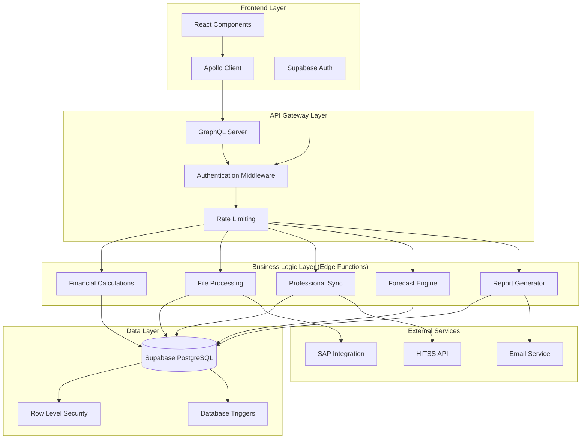

# 🏗️ Plano de Componentização e Backend Supabase - App Financeiro

## 1. Visão Geral do Projeto

O App Financeiro é um sistema de gestão financeira empresarial da Global Hitss que será completamente reestruturado para uma arquitetura moderna baseada em componentes React modulares e backend Supabase com Edge Functions.

### Objetivos da Reestruturação
- **Componentização Completa**: Modularizar todos os elementos da interface em componentes reutilizáveis
- **Backend Robusto**: Implementar Supabase com Edge Functions para processamento server-side
- **Escalabilidade**: Arquitetura preparada para crescimento e novas funcionalidades
- **Performance**: Otimização de carregamento e processamento de dados
- **Manutenibilidade**: Código organizado e fácil de manter

## 2. Análise da Arquitetura Atual

### Stack Tecnológico Atual
- **Frontend**: React 18 + TypeScript + Vite
- **Persistência**: IndexedDB (Dexie.js) - armazenamento local
- **UI**: TailwindCSS + React-Bootstrap + Chart.js
- **Estado**: React Context + Hooks
- **Autenticação**: Sistema simples local (admin/admin)

### Limitações Identificadas
- Dados armazenados apenas localmente (IndexedDB)
- Ausência de sincronização entre dispositivos
- Processamento limitado no cliente
- Falta de backup e recuperação de dados
- Autenticação básica sem segurança robusta

## 3. Nova Arquitetura Proposta

### Stack Tecnológico Nova
- **Frontend**: React 18 + TypeScript + Apollo Client
- **Backend**: Supabase Edge Functions (Deno runtime)
- **Banco de Dados**: Supabase PostgreSQL com RLS
- **API**: GraphQL Gateway + REST APIs
- **Autenticação**: Supabase Auth com JWT
- **Deploy**: Netlify (frontend) + Supabase (backend)

### Diagrama da Arquitetura



## 4. Plano de Componentização

### 4.1 Estrutura de Componentes Proposta

```
src/
├── components/
│   ├── common/              # Componentes base reutilizáveis
│   │   ├── Button/
│   │   ├── Input/
│   │   ├── Modal/
│   │   ├── Table/
│   │   ├── Chart/
│   │   └── Loading/
│   ├── layout/              # Componentes de layout
│   │   ├── Header/
│   │   ├── Sidebar/
│   │   ├── Footer/
│   │   └── Layout/
│   ├── financial/           # Componentes financeiros
│   │   ├── TransactionTable/
│   │   ├── FinancialChart/
│   │   ├── KPICard/
│   │   ├── RevenueChart/
│   │   └── CostAnalysis/
│   ├── forecast/            # Componentes de previsão
│   │   ├── ForecastChart/
│   │   ├── ForecastTable/
│   │   ├── ForecastFilters/
│   │   └── ForecastMetrics/
│   ├── professionals/       # Componentes de gestão de profissionais
│   │   ├── ProfessionalCard/
│   │   ├── ProfessionalTable/
│   │   ├── CostChart/
│   │   └── SyncStatus/
│   ├── upload/              # Componentes de upload
│   │   ├── FileUploader/
│   │   ├── UploadProgress/
│   │   ├── ValidationResults/
│   │   └── DataPreview/
│   └── reports/             # Componentes de relatórios
│       ├── ReportBuilder/
│       ├── ReportViewer/
│       ├── ExportOptions/
│       └── ReportFilters/
```

### 4.2 Componentes Base (Common)

#### Button Component
```typescript
interface ButtonProps {
  variant: 'primary' | 'secondary' | 'danger' | 'success'
  size: 'sm' | 'md' | 'lg'
  loading?: boolean
  disabled?: boolean
  icon?: React.ReactNode
  onClick?: () => void
  children: React.ReactNode
}
```

#### Table Component
```typescript
interface TableProps<T> {
  data: T[]
  columns: ColumnDef<T>[]
  loading?: boolean
  pagination?: boolean
  sorting?: boolean
  filtering?: boolean
  onRowClick?: (row: T) => void
  onSelectionChange?: (selectedRows: T[]) => void
}
```

#### Chart Component
```typescript
interface ChartProps {
  type: 'line' | 'bar' | 'pie' | 'doughnut'
  data: ChartData
  options?: ChartOptions
  height?: number
  responsive?: boolean
}
```

### 4.3 Componentes Financeiros

#### TransactionTable Component
```typescript
interface TransactionTableProps {
  transactions: Transaction[]
  filters: TransactionFilters
  onFilterChange: (filters: TransactionFilters) => void
  onTransactionEdit: (transaction: Transaction) => void
  onTransactionDelete: (id: string) => void
}
```

#### KPICard Component
```typescript
interface KPICardProps {
  title: string
  value: number
  format: 'currency' | 'percentage' | 'number'
  trend?: {
    value: number
    direction: 'up' | 'down'
    period: string
  }
  icon?: React.ReactNode
  color?: 'primary' | 'success' | 'warning' | 'danger'
}
```

### 4.4 Componentes de Previsão

#### ForecastChart Component
```typescript
interface ForecastChartProps {
  historicalData: FinancialData[]
  forecastData: ForecastData[]
  confidence?: number
  period: 'monthly' | 'quarterly' | 'yearly'
  metrics: ('revenue' | 'cost' | 'profit')[]
}
```

### 4.5 Componentes de Gestão de Profissionais

#### ProfessionalCard Component
```typescript
interface ProfessionalCardProps {
  professional: Professional
  showCosts?: boolean
  showProjects?: boolean
  onEdit?: (professional: Professional) => void
  onDelete?: (id: string) => void
}
```

## 5. Especificação das Edge Functions

### 5.1 Edge Functions Necessárias

#### 1. calculate-financial-metrics
**Propósito**: Calcular métricas financeiras complexas

```typescript
// Entrada
interface MetricsRequest {
  projectId?: string
  startDate: string
  endDate: string
  metrics: ('revenue' | 'cost' | 'profit' | 'margin')[]
  groupBy: 'month' | 'quarter' | 'year'
}

// Saída
interface MetricsResponse {
  revenue: MetricData[]
  cost: MetricData[]
  profit: MetricData[]
  margin: MetricData[]
  summary: {
    totalRevenue: number
    totalCost: number
    netProfit: number
    marginPercentage: number
  }
}
```

#### 2. process-file-upload
**Propósito**: Processar uploads de arquivos DRE/Excel

```typescript
// Entrada
interface UploadRequest {
  fileData: string // Base64
  fileName: string
  fileType: 'excel' | 'csv'
  uploadType: 'dre' | 'transactions' | 'professionals'
  projectId?: string
}

// Saída
interface UploadResponse {
  success: boolean
  processedRows: number
  errors: ValidationError[]
  warnings: ValidationWarning[]
  summary: {
    inserted: number
    updated: number
    skipped: number
  }
}
```

#### 3. sync-professionals
**Propósito**: Sincronizar dados de profissionais com sistemas externos

```typescript
// Entrada
interface SyncRequest {
  source: 'hitss-api' | 'sap' | 'manual'
  filters?: {
    department?: string
    project?: string
    status?: string
  }
}

// Saída
interface SyncResponse {
  synchronized: number
  created: number
  updated: number
  errors: SyncError[]
  lastSyncDate: string
}
```

#### 4. generate-forecast
**Propósito**: Gerar previsões financeiras usando algoritmos de ML

```typescript
// Entrada
interface ForecastRequest {
  projectId?: string
  algorithm: 'linear-regression' | 'seasonal' | 'arima'
  periods: number
  confidence: number
  includeSeasonality: boolean
}

// Saída
interface ForecastResponse {
  forecast: ForecastPoint[]
  confidence: number
  accuracy: number
  methodology: string
  assumptions: string[]
}
```

#### 5. generate-reports
**Propósito**: Gerar relatórios em PDF/Excel

```typescript
// Entrada
interface ReportRequest {
  type: 'financial-summary' | 'forecast-analysis' | 'professional-costs'
  format: 'pdf' | 'excel'
  filters: ReportFilters
  template?: string
}

// Saída
interface ReportResponse {
  fileUrl: string
  fileName: string
  size: number
  expiresAt: string
}
```

### 5.2 Estrutura das Edge Functions

```
supabase/functions/
├── _shared/
│   ├── auth.ts              # Autenticação e autorização
│   ├── cors.ts              # Configuração CORS
│   ├── database.ts          # Conexão com banco
│   ├── logger.ts            # Sistema de logs
│   ├── types.ts             # Tipos compartilhados
│   └── utils.ts             # Utilitários
├── calculate-financial-metrics/
│   ├── index.ts
│   ├── calculators/
│   │   ├── revenue-calculator.ts
│   │   ├── cost-calculator.ts
│   │   └── margin-calculator.ts
│   └── types.ts
├── process-file-upload/
│   ├── index.ts
│   ├── parsers/
│   │   ├── excel-parser.ts
│   │   ├── csv-parser.ts
│   │   └── dre-parser.ts
│   ├── validators/
│   │   ├── data-validator.ts
│   │   └── business-rules.ts
│   └── types.ts
├── sync-professionals/
│   ├── index.ts
│   ├── connectors/
│   │   ├── hitss-connector.ts
│   │   └── sap-connector.ts
│   ├── sync-strategies.ts
│   └── types.ts
├── generate-forecast/
│   ├── index.ts
│   ├── algorithms/
│   │   ├── linear-regression.ts
│   │   ├── seasonal-analysis.ts
│   │   └── arima-model.ts
│   ├── models/
│   │   └── forecast-models.ts
│   └── types.ts
└── generate-reports/
    ├── index.ts
    ├── generators/
    │   ├── pdf-generator.ts
    │   └── excel-generator.ts
    ├── templates/
    │   ├── financial-template.ts
    │   └── forecast-template.ts
    └── types.ts
```

## 6. Schema do Banco Supabase

### 6.1 Tabelas Principais

#### projects
```sql
CREATE TABLE projects (
  id UUID PRIMARY KEY DEFAULT gen_random_uuid(),
  name TEXT NOT NULL,
  code TEXT UNIQUE NOT NULL,
  description TEXT,
  status TEXT DEFAULT 'active' CHECK (status IN ('active', 'inactive', 'completed')),
  start_date DATE,
  end_date DATE,
  budget DECIMAL(15,2),
  created_at TIMESTAMPTZ DEFAULT NOW(),
  updated_at TIMESTAMPTZ DEFAULT NOW(),
  created_by UUID REFERENCES auth.users(id)
);
```

#### financial_transactions
```sql
CREATE TABLE financial_transactions (
  id UUID PRIMARY KEY DEFAULT gen_random_uuid(),
  project_id UUID REFERENCES projects(id),
  transaction_type TEXT NOT NULL CHECK (transaction_type IN ('receita', 'despesa')),
  nature TEXT NOT NULL CHECK (nature IN ('RECEITA', 'CUSTO')),
  account_code TEXT NOT NULL,
  account_name TEXT,
  account_summary TEXT,
  amount DECIMAL(15,2) NOT NULL,
  period_year INTEGER NOT NULL,
  period_month INTEGER NOT NULL CHECK (period_month BETWEEN 1 AND 12),
  description TEXT,
  observations TEXT,
  source_file TEXT,
  upload_batch_id UUID,
  raw_data JSONB,
  created_at TIMESTAMPTZ DEFAULT NOW(),
  updated_at TIMESTAMPTZ DEFAULT NOW(),
  created_by UUID REFERENCES auth.users(id)
);
```

#### professionals
```sql
CREATE TABLE professionals (
  id UUID PRIMARY KEY DEFAULT gen_random_uuid(),
  external_id TEXT UNIQUE,
  name TEXT NOT NULL,
  email TEXT UNIQUE,
  phone TEXT,
  department TEXT,
  position TEXT,
  salary DECIMAL(10,2),
  benefits DECIMAL(10,2),
  total_cost DECIMAL(10,2),
  hire_date DATE,
  termination_date DATE,
  status TEXT DEFAULT 'active' CHECK (status IN ('active', 'inactive', 'terminated')),
  contract_type TEXT CHECK (contract_type IN ('CLT', 'PJ', 'Terceirizado', 'Estagiário')),
  project_allocations JSONB,
  external_data JSONB,
  last_sync_at TIMESTAMPTZ,
  created_at TIMESTAMPTZ DEFAULT NOW(),
  updated_at TIMESTAMPTZ DEFAULT NOW(),
  created_by UUID REFERENCES auth.users(id)
);
```

#### forecasts
```sql
CREATE TABLE forecasts (
  id UUID PRIMARY KEY DEFAULT gen_random_uuid(),
  project_id UUID REFERENCES projects(id),
  forecast_type TEXT NOT NULL CHECK (forecast_type IN ('revenue', 'cost', 'profit', 'comprehensive')),
  algorithm TEXT NOT NULL,
  periods_ahead INTEGER NOT NULL,
  confidence_level DECIMAL(5,4),
  forecast_data JSONB NOT NULL,
  accuracy_metrics JSONB,
  assumptions TEXT[],
  methodology TEXT,
  created_at TIMESTAMPTZ DEFAULT NOW(),
  created_by UUID REFERENCES auth.users(id)
);
```

#### file_uploads
```sql
CREATE TABLE file_uploads (
  id UUID PRIMARY KEY DEFAULT gen_random_uuid(),
  file_name TEXT NOT NULL,
  file_type TEXT NOT NULL,
  file_size BIGINT,
  upload_type TEXT NOT NULL CHECK (upload_type IN ('dre', 'transactions', 'professionals')),
  status TEXT DEFAULT 'processing' CHECK (status IN ('processing', 'completed', 'failed')),
  processed_rows INTEGER DEFAULT 0,
  error_rows INTEGER DEFAULT 0,
  errors JSONB,
  metadata JSONB,
  project_id UUID REFERENCES projects(id),
  created_at TIMESTAMPTZ DEFAULT NOW(),
  processed_at TIMESTAMPTZ,
  created_by UUID REFERENCES auth.users(id)
);
```

#### audit_logs
```sql
CREATE TABLE audit_logs (
  id UUID PRIMARY KEY DEFAULT gen_random_uuid(),
  table_name TEXT NOT NULL,
  record_id UUID,
  action TEXT NOT NULL CHECK (action IN ('INSERT', 'UPDATE', 'DELETE')),
  old_values JSONB,
  new_values JSONB,
  user_id UUID REFERENCES auth.users(id),
  ip_address INET,
  user_agent TEXT,
  created_at TIMESTAMPTZ DEFAULT NOW()
);
```

### 6.2 Índices para Performance

```sql
-- Índices para financial_transactions
CREATE INDEX idx_financial_transactions_project_period 
ON financial_transactions(project_id, period_year, period_month);

CREATE INDEX idx_financial_transactions_account 
ON financial_transactions(account_code, account_summary);

CREATE INDEX idx_financial_transactions_amount 
ON financial_transactions(amount) WHERE amount IS NOT NULL;

-- Índices para professionals
CREATE INDEX idx_professionals_department 
ON professionals(department) WHERE department IS NOT NULL;

CREATE INDEX idx_professionals_status 
ON professionals(status);

CREATE INDEX idx_professionals_external_id 
ON professionals(external_id) WHERE external_id IS NOT NULL;

-- Índices para forecasts
CREATE INDEX idx_forecasts_project_type 
ON forecasts(project_id, forecast_type);

CREATE INDEX idx_forecasts_created_at 
ON forecasts(created_at DESC);
```

### 6.3 Row Level Security (RLS)

```sql
-- Habilitar RLS em todas as tabelas
ALTER TABLE projects ENABLE ROW LEVEL SECURITY;
ALTER TABLE financial_transactions ENABLE ROW LEVEL SECURITY;
ALTER TABLE professionals ENABLE ROW LEVEL SECURITY;
ALTER TABLE forecasts ENABLE ROW LEVEL SECURITY;
ALTER TABLE file_uploads ENABLE ROW LEVEL SECURITY;
ALTER TABLE audit_logs ENABLE ROW LEVEL SECURITY;

-- Políticas para projects
CREATE POLICY "Users can view projects they have access to" ON projects
  FOR SELECT USING (auth.uid() = created_by OR auth.jwt() ->> 'role' = 'admin');

CREATE POLICY "Users can create projects" ON projects
  FOR INSERT WITH CHECK (auth.uid() = created_by);

CREATE POLICY "Users can update their projects" ON projects
  FOR UPDATE USING (auth.uid() = created_by OR auth.jwt() ->> 'role' = 'admin');

-- Políticas para financial_transactions
CREATE POLICY "Users can view transactions of accessible projects" ON financial_transactions
  FOR SELECT USING (
    EXISTS (
      SELECT 1 FROM projects 
      WHERE projects.id = financial_transactions.project_id 
      AND (projects.created_by = auth.uid() OR auth.jwt() ->> 'role' = 'admin')
    )
  );

CREATE POLICY "Users can insert transactions" ON financial_transactions
  FOR INSERT WITH CHECK (auth.uid() = created_by);

-- Políticas similares para outras tabelas...
```

## 7. Estratégia de Migração de Dados

### 7.1 Plano de Migração do IndexedDB para Supabase

#### Fase 1: Preparação
1. **Backup dos dados locais**
   - Exportar todos os dados do IndexedDB
   - Criar arquivos JSON de backup
   - Validar integridade dos dados

2. **Configuração do ambiente Supabase**
   - Criar projeto no Supabase
   - Configurar banco de dados
   - Implementar Edge Functions
   - Configurar autenticação

#### Fase 2: Migração de Dados
1. **Migração de projetos**
   ```typescript
   async function migrateProjects() {
     const localProjects = await db.transacoes
       .orderBy('projeto')
       .uniqueKeys()
     
     for (const projeto of localProjects) {
       await supabase.from('projects').insert({
         name: projeto,
         code: generateProjectCode(projeto),
         status: 'active'
       })
     }
   }
   ```

2. **Migração de transações financeiras**
   ```typescript
   async function migrateTransactions() {
     const localTransactions = await db.transacoes.toArray()
     
     const batchSize = 100
     for (let i = 0; i < localTransactions.length; i += batchSize) {
       const batch = localTransactions.slice(i, i + batchSize)
       const transformedBatch = batch.map(transformTransaction)
       
       await supabase.from('financial_transactions')
         .insert(transformedBatch)
     }
   }
   ```

3. **Migração de profissionais**
   ```typescript
   async function migrateProfessionals() {
     const localProfessionals = await db.profissionais.toArray()
     
     const transformedData = localProfessionals.map(prof => ({
       name: prof.nome,
       position: prof.cargo,
       department: prof.tipo,
       total_cost: prof.custo,
       status: 'active'
     }))
     
     await supabase.from('professionals')
       .insert(transformedData)
   }
   ```

#### Fase 3: Validação e Sincronização
1. **Validação de dados migrados**
   - Comparar contagens de registros
   - Validar integridade referencial
   - Verificar cálculos e totais

2. **Implementação de modo híbrido**
   - Manter IndexedDB como fallback
   - Sincronização bidirecional temporária
   - Monitoramento de inconsistências

#### Fase 4: Transição Completa
1. **Desativação do IndexedDB**
   - Remover dependências do Dexie
   - Limpar código relacionado ao IndexedDB
   - Atualizar todos os componentes

2. **Otimização final**
   - Ajustar queries para performance
   - Implementar cache inteligente
   - Monitorar métricas de uso

### 7.2 Script de Migração

```typescript
// migration-script.ts
import { db } from './src/db/database'
import { supabase } from './src/services/supabaseClient'

interface MigrationResult {
  table: string
  migrated: number
  errors: number
  duration: number
}

class DataMigration {
  private results: MigrationResult[] = []

  async migrate(): Promise<MigrationResult[]> {
    console.log('🚀 Iniciando migração de dados...')
    
    try {
      await this.migrateProjects()
      await this.migrateTransactions()
      await this.migrateProfessionals()
      
      console.log('✅ Migração concluída com sucesso!')
      return this.results
    } catch (error) {
      console.error('❌ Erro na migração:', error)
      throw error
    }
  }

  private async migrateProjects() {
    const startTime = Date.now()
    let migrated = 0
    let errors = 0

    try {
      // Extrair projetos únicos das transações
      const uniqueProjects = await db.transacoes
        .orderBy('projeto')
        .uniqueKeys()

      for (const projeto of uniqueProjects) {
        try {
          const { error } = await supabase.from('projects').insert({
            name: projeto as string,
            code: this.generateProjectCode(projeto as string),
            status: 'active',
            created_at: new Date().toISOString()
          })

          if (error) throw error
          migrated++
        } catch (err) {
          console.error(`Erro ao migrar projeto ${projeto}:`, err)
          errors++
        }
      }
    } catch (error) {
      console.error('Erro na migração de projetos:', error)
      errors++
    }

    this.results.push({
      table: 'projects',
      migrated,
      errors,
      duration: Date.now() - startTime
    })
  }

  private async migrateTransactions() {
    const startTime = Date.now()
    let migrated = 0
    let errors = 0

    try {
      const localTransactions = await db.transacoes.toArray()
      const batchSize = 100

      for (let i = 0; i < localTransactions.length; i += batchSize) {
        const batch = localTransactions.slice(i, i + batchSize)
        
        try {
          const transformedBatch = batch.map(this.transformTransaction)
          const { error } = await supabase
            .from('financial_transactions')
            .insert(transformedBatch)

          if (error) throw error
          migrated += batch.length
        } catch (err) {
          console.error(`Erro no batch ${i}-${i + batchSize}:`, err)
          errors += batch.length
        }
      }
    } catch (error) {
      console.error('Erro na migração de transações:', error)
      errors++
    }

    this.results.push({
      table: 'financial_transactions',
      migrated,
      errors,
      duration: Date.now() - startTime
    })
  }

  private transformTransaction(transaction: any) {
    const [month, year] = (transaction.periodo || '').split('/')
    
    return {
      transaction_type: transaction.tipo,
      nature: transaction.natureza,
      account_code: transaction.categoria || 'N/A',
      account_name: transaction.denominacaoConta,
      account_summary: transaction.contaResumo,
      amount: transaction.valor,
      period_year: parseInt(year) || new Date().getFullYear(),
      period_month: parseInt(month) || 1,
      description: transaction.descricao,
      observations: transaction.observacao,
      raw_data: transaction,
      created_at: new Date().toISOString()
    }
  }

  private generateProjectCode(name: string): string {
    return name
      .toUpperCase()
      .replace(/[^A-Z0-9]/g, '')
      .substring(0, 10)
  }
}

// Executar migração
const migration = new DataMigration()
migration.migrate().then(results => {
  console.log('📊 Resultados da migração:', results)
}).catch(error => {
  console.error('💥 Falha na migração:', error)
})
```

## 8. Implementação de Autenticação e Autorização

### 8.1 Configuração Supabase Auth

```typescript
// auth.config.ts
export const authConfig = {
  providers: {
    email: {
      enabled: true,
      confirmEmail: true,
      resetPassword: true
    },
    google: {
      enabled: true,
      clientId: process.env.GOOGLE_CLIENT_ID,
      clientSecret: process.env.GOOGLE_CLIENT_SECRET
    },
    microsoft: {
      enabled: true,
      clientId: process.env.MICROSOFT_CLIENT_ID,
      clientSecret: process.env.MICROSOFT_CLIENT_SECRET
    }
  },
  jwt: {
    expiryLimit: 3600, // 1 hora
    refreshTokenRotation: true
  },
  security: {
    captcha: {
      enabled: true,
      provider: 'hcaptcha'
    },
    rateLimiting: {
      enabled: true,
      maxAttempts: 5,
      windowMs: 900000 // 15 minutos
    }
  }
}
```

### 8.2 Sistema de Roles e Permissões

```sql
-- Tabela de roles
CREATE TABLE user_roles (
  id UUID PRIMARY KEY DEFAULT gen_random_uuid(),
  name TEXT UNIQUE NOT NULL,
  description TEXT,
  permissions JSONB NOT NULL,
  created_at TIMESTAMPTZ DEFAULT NOW()
);

-- Tabela de usuários com roles
CREATE TABLE user_profiles (
  id UUID PRIMARY KEY REFERENCES auth.users(id),
  email TEXT NOT NULL,
  full_name TEXT,
  role_id UUID REFERENCES user_roles(id),
  department TEXT,
  is_active BOOLEAN DEFAULT true,
  last_login_at TIMESTAMPTZ,
  created_at TIMESTAMPTZ DEFAULT NOW(),
  updated_at TIMESTAMPTZ DEFAULT NOW()
);

-- Inserir roles padrão
INSERT INTO user_roles (name, description, permissions) VALUES
('admin', 'Administrador do Sistema', '{
  "projects": ["create", "read", "update", "delete"],
  "transactions": ["create", "read", "update", "delete"],
  "professionals": ["create", "read", "update", "delete"],
  "forecasts": ["create", "read", "update", "delete"],
  "reports": ["create", "read", "export"],
  "users": ["create", "read", "update", "delete"]
}'),
('manager', 'Gerente de Projeto', '{
  "projects": ["create", "read", "update"],
  "transactions": ["create", "read", "update"],
  "professionals": ["read", "update"],
  "forecasts": ["create", "read", "update"],
  "reports": ["create", "read", "export"]
}'),
('analyst', 'Analista Financeiro', '{
  "projects": ["read"],
  "transactions": ["create", "read", "update"],
  "professionals": ["read"],
  "forecasts": ["read"],
  "reports": ["read", "export"]
}'),
('viewer', 'Visualizador', '{
  "projects": ["read"],
  "transactions": ["read"],
  "professionals": ["read"],
  "forecasts": ["read"],
  "reports": ["read"]
}');
```

### 8.3 Context de Autenticação Atualizado

```typescript
// contexts/AuthContext.tsx
import { createContext, useContext, useEffect, useState } from 'react'
import { User, Session } from '@supabase/supabase-js'
import { supabase } from '../services/supabaseClient'

interface UserProfile {
  id: string
  email: string
  full_name: string
  role: {
    name: string
    permissions: Record<string, string[]>
  }
  department: string
  is_active: boolean
}

interface AuthContextType {
  user: User | null
  profile: UserProfile | null
  session: Session | null
  loading: boolean
  signIn: (email: string, password: string) => Promise<void>
  signUp: (email: string, password: string, fullName: string) => Promise<void>
  signOut: () => Promise<void>
  resetPassword: (email: string) => Promise<void>
  hasPermission: (resource: string, action: string) => boolean
}

const AuthContext = createContext<AuthContextType | undefined>(undefined)

export const AuthProvider: React.FC<{ children: React.ReactNode }> = ({ children }) => {
  const [user, setUser] = useState<User | null>(null)
  const [profile, setProfile] = useState<UserProfile | null>(null)
  const [session, setSession] = useState<Session | null>(null)
  const [loading, setLoading] = useState(true)

  useEffect(() => {
    // Verificar sessão atual
    supabase.auth.getSession().then(({ data: { session } }) => {
      setSession(session)
      setUser(session?.user ?? null)
      if (session?.user) {
        loadUserProfile(session.user.id)
      }
      setLoading(false)
    })

    // Escutar mudanças de autenticação
    const { data: { subscription } } = supabase.auth.onAuthStateChange(
      async (event, session) => {
        setSession(session)
        setUser(session?.user ?? null)
        
        if (session?.user) {
          await loadUserProfile(session.user.id)
        } else {
          setProfile(null)
        }
        
        setLoading(false)
      }
    )

    return () => subscription.unsubscribe()
  }, [])

  const loadUserProfile = async (userId: string) => {
    try {
      const { data, error } = await supabase
        .from('user_profiles')
        .select(`
          *,
          role:user_roles(*)
        `)
        .eq('id', userId)
        .single()

      if (error) throw error
      setProfile(data)
    } catch (error) {
      console.error('Erro ao carregar perfil do usuário:', error)
    }
  }

  const signIn = async (email: string, password: string) => {
    const { error } = await supabase.auth.signInWithPassword({
      email,
      password
    })
    if (error) throw error
  }

  const signUp = async (email: string, password: string, fullName: string) => {
    const { error } = await supabase.auth.signUp({
      email,
      password,
      options: {
        data: {
          full_name: fullName
        }
      }
    })
    if (error) throw error
  }

  const signOut = async () => {
    const { error } = await supabase.auth.signOut()
    if (error) throw error
  }

  const resetPassword = async (email: string) => {
    const { error } = await supabase.auth.resetPasswordForEmail(email)
    if (error) throw error
  }

  const hasPermission = (resource: string, action: string): boolean => {
    if (!profile?.role?.permissions) return false
    
    const resourcePermissions = profile.role.permissions[resource]
    return resourcePermissions?.includes(action) || false
  }

  return (
    <AuthContext.Provider value={{
      user,
      profile,
      session,
      loading,
      signIn,
      signUp,
      signOut,
      resetPassword,
      hasPermission
    }}>
      {children}
    </AuthContext.Provider>
  )
}

export const useAuth = () => {
  const context = useContext(AuthContext)
  if (context === undefined) {
    throw new Error('useAuth must be used within an AuthProvider')
  }
  return context
}
```

## 9. APIs GraphQL para Integração Frontend-Backend

### 9.1 Schema GraphQL

```graphql
# schema.graphql
type Project {
  id: ID!
  name: String!
  code: String!
  description: String
  status: ProjectStatus!
  startDate: Date
  endDate: Date
  budget: Float
  transactions: [FinancialTransaction!]!
  professionals: [Professional!]!
  forecasts: [Forecast!]!
  createdAt: DateTime!
  updatedAt: DateTime!
}

type FinancialTransaction {
  id: ID!
  project: Project!
  transactionType: TransactionType!
  nature: TransactionNature!
  accountCode: String!
  accountName: String
  accountSummary: String
  amount: Float!
  periodYear: Int!
  periodMonth: Int!
  description: String
  observations: String
  sourceFile: String
  createdAt: DateTime!
  updatedAt: DateTime!
}

type Professional {
  id: ID!
  externalId: String
  name: String!
  email: String
  phone: String
  department: String
  position: String
  salary: Float
  benefits: Float
  totalCost: Float
  hireDate: Date
  terminationDate: Date
  status: ProfessionalStatus!
  contractType: ContractType
  projectAllocations: [ProjectAllocation!]!
  createdAt: DateTime!
  updatedAt: DateTime!
}

type Forecast {
  id: ID!
  project: Project
  forecastType: ForecastType!
  algorithm: String!
  periodsAhead: Int!
  confidenceLevel: Float
  forecastData: [ForecastPoint!]!
  accuracyMetrics: JSON
  assumptions: [String!]!
  methodology: String
  createdAt: DateTime!
}

type ForecastPoint {
  period: String!
  value: Float!
  confidence: Float
  upperBound: Float
  lowerBound: Float
}

type FileUpload {
  id: ID!
  fileName: String!
  fileType: String!
  fileSize: Int!
  uploadType: UploadType!
  status: UploadStatus!
  processedRows: Int!
  errorRows: Int!
  errors: [ValidationError!]!
  project: Project
  createdAt: DateTime!
  processedAt: DateTime
}

type ValidationError {
  row: Int!
  column: String!
  message: String!
  severity: ErrorSeverity!
}

type FinancialMetrics {
  totalRevenue: Float!
  totalCost: Float!
  netProfit: Float!
  marginPercentage: Float!
  monthlyBreakdown: [MonthlyMetric!]!
}

type MonthlyMetric {
  month: String!
  revenue: Float!
  cost: Float!
  profit: Float!
  margin: Float!
}

# Enums
enum ProjectStatus {
  ACTIVE
  INACTIVE
  COMPLETED
}

enum TransactionType {
  RECEITA
  DESPESA
}

enum TransactionNature {
  RECEITA
  CUSTO
}

enum ProfessionalStatus {
  ACTIVE
  INACTIVE
  TERMINATED
}

enum ContractType {
  CLT
  PJ
  TERCEIRIZADO
  ESTAGIARIO
}

enum ForecastType {
  REVENUE
  COST
  PROFIT
  COMPREHENSIVE
}

enum UploadType {
  DRE
  TRANSACTIONS
  PROFESSIONALS
}

enum UploadStatus {
  PROCESSING
  COMPLETED
  FAILED
}

enum ErrorSeverity {
  ERROR
  WARNING
}

# Input Types
input ProjectInput {
  name: String!
  code: String!
  description: String
  startDate: Date
  endDate: Date
  budget: Float
}

input TransactionInput {
  projectId: ID!
  transactionType: TransactionType!
  nature: TransactionNature!
  accountCode: String!
  accountName: String
  accountSummary: String
  amount: Float!
  periodYear: Int!
  periodMonth: Int!
  description: String
  observations: String
}

input ProfessionalInput {
  externalId: String
  name: String!
  email: String
  phone: String
  department: String
  position: String
  salary: Float
  benefits: Float
  hireDate: Date
  contractType: ContractType
}

input ForecastInput {
  projectId: ID
  forecastType: ForecastType!
  algorithm: String!
  periodsAhead: Int!
  confidenceLevel: Float
  includeSeasonality: Boolean
}

input FileUploadInput {
  fileName: String!
  fileType: String!
  fileData: String! # Base64
  uploadType: UploadType!
  projectId: ID
}

input MetricsFilter {
  projectId: ID
  startDate: Date
  endDate: Date
  groupBy: String
}

# Queries
type Query {
  # Projects
  projects: [Project!]!
  project(id: ID!): Project
  
  # Financial Transactions
  transactions(filter: TransactionFilter): [FinancialTransaction!]!
  transaction(id: ID!): FinancialTransaction
  
  # Professionals
  professionals(filter: ProfessionalFilter): [Professional!]!
  professional(id: ID!): Professional
  
  # Forecasts
  forecasts(projectId: ID): [Forecast!]!
  forecast(id: ID!): Forecast
  
  # Metrics
  financialMetrics(filter: MetricsFilter!): FinancialMetrics!
  
  # File Uploads
  fileUploads: [FileUpload!]!
  fileUpload(id: ID!): FileUpload
}

# Mutations
type Mutation {
  # Projects
  createProject(input: ProjectInput!): Project!
  updateProject(id: ID!, input: ProjectInput!): Project!
  deleteProject(id: ID!): Boolean!
  
  # Financial Transactions
  createTransaction(input: TransactionInput!): FinancialTransaction!
  updateTransaction(id: ID!, input: TransactionInput!): FinancialTransaction!
  deleteTransaction(id: ID!): Boolean!
  
  # Professionals
  createProfessional(input: ProfessionalInput!): Professional!
  updateProfessional(id: ID!, input: ProfessionalInput!): Professional!
  deleteProfessional(id: ID!): Boolean!
  syncProfessionals(source: String!): SyncResult!
  
  # Forecasts
  generateForecast(input: ForecastInput!): Forecast!
  deleteForecast(id: ID!): Boolean!
  
  # File Upload
  uploadFile(input: FileUploadInput!): FileUpload!
  
  # Reports
  generateReport(input: ReportInput!): ReportResult!
}

# Subscriptions
type Subscription {
  fileUploadProgress(uploadId: ID!): FileUpload!
  forecastGenerated(projectId: ID): Forecast!
  transactionAdded(projectId: ID): FinancialTransaction!
}

# Scalars
scalar Date
scalar DateTime
scalar JSON
```

### 9.2 Resolvers GraphQL

```typescript
// resolvers/index.ts
import { Resolvers } from '../generated/graphql'
import { Context } from '../types/context'
import { projectResolvers } from './project'
import { transactionResolvers } from './transaction'
import { professionalResolvers } from './professional'
import { forecastResolvers } from './forecast'
import { uploadResolvers } from './upload'
import { metricsResolvers } from './metrics'

export const resolvers: Resolvers<Context> = {
  Query: {
    ...projectResolvers.Query,
    ...transactionResolvers.Query,
    ...professionalResolvers.Query,
    ...forecastResolvers.Query,
    ...uploadResolvers.Query,
    ...metricsResolvers.Query
  },
  
  Mutation: {
    ...projectResolvers.Mutation,
    ...transactionResolvers.Mutation,
    ...professionalResolvers.Mutation,
    ...forecastResolvers.Mutation,
    ...uploadResolvers.Mutation
  },
  
  Subscription: {
    ...uploadResolvers.Subscription,
    ...forecastResolvers.Subscription,
    ...transactionResolvers.Subscription
  },
  
  // Type resolvers
  Project: {
    transactions: async (parent, args, context) => {
      return context.dataSources.transaction.getByProjectId(parent.id)
    },
    professionals: async (parent, args, context) => {
      return context.dataSources.professional.getByProjectId(parent.id)
    },
    forecasts: async (parent, args, context) => {
      return context.dataSources.forecast.getByProjectId(parent.id)
    }
  },
  
  FinancialTransaction: {
    project: async (parent, args, context) => {
      return context.dataSources.project.getById(parent.projectId)
    }
  },
  
  Professional: {
    projectAllocations: async (parent, args, context) => {
      return context.dataSources.allocation.getByProfessionalId(parent.id)
    }
  },
  
  Forecast: {
    project: async (parent, args, context) => {
      if (!parent.projectId) return null
      return context.dataSources.project.getById(parent.projectId)
    }
  }
}
```

### 9.3 Data Sources

```typescript
// dataSources/ProjectDataSource.ts
import { DataSource } from 'apollo-datasource'
import { SupabaseClient } from '@supabase/supabase-js'
import { Project, ProjectInput } from '../generated/graphql'

export class ProjectDataSource extends DataSource {
  constructor(private supabase: SupabaseClient) {
    super()
  }

  async getAll(): Promise<Project[]> {
    const { data, error } = await this.supabase
      .from('projects')
      .select('*')
      .order('created_at', { ascending: false })

    if (error) throw new Error(error.message)
    return data || []
  }

  async getById(id: string): Promise<Project | null> {
    const { data, error } = await this.supabase
      .from('projects')
      .select('*')
      .eq('id', id)
      .single()

    if (error) throw new Error(error.message)
    return data
  }

  async create(input: ProjectInput, userId: string): Promise<Project> {
    const { data, error } = await this.supabase
      .from('projects')
      .insert({
        ...input,
        created_by: userId
      })
      .select()
      .single()

    if (error) throw new Error(error.message)
    return data
  }

  async update(id: string, input: Partial<ProjectInput>): Promise<Project> {
    const { data, error } = await this.supabase
      .from('projects')
      .update({
        ...input,
        updated_at: new Date().toISOString()
      })
      .eq('id', id)
      .select()
      .single()

    if (error) throw new Error(error.message)
    return data
  }

  async delete(id: string): Promise<boolean> {
    const { error } = await this.supabase
      .from('projects')
      .delete()
      .eq('id', id)

    if (error) throw new Error(error.message)
    return true
  }
}
```

## 10. Cronograma de Implementação

### Fase 1: Preparação e Configuração (Semanas 1-2)
- [ ] Configurar projeto Supabase
- [ ] Implementar schema do banco de dados
- [ ] Configurar Edge Functions básicas
- [ ] Configurar autenticação Supabase
- [ ] Criar estrutura de componentes base

### Fase 2: Componentização Frontend (Semanas 3-5)
- [ ] Implementar componentes base (Button, Input, Table, Chart)
- [ ] Componentizar módulo financeiro
- [ ] Componentizar módulo de previsões
- [ ] Componentizar módulo de profissionais
- [ ] Implementar sistema de layout responsivo

### Fase 3: Edge Functions e APIs (Semanas 6-8)
- [ ] Implementar calculate-financial-metrics
- [ ] Implementar process-file-upload
- [ ] Implementar sync-professionals
- [ ] Implementar generate-forecast
- [ ] Implementar generate-reports
- [ ] Configurar GraphQL Gateway

### Fase 4: Integração e Migração (Semanas 9-11)
- [ ] Integrar frontend com APIs GraphQL
- [ ] Implementar migração de dados
- [ ] Configurar autenticação completa
- [ ] Implementar sistema de permissões
- [ ] Testes de integração

### Fase 5: Otimização e Deploy (Semanas 12-13)
- [ ] Otimização de performance
- [ ] Configurar CI/CD
- [ ] Deploy em ambiente de produção
- [ ] Documentação final
- [ ] Treinamento da equipe

### Fase 6: Monitoramento e Ajustes (Semana 14)
- [ ] Monitoramento de performance
- [ ] Correção de bugs
- [ ] Ajustes baseados em feedback
- [ ] Documentação de operação

## 11. Considerações de Performance

### 11.1 Otimizações Frontend
- **Code Splitting**: Divisão do bundle por rotas e funcionalidades
- **Lazy Loading**: Carregamento sob demanda de componentes
- **Memoização**: React.memo e useMemo para componentes pesados
- **Virtualização**: Para tabelas com muitos dados
- **Cache Inteligente**: Apollo Client com políticas de cache

### 11.2 Otimizações Backend
- **Índices de Banco**: Otimização de queries frequentes
- **Connection Pooling**: Gerenciamento eficiente de conexões
- **Edge Functions**: Processamento próximo ao usuário
- **Caching**: Redis para dados frequentemente acessados
- **Batch Processing**: Processamento em lotes para uploads

### 11.3 Monitoramento
- **Métricas de Performance**: Tempo de resposta, throughput
- **Logs Estruturados**: Rastreamento de erros e performance
- **Alertas**: Notificações para problemas críticos
- **Analytics**: Uso da aplicação e padrões de acesso

## 12. Segurança

### 12.1 Medidas de Segurança
- **Row Level Security (RLS)**: Controle de acesso a nível de linha
- **JWT Tokens**: Autenticação segura com tokens
- **HTTPS**: Comunicação criptografada
- **Validação de Input**: Sanitização de dados de entrada
- **Rate Limiting**: Proteção contra ataques de força bruta
- **Audit Logs**: Rastreamento de todas as ações

### 12.2 Compliance
- **LGPD**: Conformidade com Lei Geral de Proteção de Dados
- **Backup**: Estratégia de backup e recuperação
- **Retenção de Dados**: Políticas de retenção e exclusão
- **Criptografia**: Dados sensíveis criptografados

---

**Este documento serve como guia completo para a componentização e implementação do backend Supabase do App Financeiro. Cada seção deve ser revisada e ajustada conforme necessário durante a implementação.**