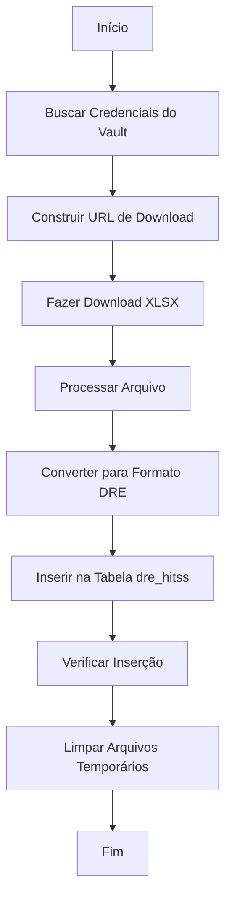

# Automação HITSS com Supabase Vault

## 📋 Visão Geral

Este documento descreve como a automação HITSS foi configurada para usar o Supabase Vault para armazenar credenciais de forma segura.

## 🔐 Segredos Configurados no Vault

Os seguintes segredos estão armazenados no Supabase Vault:

| Nome do Segredo | Descrição | Exemplo |
|----------------|-----------|---------|
| `hitss_username` | Usuário para autenticação na API HITSS | `usuario_api` |
| `hitss_password` | Senha para autenticação na API HITSS | `senha_segura` |
| `hitss_base_url` | URL base da API HITSS | `https://hitsscontrol.globalhitss.com.br` |

## 🚀 Como Funciona

### 1. Busca de Segredos
```javascript
async function getVaultSecret(secretName) {
  const { data, error } = await supabase.rpc('get_secret', { secret_name: secretName });
  return error ? null : data;
}
```

### 2. Uso na Automação
```javascript
// Buscar credenciais do Vault
const username = await getVaultSecret('hitss_username');
const password = await getVaultSecret('hitss_password');
const baseUrl = await getVaultSecret('hitss_base_url');

// Construir autenticação
const authString = Buffer.from(`${username}:${password}`).toString('base64');
```

## 📁 Arquivos Principais

### `hitss-automation-script.js`
Script principal de automação que:
- Busca credenciais do Vault
- Faz download do arquivo XLSX da HITSS
- Processa e converte dados para formato DRE
- Insere dados na tabela `dre_hitss`

### `test-vault-hitss.js`
Script de teste que verifica:
- Acesso aos segredos no Vault
- Construção correta da URL
- Geração de autenticação básica

## 🔧 Como Executar

### Teste do Vault
```bash
node test-vault-hitss.js
```

### Automação Completa
```bash
node hitss-automation-script.js
```

## 🛡️ Segurança

### Vantagens do Vault:
- ✅ Credenciais criptografadas no banco
- ✅ Acesso controlado por RLS (Row Level Security)
- ✅ Logs de acesso auditáveis
- ✅ Rotação de segredos facilitada
- ✅ Sem exposição em código ou variáveis de ambiente

### Boas Práticas:
- 🔒 Nunca logar valores completos dos segredos
- 🔄 Rotacionar credenciais periodicamente
- 👥 Controlar acesso através de políticas RLS
- 📊 Monitorar acessos através dos logs

## 🔄 Fluxo da Automação



## 📊 Estrutura da Tabela dre_hitss

```sql
CREATE TABLE dre_hitss (
    id SERIAL PRIMARY KEY,
    uploadBatchId TEXT NOT NULL,
    ano INTEGER NOT NULL,
    mes INTEGER NOT NULL CHECK (mes >= 1 AND mes <= 12),
    natureza TEXT NOT NULL CHECK (natureza IN ('Receita', 'Despesa')),
    conta TEXT NOT NULL,
    descricao TEXT,
    valor DECIMAL(15,2) NOT NULL,
    projeto TEXT,
    centro_custo TEXT,
    observacoes TEXT,
    created_at TIMESTAMP DEFAULT NOW(),
    updated_at TIMESTAMP DEFAULT NOW()
);
```

## 🚨 Troubleshooting

### Erro: "Credenciais não encontradas no Vault"
- Verificar se os segredos estão configurados no Vault
- Executar `node test-vault-hitss.js` para diagnóstico

### Erro: "HTTP 401 Unauthorized"
- Verificar se as credenciais no Vault estão corretas
- Confirmar se o usuário tem permissão na API HITSS

### Erro: "fetch failed"
- Verificar conectividade de rede
- Confirmar se a URL base está correta no Vault

## 📝 Logs de Exemplo

```
🔐 Buscando credenciais do Vault...
✅ Credenciais obtidas do Vault com sucesso
📥 Iniciando download do arquivo XLSX...
✅ Arquivo baixado: hitss-data.xlsx
📊 Processando arquivo XLSX...
📋 150 registros encontrados
🔄 Convertendo dados para formato DRE...
✅ 450 registros convertidos para formato DRE
💾 Inserindo dados na tabela dre_hitss...
✅ Lote 1 inserido: 100 registros
✅ Lote 2 inserido: 100 registros
✅ Lote 3 inserido: 100 registros
✅ Lote 4 inserido: 100 registros
✅ Lote 5 inserido: 50 registros
🎉 Total inserido: 450 registros
📊 Total de registros na tabela: 450
🗑️ Arquivo temporário removido
✅ Automação concluída com sucesso!
```

## 🔗 Links Úteis

- [Documentação Supabase Vault](https://supabase.com/docs/guides/database/vault)
- [Arquivo de Configuração do Vault](./SUPABASE-VAULT.md)
- [Scripts de Migração](./supabase/migrations/)

---

**Última atualização:** 19/09/2025  
**Versão:** 1.0  
**Autor:** Sistema de Automação HITSS