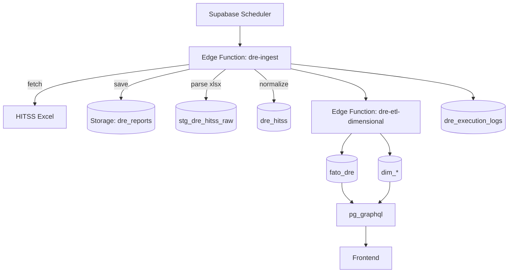

# PRD – DRE HITSS 100% Supabase

## 1. Visão Geral e Problema
Centralizar no Supabase todo o fluxo de ingestão, normalização e disponibilização de dados da DRE (Demonstração do Resultado do Exercício), eliminando regras de negócio do frontend. O Supabase ficará responsável por:
- Baixar o arquivo Excel da HITSS (fonte oficial).
- Armazenar o arquivo no Storage para auditoria.
- Normalizar e inserir em tabela transacional (`dre_hitss`).
- Popular um modelo dimensional (fato e dimensões) para consumo analítico.
- Expor os dados ao frontend via GraphQL (pg_graphql), em JSON, sem qualquer lógica de negócio no cliente.

## 2. Público-alvo
- Equipe financeira e de operações (consumo de dashboards).
- Equipe de engenharia (manutenção e evolução do pipeline).

## 3. Funcionalidades
- Ingestão automática (agendada) do Excel da HITSS.
- Persistência de arquivo fonte (Supabase Storage) + metadados e rastreabilidade (execution_id, hash do arquivo).
- Normalização e carga transacional em `dre_hitss` (com idempotência).
- Criação/atualização de dimensões (cliente, conta, projeto, tempo, natureza, tipo).
- Tabela fato `fato_dre` para análises de valor por período.
- Camada GraphQL para consultas do frontend com visões prontas.
- Logs de execução detalhados (`dre_execution_logs`).
- Notificação opcional ao término (Resend API) – fora do escopo crítico do MVP.

## 4. Fluxo do Usuário
- Operação 100% automática via agendamento, sem intervenção do usuário.
- (Opcional) Endpoint manual para reprocessamento de um arquivo específico.

## 5. Critérios de Sucesso
- Nenhuma regra de negócio no frontend; apenas renderização.
- Pipeline idempotente (o mesmo arquivo não duplica dados).
- Processamento completo < 10 minutos (22k+ linhas) em ambiente padrão Supabase.
- Exposição por GraphQL de consultas essenciais para o dashboard (resumo mensal, por cliente, por conta, por projeto).
- Observabilidade: logs por etapa e métricas básicas de volume/tempo.

## 6. Riscos e Mitigações
- Certificado TLS inválido na origem do Excel: preferir fonte com TLS válido; se inevitável, configurar proxy de aquisição fora da edge (evitar `rejectUnauthorized: false`).
- Volume de dados crescente: usar inserções em lote e índices adequados.
- Formatos variáveis do Excel: robustez no parser (validação de cabeçalhos; fallback com relatório de colunas ausentes).
- Falhas intermitentes na fonte: retries exponenciais e short circuit.
- Segurança: Service Role Key somente em função backend; segredos no Vault; RLS na camada de leitura.

## 7. Arquitetura de Componentes


## 8. Stack Sugerida
- Supabase Self-Hosted (Coolify) + Storage + Edge Functions.
- URL: `https://supabase.fsw-hitss.duckdns.org`
- Extensão `pg_graphql` para GraphQL nativo.
- Biblioteca `xlsx` (npm) para parsing do Excel dentro da Edge Function.

## 9. Modelo de Dados (DDL Proposto)
Observação: ajustar tipos/constraints conforme produção.

```sql
-- Extensões
create extension if not exists pg_graphql;
create extension if not exists pgcrypto;

-- Tabelas de log e staging
create table if not exists public.dre_execution_logs (
  id uuid primary key default gen_random_uuid(),
  execution_id text not null,
  step text not null,
  status text not null,
  message text,
  created_at timestamptz not null default now()
);

create table if not exists public.stg_dre_hitss_raw (
  id uuid primary key default gen_random_uuid(),
  execution_id text not null,
  file_name text not null,
  file_hash text not null,
  row_number int not null,
  payload jsonb not null,
  created_at timestamptz not null default now(),
  unique (file_hash, row_number)
);

-- Tabela normalizada (OLTP)
create table if not exists public.dre_hitss (
  id uuid primary key default gen_random_uuid(),
  execution_id text not null,
  projeto text,
  ano int not null,
  mes int not null,
  conta text,
  descricao text,
  natureza text check (natureza in ('RECEITA','DESPESA')),
  tipo text, -- OPERACIONAL / NAO_OPERACIONAL (mapeado)
  valor numeric(18,2) not null,
  observacoes text,
  relatorio text,
  cliente text,
  linha_negocio text,
  responsavel_area text,
  responsavel_delivery text,
  responsavel_devengado text,
  id_homs text,
  codigo_projeto text,
  filial_faturamento text,
  imposto text,
  conta_resumo text,
  denominacao_conta text,
  id_recurso text,
  recurso text,
  lancamento numeric(18,2),
  periodo text, -- valor original do Excel
  metadata jsonb,
  created_at timestamptz not null default now()
);

create index if not exists idx_dre_hitss_ano_mes on public.dre_hitss(ano, mes);
create index if not exists idx_dre_hitss_cliente on public.dre_hitss(cliente);
create index if not exists idx_dre_hitss_conta on public.dre_hitss(conta);

-- Dimensões
create table if not exists public.dim_tempo (
  id serial primary key,
  ano int not null,
  mes int not null,
  mes_nome text not null,
  trimestre int not null,
  unique (ano, mes)
);

create table if not exists public.dim_cliente (
  id serial primary key,
  nome text not null unique
);

create table if not exists public.dim_conta (
  id serial primary key,
  conta text not null,
  descricao text,
  unique(conta)
);

create table if not exists public.dim_projeto (
  id serial primary key,
  codigo text,
  nome text,
  unique(codigo, nome)
);

create table if not exists public.dim_natureza (
  id serial primary key,
  natureza text not null unique -- RECEITA/DESPESA
);

create table if not exists public.dim_tipo (
  id serial primary key,
  tipo text not null unique -- OPERACIONAL/NAO_OPERACIONAL
);

-- Fato
create table if not exists public.fato_dre (
  id bigserial primary key,
  tempo_id int not null references public.dim_tempo(id),
  cliente_id int references public.dim_cliente(id),
  conta_id int references public.dim_conta(id),
  projeto_id int references public.dim_projeto(id),
  natureza_id int references public.dim_natureza(id),
  tipo_id int references public.dim_tipo(id),
  valor numeric(18,2) not null,
  quantidade int default 1,
  execution_id text,
  created_at timestamptz not null default now()
);

-- Views para GraphQL (exemplos)
create or replace view public.v_dre_resumo_mensal as
select dt.ano, dt.mes, 
       sum(case when dn.natureza = 'RECEITA' then f.valor else 0 end) as receita,
       sum(case when dn.natureza = 'DESPESA' then f.valor else 0 end) as despesa,
       sum(case when dn.natureza = 'RECEITA' then f.valor else -f.valor end) as resultado
  from fato_dre f
  join dim_tempo dt on dt.id = f.tempo_id
  join dim_natureza dn on dn.id = f.natureza_id
 group by dt.ano, dt.mes;

create or replace view public.v_dre_por_cliente as
select c.nome as cliente, dt.ano, dt.mes,
       sum(f.valor) as valor
  from fato_dre f
  join dim_tempo dt on dt.id = f.tempo_id
  left join dim_cliente c on c.id = f.cliente_id
 group by c.nome, dt.ano, dt.mes;
```

## 10. Edge Functions (Design)
- `dre-ingest` (agendada):
  - Obtém `HITSS_DOWNLOAD_URL` do Vault (RPC `get_secret`).
  - `fetch` do Excel da origem; grava no Storage (`dre-files/uploads/<ts>.xlsx`).
  - Faz parse do Excel (npm `xlsx`, via Deno NPM) e valida cabeçalhos esperados.
  - Calcula `file_hash` (ex.: SHA-256 do conteúdo) e gera `execution_id`.
  - Insere em `stg_dre_hitss_raw` (uma linha por registro) com `unique(file_hash,row_number)` para idempotência.
  - Normaliza e insere/upserta em `dre_hitss`, convertendo:
    - `Periodo` → `ano` / `mes` (aceitar "M/YYYY" ou `Date`).
    - `Natureza` → RECEITA/DESPESA (ou pelo sinal do lançamento).
    - `Tipo` → mapear de valores originais (ex.: "Mercado", "Interno") para `OPERACIONAL` por padrão; permitir tabela de mapeamento futura.
    - `Lancamento` → número normalizado (sanitize separadores locais).
  - Chama `dre-etl-dimensional` ao final (ou emite evento para encadear).

- `dre-etl-dimensional`:
  - Upsert em dimensões a partir de `dre_hitss` (clientes, contas, projetos, natureza, tipo, tempo).
  - Popula `fato_dre` com as chaves dimensionais e medida `valor`.
  - Estratégia incremental por `execution_id`.

Ambas as funções devem registrar logs em `dre_execution_logs` por etapa.

## 11. GraphQL (pg_graphql)
- Habilitar `pg_graphql`.
- Expor tabelas e views necessárias ao frontend, preferencialmente as views agregadas (`v_dre_resumo_mensal`, `v_dre_por_cliente`, etc.).
- Exemplos de queries:

```graphql
query ResumoMensal($ano: Int!) {
  v_dre_resumo_mensal(filter: {ano: {eq: $ano}}) {
    ano
    mes
    receita
    despesa
    resultado
  }
}
```

```graphql
query DREPorCliente($ano: Int!, $mes: Int) {
  v_dre_por_cliente(filter: {ano: {eq: $ano}, mes: {eq: $mes}}) {
    cliente
    ano
    mes
    valor
  }
}
```

## 12. Segurança
- RLS nas tabelas de leitura (bloquear gravação por `anon`).
- Edge Functions com Service Role Key (apenas backend).
- Segredos armazenados no Vault (`HITSS_DOWNLOAD_URL`, `RESEND_API_KEY`).
- Política de Storage para permitir apenas leitura pública caso necessário; uploads apenas via função.

## 13. Observabilidade
- `dre_execution_logs` com métricas de contagem de linhas, tempo por etapa, tamanho do arquivo, `file_hash`.
- IDs correlacionados (`execution_id`) entre tabelas e logs.

## 14. Roadmap
- Fase 1 (MVP): ingestão, normalização, fato e dimensões, views GraphQL básicas, RLS.
- Fase 2: mapeamento avançado de `Tipo`, dashboards adicionais, retries/exponenciais, notificação opcional por email.
- Fase 3: qualidade de dados (regras de validação), SLOs e alertas.

## 15. Idempotência e Auditoria
- `file_hash` (SHA-256): hash do conteúdo do arquivo Excel. Evita reprocessamento do mesmo arquivo.
- `row_hash` (SHA-256): hash determinístico por linha normalizada (projeto, cliente, conta, denominação, período, valor, recurso). Índice único em `dre_hitss` para impedir duplicidade por linha.
- `upload_batch_id` (UUID) e `execution_id` (text/UUID): correlação de lote e execução em todo o pipeline.
- Staging `stg_dre_hitss_raw`: guarda cada linha com `(file_hash, row_number)` único para auditoria e reprocessamento.
- Logs em `dre_execution_logs`: status por etapa e métricas (linhas, tempo, tamanho).

## 16. Execução e Deploy
- Migrações (ordem sugerida):
  1) `20250925_create_staging_and_bucket.sql`
  2) `20250925_create_dre_dimensions_and_fact.sql`
  3) `20250925_create_views_and_rpcs.sql`
  4) `20250925_alter_dre_hitss_idempotency.sql`
  5) `20250925_schedule_dre_ingest.sql`
- Segredos no Vault: `HITSS_DOWNLOAD_URL`, `RESEND_API_KEY`.
- Parâmetros para cron (`pg_cron` + `pg_net`): `app.settings.project_url`, `app.settings.service_role_key`.
- Edge Functions: publicar `dre-ingest`, `process-dre-upload`, `dre-etl-dimensional`.
