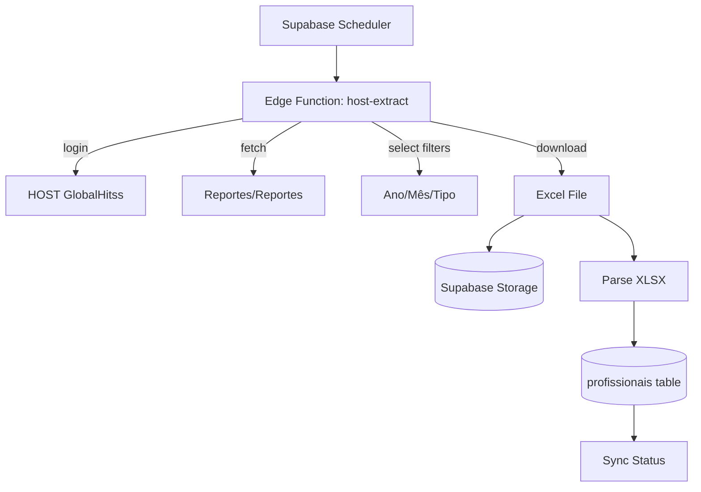

# Documentação HOST GlobalHitss

**Data de Exploração:** 2026-01-05
**URL Base:** https://host.globalhitss.com/
**Credenciais de Teste:** cardosode / Fsw@2025

---

## Estrutura do Menu Principal

### 1. 📅 Horas
| Submenu | URL |
|---------|-----|
| Horas de Inscrição | `/Horas/CapturaHoras2` |

### 2. 💰 Cuadro de Costos
| Submenu | URL |
|---------|-----|
| Autorização Cuadro de Costo | `/Autorizaciones/Autorizaciones` |

### 3. 📊 Projetos
| Submenu | URL |
|---------|-----|
| Projetos | `/Proyectos/Proyecto` |
| Cuadro de Costo Projeto | `/Proyectos/Presupuesto` |
| Responsável | `/Proyectos/Responsables` |
| Atribuir Contribuintes | `/Proyectos/AsignacionesColaboradores` |
| Conceitos Financeiros | `/Proyectos/ConceptosFinancieros` |
| Proyectos Estatus | `/Proyectos/ProyectoEstatus` |
| Incidências | `/Proyectos/Incidencias` |
| Documentos | `/Proyectos/Evidencias` |
| Atividades | `/Proyectos/ActividadesFlexibles` |
| Configurações | `/Proyectos/Configuracion` |
| Config. Atividades | `/Proyectos/ConfigActividadesFlexibles` |
| Información REPSE | `/Proyectos/InformacionRepse` |
| Colaboradores Disponíveis | `/Proyectos/ColaboradoresDisponibles` |
| Backlog | `/Proyectos/Backlog` |

### 4. 📈 Relatórios
| Submenu | URL |
|---------|-----|
| Estado de Cuenta | `/Reportes/EstadoCuenta` |
| **Configuración de Reportes** | `/Reportes/Reportes` |

### 5. 👥 Recursos Humanos
| Submenu | URL |
|---------|-----|
| Detalles Colaborador | `/Reportes/DetalleRecursosHumanos` |

### 6. 🔄 Transferências
| Submenu | URL |
|---------|-----|
| Guias y Otros (Downloads) | `/Common/Descargas` |

---

## Módulo de Reportes - Detalhamento

### URL: `/Reportes/Reportes`

O módulo de Reportes é o principal ponto de extração de dados do sistema HOST.

### Filtros Disponíveis
- **Ano (ddlAnios):** Select com anos disponíveis
- **Mês (ddlMes):** Select com meses (1-12)
- **Tipo de Relatório (ddlReportes):** Select com tipos de relatório

### Relatórios Disponíveis para Extração

| ID | Nome do Relatório | Descrição |
|----|-------------------|-----------|
| 1 | Auditoria_AltasRecursos | Auditoria de altas de recursos/profissionais |
| 2 | BajasRecursos | Baixas de recursos (saídas) |
| 3 | DevengadoMensualComercial | Devengado mensal comercial |
| 4 | DevengadoMensualFabricaTelmex | Devengado mensal Fábrica Telmex |
| 5 | DocumentacionProyectos | Documentação de projetos |
| 6 | Horas Ext Resumen Detalle Actividad | Horas extras por atividade |
| 7 | Horas Ext Resumen Detalle Dia | Horas extras por dia |
| 8 | Horas Ext Resumen Proyecto Colaborador | Horas extras por projeto/colaborador |
| 9 | **Horas_HOST_Detalle Actividad** | Detalhe de horas por atividade |
| 10 | **Horas_HOST_DetalleDia** | Detalhe de horas por dia |
| 11 | **Horas_HOST_MonitoreoRecursos** | Monitoramento de recursos |
| 12 | **Horas_HOST_RecursoProyecto** | Recursos por projeto |
| 13 | ODT_Capturado | ODT capturado |
| 14 | Proyectos | Relatório geral de projetos |
| 15 | RepActividades | Relatório de atividades |
| 16 | RepBackLog13299 | Backlog específico |
| 17 | **Reporte Colaboradores Disponibles** | Lista de colaboradores disponíveis |
| 18 | Reporte de Avance de Proyectos | Progresso de projetos |
| 19 | Reporte Presupuestos Mes a Mes | Orçamentos mensais |

> **Nota:** Os relatórios em **negrito** são os mais relevantes para extração de dados de profissionais.

### Botões de Ação
- **Generar:** Gera o relatório com os filtros selecionados
- **Exportar:** Exporta para Excel (.xlsx)

---

## Relatórios Prioritários para Módulo Profissionais

Para o módulo de Profissionais, os seguintes relatórios são essenciais:

### 1. Horas_HOST_RecursoProyecto
- **Uso:** Lista de profissionais alocados por projeto
- **Dados esperados:** Nome, projeto, horas alocadas

### 2. Horas_HOST_MonitoreoRecursos  
- **Uso:** Monitoramento de atividade dos recursos
- **Dados esperados:** Status de atividade, disponibilidade

### 3. Reporte Colaboradores Disponibles
- **Uso:** Lista de colaboradores disponíveis para alocação
- **Dados esperados:** Lista completa de profissionais

### 4. Auditoria_AltasRecursos
- **Uso:** Novos profissionais adicionados
- **Dados esperados:** Data de entrada, dados cadastrais

### 5. BajasRecursos
- **Uso:** Profissionais que saíram
- **Dados esperados:** Data de saída, motivo

---

## Outros Endpoints Úteis

### Recursos Humanos - Detalles Colaborador
**URL:** `/Reportes/DetalleRecursosHumanos`

Página específica para visualizar detalhes de colaboradores. Pode conter:
- Dados cadastrais
- Histórico de projetos
- Informações de contrato

### Colaboradores Disponíveis
**URL:** `/Proyectos/ColaboradoresDisponibles`

Lista de colaboradores com disponibilidade para novos projetos.

---

## Estratégia de Automação

### Abordagem Recomendada

### Implementação Sugerida

1. **Playwright Edge Function:** Script que faz login e navega no site
2. **Filtros:** Ano atual + Mês atual (ou período configurável)
3. **Download:** Gerar relatório e baixar Excel
4. **Parse:** Processar Excel e inserir no Supabase
5. **Storage:** Guardar arquivo original para auditoria

---

## Próximos Passos

- [ ] Criar tabela `profissionais` no Supabase
- [ ] Desenvolver Edge Function para extração
- [ ] Configurar cron job para execução automática
- [ ] Criar página no app-financeiro para visualização
- [ ] Adicionar item no Sidebar
